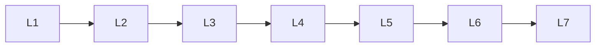

# Providers

> Section of the **rag** handbook.

## Lessons

| # | Lesson |
|---|--------|
| 1 | [Chroma](01-chroma.md) |
| 2 | [Faiss](02-faiss.md) |
| 3 | [Milvus](03-milvus.md) |
| 4 | [Pgvector](04-pgvector.md) |
| 5 | [Pinecone](05-pinecone.md) |
| 6 | [Qdrant](06-qdrant.md) |
| 7 | [Weaviate](07-weaviate.md) |

**Topic hub:** [../README.md](../README.md)
