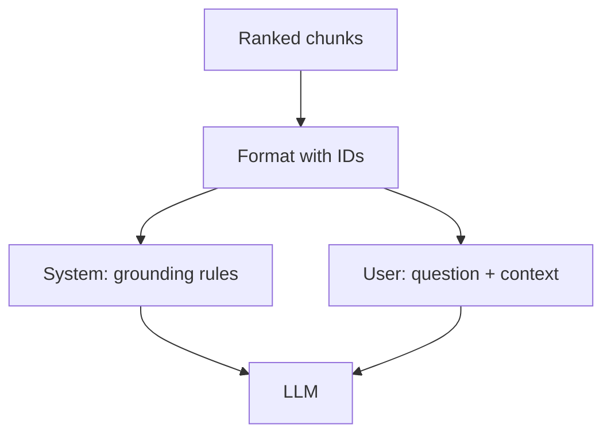

# RAG Prompt Assembly

## Overview

Section **14** of Phase 7.



## Assembly Template

```
System: Answer only from <sources>. Cite [chunk_id] inline. If insufficient, say so.

<sources>
<source id="chunk-1" doc="policy.pdf">...</source>
</sources>

User: {question}
```

Use [RAG query template](../../prompts/templates/rag-query.md).

## Navigation

- [Citations and Grounding](citations-and-grounding.md)

---

## Changelog

| Version | Date | Changes |
|---------|------|---------|
| 1.0 | 2026-07-13 | Phase 7 Section 14 |
