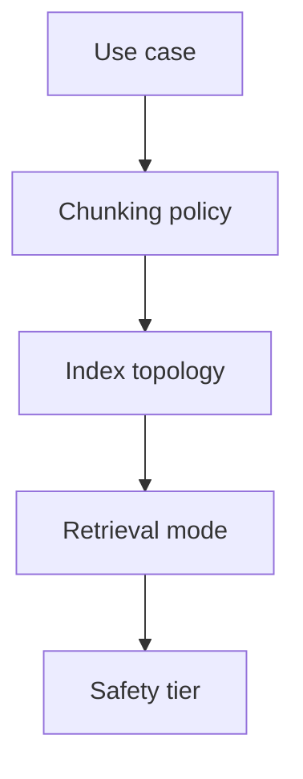

# RAG System Design

## Overview

Section **20** — reference architectures by product type.

## Enterprise Search

Hybrid retrieval + ACL filters + analytics on click-through. Scale: sharded index, CDN for static docs.

## Knowledge Base Chat

Parent-child chunks, citations required, feedback loop to golden set.

## Document Chat

Single-doc mode: stuff or map-reduce; multi-doc: full RAG pipeline.

## Code Search

AST chunking, code embeddings, path metadata, permission from Git ACL.

## Research Assistant

Multi-hop retrieval, reranking, GraphRAG for corpus overview questions.

## Customer Support AI

Ticket + KB fusion, freshness on policies, escalation when score low.

## Legal / Medical AI

High citation fidelity, abstain thresholds, human review, audit trails — never sole decision maker.

## GitHub Repository Search

Index per repo/branch; incremental on push webhook.

## Navigation

- [RAG Mistakes](rag-mistakes.md)

---

## Changelog

| Version | Date | Changes |
|---------|------|---------|
| 1.0 | 2026-07-13 | Initial publication |
