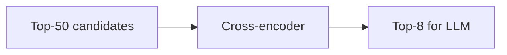

# Reranking for RAG

## Overview

Section **12**. Bi-encoder retrieval is fast but approximate; **cross-encoders** score (query, passage) jointly for higher precision.



## Approaches

| Type | Latency | Quality |
|------|---------|---------|
| **Bi-encoder** (retrieval) | Low | Good recall |
| **Cross-encoder** | Medium | High precision |
| **Cohere Rerank API** | Low ops | Strong |
| **Jina / BGE reranker** | Self-host | Cost control |
| **LLM reranking** | High | Flexible, expensive |

## Typical Gains

NDCG@10 improvements of 10–30% vs retrieval-only — standard in production.

## Python Example

```python
# sentence-transformers cross-encoder
from sentence_transformers import CrossEncoder

model = CrossEncoder("BAAI/bge-reranker-v2-m3")
pairs = [[query, c.text] for c in candidates]
scores = model.predict(pairs)
ranked = sorted(zip(candidates, scores), key=lambda x: -x[1])
```

## Navigation

- [RAG Context Compression](rag-context-compression.md)

---

## Changelog

| Version | Date | Changes |
|---------|------|---------|
| 1.0 | 2026-07-13 | Initial publication |
