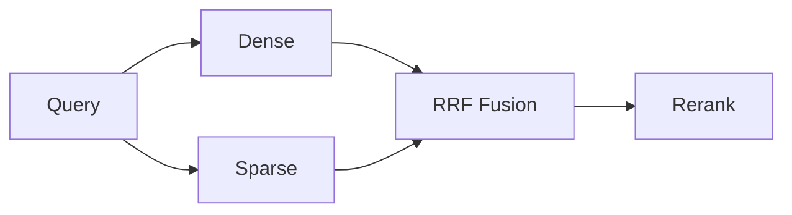

# Retrieval Strategies for RAG

> How production systems fetch candidate knowledge — strategy selection and tradeoffs.

## Overview

Section **9**.

| Strategy | Mechanism | Best for |
|----------|-----------|----------|
| **Dense** | Embedding similarity | Paraphrase, semantic |
| **Sparse** | BM25 / SPLADE | Keywords, SKUs, legal cites |
| **Lexical** | Inverted index | Exact terms |
| **Hybrid** | Fuse dense + sparse | Enterprise default |
| **Metadata filter** | SQL/JSON predicates | Tenant, ACL, date |
| **Hierarchical** | Tree walk + leaf search | Long structured docs |
| **Multi-stage** | Cheap recall → rerank | Large corpora |
| **Multi-query** | Several query variants | Ambiguous questions |
| **Parent retrieval** | Retrieve parent after child hit | Parent-child chunks |
| **Child retrieval** | Small chunks for precision | Fine-grained facts |

**Production default:** Hybrid top-50 → rerank to top-8 → compress to budget.

## Navigation

- [BM25](bm25.md) · [Query Engineering](query-engineering.md) · [Reranking](reranking.md)

---

## Changelog

| Version | Date | Changes |
|---------|------|---------|
| 1.0 | 2026-07-13 | Initial publication |
