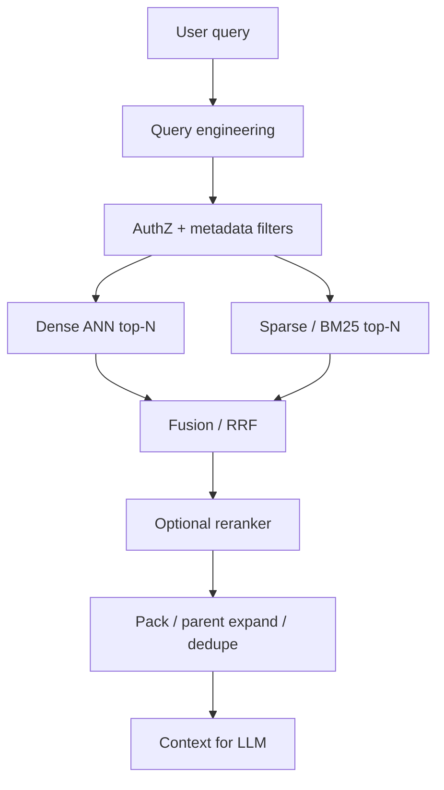

# Retrieval Strategies for RAG

> Choose how candidates enter the context window: dense, sparse, hybrid, hierarchical, multi-query, and multi-stage pipelines — and measure which mix wins for your corpus.

## Table of Contents

- [Definition](#definition)
- [Why It Matters](#why-it-matters)
- [How It Works](#how-it-works)
- [Strategy Catalog](#strategy-catalog)
- [Fusion Methods](#fusion-methods)
- [Decision Guide](#decision-guide)
- [Python Examples](#python-examples)
- [Production Considerations](#production-considerations)
- [Performance & Cost](#performance--cost)
- [Security Notes](#security-notes)
- [Common Mistakes](#common-mistakes)
- [Interview Preparation](#interview-preparation)
- [Navigation](#navigation)

---

## Definition

**Retrieval strategy** is the policy that turns a user query into an ordered set of passages for the generator. It covers:

| Axis | Choices |
|------|---------|
| Signal | Dense embeddings, sparse/BM25, metadata filters, graph walks |
| Structure | Flat chunks, parent–child, hierarchical summaries |
| Stages | Single-shot top‑k vs recall→rerank→pack |
| Query plan | One query, rewrite/expand, multi-query, HyDE |
| Fusion | Weighted sum, RRF, learned rankers |

Success is not “similarity looks good.” Success is **task metrics**: answer faithfulness, citation precision, and latency/cost within SLO.

---

## Why It Matters

Most RAG failures are retrieval failures wearing a generation costume.

| Symptom | Likely retrieval cause |
|---------|------------------------|
| Fluent but wrong | Missed gold docs (low recall) |
| Right doc, wrong snippet | Bad chunk granularity / no parent expand |
| Keyword miss | Dense-only on rare IDs, codes, names |
| Semantic miss | Sparse-only on paraphrases |
| Slow + expensive | Oversized k, no early filters, always-on multi-query |

A clear strategy lets you A/B one axis (e.g. hybrid vs dense) without rewriting the whole app.

---

## How It Works



**Invariant:** filters and tenant ACL must apply *before* or *inside* search, never as a post-hoc hope.

---

## Strategy Catalog

### Dense retrieval

Embed query with the **same model family** as the index; ANN search (HNSW, IVF, etc.).

| Pros | Cons |
|------|------|
| Paraphrase / synonym strong | Weak on rare tokens, SKUs, exact quotes |
| Multilingual with right model | Index + embedding ops cost |

**Use when:** conceptual Q&A, support knowledge bases, product docs with varied wording.

### Sparse / lexical (BM25, learned sparse)

Term matching with IDF weighting; optionally SPLADE-style sparse neural vectors.

| Pros | Cons |
|------|------|
| Exact IDs, error codes, legal cites | Paraphrase brittle |
| Cheap, interpretable | Needs good tokenization / analyzers |

See [BM25](03-bm25.md).

### Hybrid

Run dense + sparse (same filters), fuse scores. Production default for enterprise corpora.

```text
score = α · dense_norm + (1 − α) · sparse_norm
# or rank fusion (RRF) — often more robust than hand-tuned α
```

### Hierarchical / summary retrieval

Index summaries or section titles first; drill into child chunks. Helps long manuals and multi-hop “which section?” questions.

### Parent–child

Retrieve small children for precision; expand to parent window for generation context. Pairs tightly with [chunking](../ingestion/02-chunking.md).

### Multi-query / decomposition

LLM (or rules) emits several search queries; union candidates then fuse. Raises recall for compound questions; raises latency and cost.

### Multi-stage

1. **Recall** — cheap wide net (hybrid top 50–200)  
2. **Rerank** — cross-encoder / LLM judge on top 20–50  
3. **Pack** — token budget, diversity, citations  

See [Reranking](06-reranking.md) and [Query Engineering](05-query-engineering.md).

---

## Fusion Methods

| Method | Idea | Notes |
|--------|------|-------|
| Weighted sum | Normalize then mix | Sensitive to score scales |
| RRF | `1 / (k + rank)` sum | Rank-based; stable across backends |
| Max / CombMNZ | Classical IR fusion | Simple baselines |
| Learned | Small model on features | Needs labeled pairs |

**RRF sketch:**

\[
\text{RRF}(d) = \sum_{r \in systems} \frac{1}{k + \mathrm{rank}_r(d)}
\]

Typical \(k = 60\). Prefer RRF when dense and BM25 score distributions are incomparable.

---

## Decision Guide

| Corpus / query shape | Prefer |
|----------------------|--------|
| Product SKUs, tickets, error codes | Hybrid or sparse-first |
| FAQ / conceptual | Dense or hybrid |
| Long policies / manuals | Hierarchical + parent–child |
| Multi-part questions | Multi-query → fuse → rerank |
| Strict p95 latency | Single hybrid + light rerank; cache |
| High hallucination risk | Multi-stage + citation packing |

| Metric to optimize | Strategy lever |
|--------------------|----------------|
| Recall@50 | Wider hybrid / multi-query |
| nDCG@10 / answer quality | Rerank + pack |
| p95 latency | Smaller N, skip LLM rewrite on cache hit |
| $/query | Cap multi-query; cache embeddings |

---

## Python Examples

```python
from collections import defaultdict
from dataclasses import dataclass


@dataclass
class Hit:
    doc_id: str
    text: str
    score: float
    source: str  # "dense" | "sparse"


def rrf_fuse(lists: list[list[Hit]], k: int = 60) -> list[Hit]:
    scores: dict[str, float] = defaultdict(float)
    texts: dict[str, str] = {}
    for hits in lists:
        for rank, h in enumerate(hits, start=1):
            scores[h.doc_id] += 1.0 / (k + rank)
            texts[h.doc_id] = h.text
    ranked = sorted(scores.items(), key=lambda x: x[1], reverse=True)
    return [Hit(doc_id=i, text=texts[i], score=s, source="rrf") for i, s in ranked]


def hybrid_retrieve(
    query: str,
    dense_search,
    sparse_search,
    filters: dict,
    n_dense: int = 40,
    n_sparse: int = 40,
    top_k: int = 20,
) -> list[Hit]:
    dense = dense_search(query, top_k=n_dense, filters=filters)
    sparse = sparse_search(query, top_k=n_sparse, filters=filters)
    return rrf_fuse([dense, sparse])[:top_k]


def parent_expand(hits: list[Hit], parent_store, max_chars: int = 4000) -> list[str]:
    """Map child hits to unique parents under a character budget."""
    seen, out, used = set(), [], 0
    for h in hits:
        parent = parent_store.get_parent(h.doc_id)
        if parent.id in seen:
            continue
        if used + len(parent.text) > max_chars:
            break
        seen.add(parent.id)
        out.append(parent.text)
        used += len(parent.text)
    return out
```

Wrap ANN and BM25 clients behind the same `filters` contract so ACL bugs cannot diverge by path.

---

## Production Considerations

- **Version the bundle:** embedding model id, chunker, index build id, fusion params — one rollback unit.
- **Filter parity:** dense and sparse must honor the same tenant / ACL / freshness filters.
- **Dedup:** near-duplicate chunks waste context; cluster or content-hash before packing.
- **Empty / low-confidence path:** if fused scores fall below a floor, refuse or ask a clarifying question instead of inventing.
- **Observability:** log query, filters, per-system ranks, fused ids, and which ids entered the prompt.

---

## Performance & Cost

| Stage | Cost drivers | Levers |
|-------|--------------|--------|
| Dense ANN | Embedding QPS, HNSW ef | Cache query vectors; tune ef/recall |
| Sparse | Index size, analyzer | Shard by tenant; stopword policy |
| Multi-query | Extra LLM + searches | Intent gate; only on hard queries |
| Rerank | Cross-encoder batch | Top‑N only; distilled reranker |
| Generation | Context tokens | Parent expand with hard budget |

Track **$/successful answer** and **p95 end-to-end**, not only ANN latency.

---

## Security Notes

- Enforce **authZ in the retriever**, not in the prompt (“only use allowed docs”).
- Treat retrieved text as **untrusted** (indirect prompt injection); isolate instructions from passages.
- Redact secrets from logs of retrieved snippets.
- Rate-limit multi-query and tool-like retrieval to bound exfiltration via many probes.

---

## Common Mistakes

- Dense-only on ID-heavy corpora (and sparse-only on paraphrastic support).
- Different filters on dense vs sparse → “hybrid” that leaks or misses.
- Huge `k` with no rerank → noise fills the context window.
- Measuring cosine demo quality instead of grounded answer eval.
- Parent–child mismatch after rechunking (orphan children, stale parents).
- Always-on HyDE/multi-query without an intent router.

---

## Interview Preparation

**Q: Dense vs sparse vs hybrid — when each?**  
**A:** Dense for semantics/paraphrase; sparse for exact tokens and rare terms; hybrid (often RRF) as the default when both failure modes appear in offline eval.

**Q: How do you design a multi-stage retriever?**  
**A:** Cheap wide recall (hybrid) → cross-encoder/LLM rerank on a small N → pack under token budget with citations; gate each stage on latency and golden-set metrics.

**Q: Why RRF over weighted score fusion?**  
**A:** Ranks are comparable across systems; raw ANN and BM25 scores are not. RRF reduces brittle α tuning.

**Q: What breaks first in production hybrid search?**  
**A:** ACL/filter skew between indexes, embedding model upgrades without reindex, and context packing that drops the cited child span.

---

## Navigation

### This section — Retrieval

| # | Topic | Document |
|---|-------|----------|
| 1 | Embeddings for RAG | [01-embeddings-for-rag.md](01-embeddings-for-rag.md) |
| 2 | Vector Databases | [02-vector-databases.md](02-vector-databases.md) |
| 3 | BM25 | [03-bm25.md](03-bm25.md) |
| 4 | Retrieval Strategies | **You are here** |
| 5 | Query Engineering | [05-query-engineering.md](05-query-engineering.md) |
| 6 | Reranking | [06-reranking.md](06-reranking.md) |

### Path

- Previous: [BM25](03-bm25.md)
- Next: [Query Engineering](05-query-engineering.md)
- Section hub: [Retrieval](README.md)
- Domain hub: [RAG](../README.md)

### Related topics

- [Chunking](../ingestion/02-chunking.md)
- [Embeddings & Vector Databases](../../embeddings-vector-databases/README.md)
- [RAG Evaluation](../../ai-evaluation/surface-areas/02-rag-evaluation.md)
- [Production RAG](../evaluation-and-production/02-production-rag.md)
