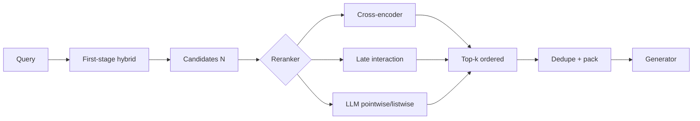

# Reranking for RAG

> First-stage retrieval optimizes recall; reranking optimizes precision under a tight token budget — cross-encoders, ColBERT-style late interaction, and LLM judges.

## Table of Contents

- [Definition](#definition)
- [Why It Matters](#why-it-matters)
- [How It Works](#how-it-works)
- [Reranker Families](#reranker-families)
- [Where to Place the Cut](#where-to-place-the-cut)
- [Python Examples](#python-examples)
- [Production Considerations](#production-considerations)
- [Performance & Cost](#performance--cost)
- [Security Notes](#security-notes)
- [Common Mistakes](#common-mistakes)
- [Interview Preparation](#interview-preparation)
- [Navigation](#navigation)

---

## Definition

**Reranking** scores a **small candidate set** \((q, d_i)\) jointly (or with richer interaction) after a cheap first-stage retrieval. Output is a new order — and often a truncated top‑k for the generator.

| Stage | Goal | Typical size |
|-------|------|--------------|
| Recall (ANN / BM25 / hybrid) | High recall@N | N = 50–200 |
| Rerank | High precision@k | k = 5–20 into the prompt |
| Pack | Fit token budget + citations | Character/token cap |

Reranking is **not** a substitute for broken chunking or missing ACL filters.

---

## Why It Matters

Bi-encoders encode query and doc separately; they cannot attend across tokens. That misses:

- Negation (“without SSO”)
- Constraint binding (“2023 pricing for Enterprise”)
- Cross-sentence evidence that only appears when q and d are read together

| Without rerank | With good rerank |
|----------------|------------------|
| Top ANN hits are “about the topic” | Top hits actually answer the ask |
| Context filled with near-duplicates | Diversity + relevance |
| Generator cites wrong neighbor chunk | Higher citation precision |

Offline: improve nDCG@10 / MRR and **answer faithfulness** on a fixed recall set. If recall@N is already bad, fix [retrieval strategies](04-retrieval-strategies.md) first.

---

## How It Works



**Contract:** same authZ filters as stage‑1; never rerank docs the user cannot read.

---

## Reranker Families

### Cross-encoder

Concatenate `[CLS] query [SEP] doc`; single relevance logit. Strong accuracy; cost ∝ N × sequence length.

| Pros | Cons |
|------|------|
| Best pairwise interaction | Cannot precompute doc vectors for ANN |
| Mature open models (e.g. MS MARCO-tuned) | Latency spike if N large |

### Late interaction (ColBERT-style)

Keep token-level embeddings; MaxSim between query and doc tokens. Compromise: better than bi-encoder, cheaper than full cross-attention at large N (with specialized indexes).

### Bi-encoder rescoring

Re-embed with a stronger model or domain-finetuned encoder — still no full interaction; use as a cheap mid-stage.

### LLM-as-reranker

Pointwise (“score 0–1”), pairwise, or listwise (“order these 10”). Flexible instructions; expensive and less stable unless you constrain JSON and calibrate.

| Pattern | When |
|---------|------|
| Pointwise batch | Parallelizable; need calibration |
| Pairwise | Tournament / bubble; many calls |
| Listwise | One call for small N; position bias |

### Feature / learning-to-rank

Combine BM25 score, dense score, recency, click priors, title match — useful when you have labels and want explainable weights.

---

## Where to Place the Cut

| Knob | Too small | Too large |
|------|-----------|-----------|
| Stage‑1 N | Gold doc never enters rerank | Latency/cost explode |
| Final k | Missing evidence | Noise + $ tokens |
| Doc truncation | Cuts answer span | Wastes GPU |

**Practical defaults:** hybrid N=80 → cross-encoder top 10 → pack ≤ 3–6k tokens. Tune on a golden set; do not copy demo notebooks.

**Skip rerank when:** latency SLO forbids it *and* hybrid@k already saturates answer metrics; or candidates are already ≤5 from a precise filter.

---

## Python Examples

```python
from dataclasses import dataclass
import math


@dataclass
class Candidate:
    id: str
    text: str
    stage1_score: float


def truncate(text: str, max_chars: int = 1200) -> str:
    return text if len(text) <= max_chars else text[: max_chars - 1] + "…"


def cross_encoder_rerank(
    query: str,
    cands: list[Candidate],
    model,
    top_k: int = 8,
) -> list[tuple[Candidate, float]]:
    """model.predict(list[tuple[str, str]]) -> relevance scores."""
    pairs = [(query, truncate(c.text)) for c in cands]
    scores = model.predict(pairs)
    ranked = sorted(zip(cands, scores), key=lambda x: x[1], reverse=True)
    return ranked[:top_k]


def mmr_diversify(
    query_vec,
    doc_vecs: list,
    docs: list[Candidate],
    lambda_: float = 0.7,
    top_k: int = 8,
) -> list[Candidate]:
    """Maximal Marginal Relevance after (or instead of) pure relevance sort."""
    selected, remaining = [], list(range(len(docs)))

    def cos(a, b):
        return sum(x * y for x, y in zip(a, b)) / (
            math.sqrt(sum(x * x for x in a)) * math.sqrt(sum(y * y for y in b)) + 1e-9
        )

    while remaining and len(selected) < top_k:
        best_i, best_score = None, -1e9
        for i in remaining:
            rel = cos(query_vec, doc_vecs[i])
            div = max((cos(doc_vecs[i], doc_vecs[j]) for j in selected), default=0.0)
            score = lambda_ * rel - (1 - lambda_) * div
            if score > best_score:
                best_i, best_score = i, score
        selected.append(best_i)
        remaining.remove(best_i)
    return [docs[i] for i in selected]


def should_rerank(n_cands: int, p95_budget_ms: float, rerank_ms_per_doc: float) -> bool:
    return n_cands > 5 and n_cands * rerank_ms_per_doc < p95_budget_ms * 0.4
```

For LLM listwise rerank, pin temperature 0, force a JSON schema of ids, and reject/repair if the model invents ids not in the candidate set.

---

## Production Considerations

- **Batch on GPU** with fixed max length; pad carefully to avoid straggler latency.
- **Fail open vs closed:** if reranker times out, fall back to stage‑1 order and flag the request — do not drop all context silently.
- **Version** model weights + max length + N/k with the index build.
- **Shadow eval:** log stage‑1 vs reranked order; measure how often the cited doc changed.
- **Freshness:** recency features belong in features LTR or as a boost after relevance, not as a replacement for relevance.

---

## Performance & Cost

| Approach | Latency | $/1k queries (order-of-mag) | Quality |
|----------|---------|-----------------------------|---------|
| No rerank | Lowest | Lowest | Baseline |
| Cross-encoder N≤50 | +20–80ms GPU | Low–med | High |
| ColBERT late interaction | Tunable | Med (index) | High |
| LLM listwise | +200ms–2s | High | Variable |

Cost lever: **adaptive rerank** — only invoke when stage‑1 margin is flat (top scores nearly tied) or query is tagged “hard.”

---

## Security Notes

- Truncate and sanitize candidate text before LLM rerankers (injection via retrieved HTML/scripts).
- Do not send cross-tenant candidates into a shared batch incorrectly labeled — batch ≠ shared visibility if filters failed upstream.
- Cache keys must include **tenant + ACL hash + model version**, not only query text.

---

## Common Mistakes

- Reranking N=200 on CPU in the request path.
- Measuring only pairwise accuracy, not end-to-end grounded answers.
- Feeding full parent documents into the cross-encoder (blow up latency) instead of child spans.
- LLM rerank that invents document ids — trust without schema validation.
- Ignoring duplicates: reranker promotes three near-copies of the same paragraph.
- Expecting rerank to fix recall@N = 0.

---

## Interview Preparation

**Q: Why not use a cross-encoder for the entire corpus?**  
**A:** Scoring is O(|D|) per query with full interaction — infeasible at web/enterprise scale. Use ANN/BM25 for recall, cross-encoder on a shortlist.

**Q: Cross-encoder vs bi-encoder vs ColBERT?**  
**A:** Bi-encoder for scalable retrieval; cross-encoder for accurate shortlist scoring; late interaction as a middle ground with token-level MaxSim and specialized indexes.

**Q: How do you know N is large enough?**  
**A:** Plot recall@N of gold passages on a labeled set; pick the smallest N where recall plateaus, then spend budget on rerank quality.

**Q: When is LLM reranking worth it?**  
**A:** When instructions/constraints are complex and N is tiny (≤10–20), latency allows, and you validate structured outputs — otherwise prefer a tuned cross-encoder.

---


## Tuning knobs

| Knob | Effect |
|------|--------|
| N (candidates) | Recall vs cost/latency |
| k (kept) | Prompt size vs evidence |
| Model size | Quality vs ms |
| Diversity (MMR) | Reduce near-duplicates |

## Reference architecture snippet

```python
def retrieve_and_rerank(query, store, reranker, N=50, k=5, filters=None):
    hits = store.search(query, top_k=N, filters=filters or {})
    ranked = reranker.rank(query, hits)
    return ranked[:k]
```

## When to skip reranking

- Tiny corpora where BM25 already perfect
- Ultra-low latency autocomplete
- First-stage already returns k=3 with human-curated FAQs

## Related reading

- [Hybrid BM25+vector](../../embeddings-vector-databases/indexing-and-search/03-hybrid-bm25-vector.md)
- [RAG evaluation](../../ai-evaluation/surface-areas/02-rag-evaluation.md)

## Navigation

### This section — Retrieval

| # | Topic | Document |
|---|-------|----------|
| 4 | Retrieval Strategies | [04-retrieval-strategies.md](04-retrieval-strategies.md) |
| 5 | Query Engineering | [05-query-engineering.md](05-query-engineering.md) |
| 6 | Reranking | **You are here** |

### Path

- Previous: [Query Engineering](05-query-engineering.md)
- Next: [RAG Evaluation](../evaluation-and-production/01-rag-evaluation.md)
- Section hub: [Retrieval](README.md)
- Domain hub: [RAG](../README.md)

### Related topics

- [Retrieval Strategies](04-retrieval-strategies.md)
- [Embeddings & Vector Databases](../../embeddings-vector-databases/README.md)
- [RAG Evaluation (ai-evaluation)](../../ai-evaluation/surface-areas/02-rag-evaluation.md)
- [Chunking](../ingestion/02-chunking.md)
