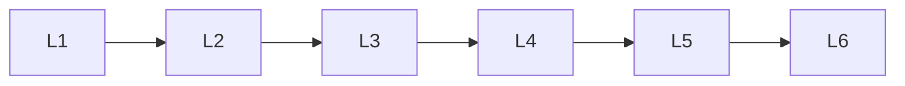

# Retrieval

> Section of the **rag** handbook.

## Lessons

| # | Lesson |
|---|--------|
| 1 | [Embeddings For Rag](01-embeddings-for-rag.md) |
| 2 | [Vector Databases](02-vector-databases.md) |
| 3 | [Bm25](03-bm25.md) |
| 4 | [Retrieval Strategies](04-retrieval-strategies.md) |
| 5 | [Query Engineering](05-query-engineering.md) |
| 6 | [Reranking](06-reranking.md) |

**Topic hub:** [../README.md](../README.md)
