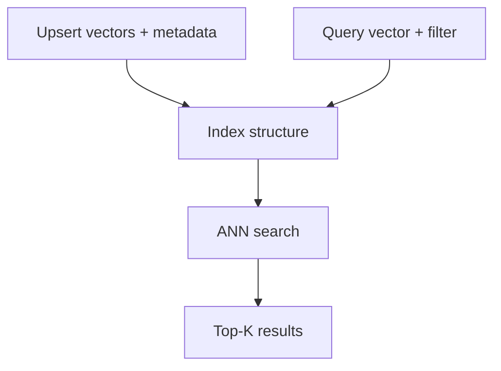

# Vector Databases for RAG

> How vector indexes work internally and what to demand from a production store.

## Table of Contents

- [Overview](#overview)
- [Exact vs Approximate Search](#exact-vs-approximate-search)
- [Index Types](#index-types)
- [HNSW](#hnsw)
- [IVF](#ivf)
- [Product Quantization](#product-quantization)
- [Metadata Filtering](#metadata-filtering)
- [Collections and Namespaces](#collections-and-namespaces)
- [Sharding and Replication](#sharding-and-replication)
- [Implementation Guides](#implementation-guides)
- [Interview Preparation](#interview-preparation)
- [Navigation](#navigation)

---

## Overview

Section **7**.

A **vector database** stores embeddings and answers k-NN queries under latency SLOs, with metadata filters and operational features.

---

## Exact vs Approximate Search

| Type | Complexity | Use |
|------|------------|-----|
| **Exact (brute force)** | O(n) | Small corpora, eval baselines |
| **ANN** | Sublinear | Production scale |

ANN trades recall for speed — tune with `ef_search`, `nprobe`.

---

## Index Types

| Index | Idea |
|-------|------|
| **Flat** | Exact, no index |
| **HNSW** | Graph navigable small world |
| **IVF** | Inverted file — cluster centroids |
| **PQ** | Compress vectors for memory |
| **DiskANN** | Disk-based graph (very large scale) |

---

## HNSW

**Hierarchical Navigable Small World** — layered graph. Popular default (Qdrant, Weaviate, pgvector).

Parameters: `M` (connections), `ef_construction`, `ef_search` — higher ef = better recall, slower.

---

## IVF

Partition space into `nlist` clusters. Search probes `nprobe` nearest centroids. Good for very large GPU indexes (FAISS).

---

## Product Quantization

Compress vectors to reduce RAM — some accuracy loss. Used with IVF in FAISS at billion scale.

---

## Metadata Filtering

Pre-filter or post-filter on `tenant_id`, `doc_type`, dates. **Pre-filter** required for security.

---

## Collections and Namespaces

Isolate tenants or environments: `prod-acme-kb-v7`, `staging-acme-kb-v7`.

---

## Sharding and Replication

Shard by tenant or hash; replicas for read scaling and HA.

---

## Implementation Guides

| Database | Guide |
|----------|-------|
| FAISS | [providers/faiss.md](providers/faiss.md) |
| Chroma | [providers/chroma.md](providers/chroma.md) |
| PGVector | [providers/pgvector.md](providers/pgvector.md) |
| Pinecone | [providers/pinecone.md](providers/pinecone.md) |
| Milvus | [providers/milvus.md](providers/milvus.md) |
| Weaviate | [providers/weaviate.md](providers/weaviate.md) |
| Qdrant | [providers/qdrant.md](providers/qdrant.md) |

---

## Interview Preparation

**Q: Explain HNSW in one minute.**

> Multi-layer proximity graph; search greedy from top layer down; approximate nearest neighbors in log time; tune ef for recall/latency.

---

## Navigation

### Next

- [Retrieval Strategies](retrieval-strategies.md) (after provider guides)

---

## Changelog

| Version | Date | Changes |
|---------|------|---------|
| 1.0 | 2026-07-13 | Initial publication |
