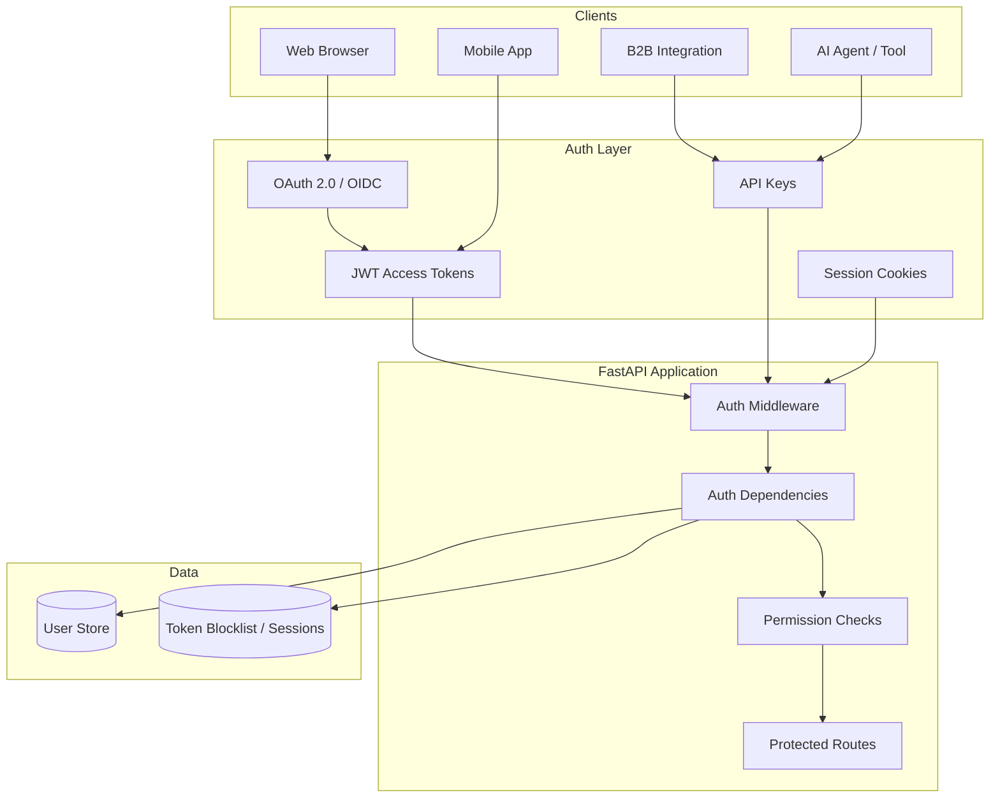
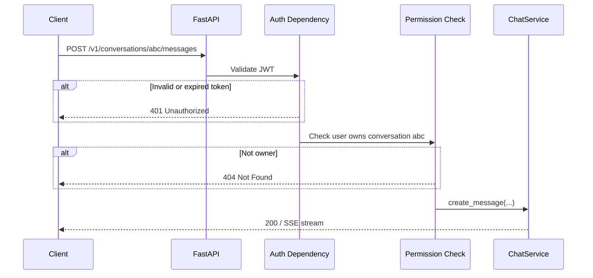
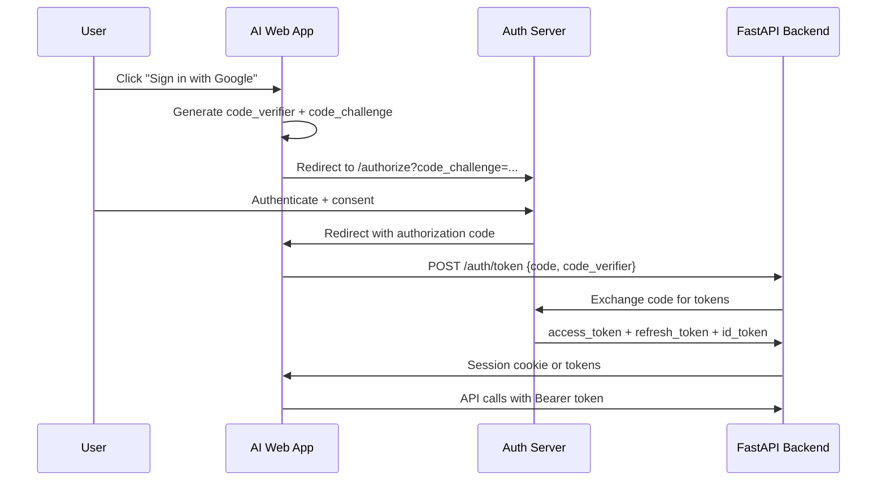
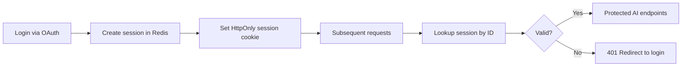
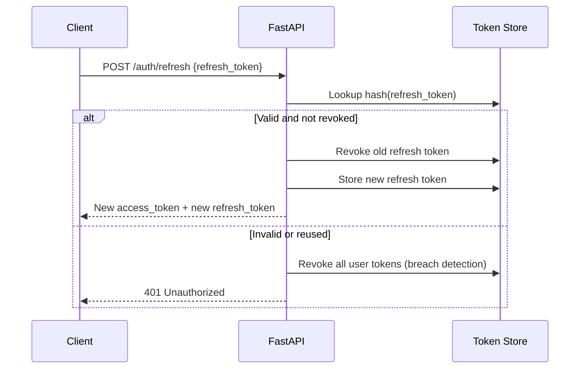

# Authentication and Authorization for AI

> How to secure AI APIs end to end — from JWT and OAuth2 to RBAC, refresh tokens, and FastAPI protected routes — with patterns that protect LLM spend and user data.

## Table of Contents

- [Why Auth Matters for AI Applications](#why-auth-matters-for-ai-applications)
- [Authentication vs Authorization](#authentication-vs-authorization)
- [API Keys](#api-keys)
- [JWT Authentication](#jwt-authentication)
- [OAuth 2.0](#oauth-20)
- [Sessions](#sessions)
- [Refresh Tokens](#refresh-tokens)
- [Token Expiration](#token-expiration)
- [RBAC and Permissions](#rbac-and-permissions)
- [Protected Routes in FastAPI](#protected-routes-in-fastapi)
- [Resource-Level Authorization](#resource-level-authorization)
- [Multi-Tenant AI Security](#multi-tenant-ai-security)
- [Production Considerations](#production-considerations)
- [Security Hardening](#security-hardening)
- [Common Mistakes](#common-mistakes)
- [Interview Preparation](#interview-preparation)
- [Navigation](#navigation)

---

## Why Auth Matters for AI Applications

An unauthenticated AI endpoint is an open wallet. Every request can trigger LLM inference, vector searches, and document processing — all with real monetary cost. Beyond billing, AI apps store sensitive data: chat history, uploaded documents, proprietary prompts, and agent configurations.

| Threat | Without Auth | With Proper Auth |
|--------|--------------|------------------|
| Anonymous LLM abuse | Unlimited spend | Per-user quotas and audit trail |
| Cross-user data access | Conversation leakage | Resource-level authorization |
| API key theft (frontend) | Provider key exposed | Backend proxy with user tokens |
| Prompt injection via shared endpoints | No attribution | Identity-bound rate limits and logging |
| B2B integration risk | No tenant isolation | API keys scoped to workspace |

> **Production Standard:** Transport-level HTTP auth concepts are in [HTTP Fundamentals for AI](../apis/http-fundamentals-for-ai.md). API contract design (error envelopes, versioning) is in [API Design for AI](../apis/api-design-for-ai.md). This document covers **identity, access control, and FastAPI implementation**.



---

## Authentication vs Authorization

These terms are often conflated. In AI systems, both must be enforced on every request — especially before any LLM call.

| | Authentication | Authorization |
|---|----------------|---------------|
| **Question** | Who is this caller? | What can they do? |
| **Failure HTTP code** | `401 Unauthorized` | `403 Forbidden` (or `404` to prevent enumeration) |
| **Mechanisms** | API key, JWT, session cookie, OAuth | Roles, permissions, scopes, resource ownership |
| **AI example** | Valid Bearer token presented | User can read only their own conversations |
| **Checked** | At API gateway / auth dependency | After auth, before service layer |



**Rule:** Authenticate first, authorize second, then call the LLM. Never reverse this order to "save latency."

---

## API Keys

API keys are the simplest auth mechanism — ideal for **service-to-service** and **B2B** integrations. They are opaque strings, not self-contained like JWTs.

### When to Use API Keys

| Use Case | Recommended |
|----------|-------------|
| B2B partner integrations | Yes — scoped keys per partner |
| Internal microservices | Yes — with rotation policy |
| User-facing web/mobile apps | No — use JWT/OAuth instead |
| LLM provider calls (outbound) | Yes — stored server-side only |
| Public browser clients | **Never** — keys leak in DevTools |

### API Key Design

```python
import secrets
import hashlib


def generate_api_key(prefix: str = "aip") -> tuple[str, str]:
    """Returns (raw_key, hashed_key). Store only the hash."""
    raw = f"{prefix}_{secrets.token_urlsafe(32)}"
    hashed = hashlib.sha256(raw.encode()).hexdigest()
    return raw, hashed


def verify_api_key(raw_key: str, stored_hash: str) -> bool:
    return hashlib.sha256(raw_key.encode()).hexdigest() == stored_hash
```

### FastAPI API Key Dependency

```python
from fastapi import Depends, HTTPException, Security, status
from fastapi.security import APIKeyHeader

api_key_header = APIKeyHeader(name="X-API-Key", auto_error=False)


class APIKeyUser(BaseModel):
    id: str
    workspace_id: str
    scopes: list[str]


async def get_api_key_user(
    api_key: str | None = Security(api_key_header),
    db: AsyncSession = Depends(get_db),
) -> APIKeyUser:
    if not api_key:
        raise HTTPException(
            status_code=status.HTTP_401_UNAUTHORIZED,
            detail="Missing API key",
            headers={"WWW-Authenticate": "ApiKey"},
        )

    key_hash = hashlib.sha256(api_key.encode()).hexdigest()
    record = await db.scalar(select(APIKey).where(APIKey.key_hash == key_hash, APIKey.revoked.is_(False)))
    if not record:
        raise HTTPException(status_code=status.HTTP_401_UNAUTHORIZED, detail="Invalid API key")

    if record.expires_at and record.expires_at < datetime.now(UTC):
        raise HTTPException(status_code=status.HTTP_401_UNAUTHORIZED, detail="API key expired")

    return APIKeyUser(id=record.id, workspace_id=record.workspace_id, scopes=record.scopes)
```

### API Key Scopes

Scope keys to limit blast radius:

| Scope | Permits |
|-------|---------|
| `chat:write` | Create messages, stream completions |
| `documents:read` | List and download documents |
| `documents:write` | Upload and delete documents |
| `admin` | Workspace configuration |

```python
def require_scope(required: str):
    async def checker(user: APIKeyUser = Depends(get_api_key_user)) -> APIKeyUser:
        if required not in user.scopes and "admin" not in user.scopes:
            raise HTTPException(status_code=403, detail=f"Missing scope: {required}")
        return user
    return checker
```

---

## JWT Authentication

**JSON Web Tokens (JWT)** are self-contained, signed tokens that carry claims (user ID, roles, expiry). They are the standard for user-facing AI apps.

### JWT Structure

```
eyJhbGciOiJIUzI1NiJ9.eyJzdWIiOiJ1c2VyXzEyMyIsImV4cCI6MTY5MDAwMDAwMH0.signature
|_______ header ______| |___________ payload ___________| |_ sig _|
```

| Part | Contents |
|------|----------|
| Header | Algorithm (`HS256`, `RS256`) |
| Payload | Claims: `sub`, `exp`, `iat`, `roles`, `workspace_id` |
| Signature | HMAC or RSA signature — verifies integrity |

### Access Token Claims for AI Apps

```json
{
  "sub": "user_abc123",
  "email": "user@example.com",
  "workspace_id": "ws_xyz",
  "roles": ["member"],
  "permissions": ["chat:write", "documents:read"],
  "iat": 1720850000,
  "exp": 1720850900,
  "iss": "https://auth.example.com",
  "aud": "ai-assistant-api"
}
```

### Creating and Validating JWTs

```python
from datetime import UTC, datetime, timedelta

from jose import JWTError, jwt
from pydantic import BaseModel

ALGORITHM = "HS256"
ACCESS_TOKEN_EXPIRE_MINUTES = 15


class TokenPayload(BaseModel):
    sub: str
    workspace_id: str
    roles: list[str] = []
    permissions: list[str] = []


def create_access_token(
    user_id: str,
    workspace_id: str,
    roles: list[str],
    permissions: list[str],
    secret: str,
    expires_delta: timedelta | None = None,
) -> str:
    expire = datetime.now(UTC) + (expires_delta or timedelta(minutes=ACCESS_TOKEN_EXPIRE_MINUTES))
    payload = {
        "sub": user_id,
        "workspace_id": workspace_id,
        "roles": roles,
        "permissions": permissions,
        "exp": expire,
        "iat": datetime.now(UTC),
        "iss": "ai-assistant-api",
        "aud": "ai-assistant-api",
    }
    return jwt.encode(payload, secret, algorithm=ALGORITHM)


def decode_access_token(token: str, secret: str) -> TokenPayload:
    try:
        payload = jwt.decode(
            token,
            secret,
            algorithms=[ALGORITHM],  # explicit allowlist — prevent algorithm confusion
            audience="ai-assistant-api",
            issuer="ai-assistant-api",
        )
        return TokenPayload(**payload)
    except JWTError as exc:
        raise HTTPException(status_code=401, detail="Invalid or expired token") from exc
```

### FastAPI JWT Bearer Dependency

```python
from fastapi import Depends
from fastapi.security import HTTPAuthorizationCredentials, HTTPBearer

bearer_scheme = HTTPBearer(auto_error=False)


class CurrentUser(BaseModel):
    id: str
    workspace_id: str
    roles: list[str]
    permissions: list[str]


async def get_current_user(
    credentials: HTTPAuthorizationCredentials | None = Depends(bearer_scheme),
    settings: Settings = Depends(get_settings),
) -> CurrentUser:
    if not credentials or credentials.scheme.lower() != "bearer":
        raise HTTPException(
            status_code=401,
            detail="Not authenticated",
            headers={"WWW-Authenticate": "Bearer"},
        )
    payload = decode_access_token(credentials.credentials, settings.jwt_secret)
    return CurrentUser(
        id=payload.sub,
        workspace_id=payload.workspace_id,
        roles=payload.roles,
        permissions=payload.permissions,
    )
```

### JWT Security Rules

1. **Short-lived access tokens** — 15 minutes default for AI apps
2. **Explicit algorithm allowlist** — never accept `none` or unexpected algorithms
3. **Validate `iss`, `aud`, `exp`** — reject tokens from wrong issuer
4. **Use RS256 for multi-service** — public key verification without shared secret
5. **Never store JWTs in localStorage** — prefer HttpOnly cookies or secure memory (mobile)

---

## OAuth 2.0

OAuth 2.0 delegates authentication to an identity provider (Google, GitHub, Auth0, Okta). Your AI app receives tokens without handling passwords.

### OAuth 2.0 Flows

| Flow | Use Case | AI App Fit |
|------|----------|------------|
| **Authorization Code + PKCE** | Web and mobile apps | Primary flow for user login |
| **Client Credentials** | Machine-to-machine | Backend service accounts |
| **Device Code** | CLI, TV, headless | AI CLI tools |
| **Implicit** | SPA (legacy) | **Deprecated** — use PKCE instead |

### Authorization Code Flow with PKCE



### FastAPI OAuth Callback (Simplified)

```python
import httpx
from fastapi import APIRouter, HTTPException
from pydantic import BaseModel

router = APIRouter(prefix="/auth", tags=["auth"])


class TokenExchangeRequest(BaseModel):
    code: str
    code_verifier: str
    redirect_uri: str


class TokenResponse(BaseModel):
    access_token: str
    refresh_token: str
    token_type: str = "bearer"
    expires_in: int


@router.post("/token", response_model=TokenResponse)
async def exchange_code(
    payload: TokenExchangeRequest,
    settings: Settings = Depends(get_settings),
):
    async with httpx.AsyncClient() as client:
        response = await client.post(
            settings.oauth_token_url,
            data={
                "grant_type": "authorization_code",
                "code": payload.code,
                "code_verifier": payload.code_verifier,
                "redirect_uri": payload.redirect_uri,
                "client_id": settings.oauth_client_id,
                "client_secret": settings.oauth_client_secret,
            },
        )
    if not response.is_success:
        raise HTTPException(status_code=400, detail="OAuth token exchange failed")

  # Optionally mint your own JWT from the ID token claims
    tokens = response.json()
    return TokenResponse(**tokens)
```

### OIDC (OpenID Connect)

OIDC adds an **ID token** (JWT) with user profile claims (`email`, `name`, `sub`). Use OIDC when you need verified user identity — standard for "Sign in with Google/GitHub."

| Token | Purpose |
|-------|---------|
| **ID token** | User identity (who logged in) |
| **Access token** | API access (call your FastAPI backend) |
| **Refresh token** | Obtain new access tokens without re-login |

---

## Sessions

Server-side sessions store auth state in Redis or a database, with the client holding only an opaque session ID (typically in an HttpOnly cookie).

### Sessions vs JWT

| | Server-Side Session | JWT |
|---|---------------------|-----|
| **Revocation** | Immediate (delete session) | Hard (need blocklist or short expiry) |
| **Storage** | Redis/DB | Client-side |
| **Scalability** | Requires shared session store | Stateless verification |
| **Best for** | Web apps with cookie auth | Mobile, SPA with Bearer tokens, microservices |

### Session Flow for AI Web Apps



### FastAPI Session Implementation

```python
import json
import secrets
from datetime import UTC, datetime, timedelta

from fastapi import Cookie, Response
from redis.asyncio import Redis

SESSION_COOKIE = "session_id"
SESSION_TTL = timedelta(days=7)


class SessionData(BaseModel):
    user_id: str
    workspace_id: str
    roles: list[str]
    created_at: datetime


async def create_session(redis: Redis, data: SessionData) -> str:
    session_id = secrets.token_urlsafe(32)
    await redis.setex(
        f"session:{session_id}",
        int(SESSION_TTL.total_seconds()),
        data.model_dump_json(),
    )
    return session_id


async def get_session(redis: Redis, session_id: str | None) -> SessionData | None:
    if not session_id:
        return None
    raw = await redis.get(f"session:{session_id}")
    return SessionData.model_validate_json(raw) if raw else None


async def get_session_user(
    session_id: str | None = Cookie(None, alias=SESSION_COOKIE),
    redis: Redis = Depends(get_redis),
) -> SessionData:
    session = await get_session(redis, session_id)
    if not session:
        raise HTTPException(status_code=401, detail="Not authenticated")
    return session


@router.post("/auth/logout")
async def logout(
    response: Response,
    session_id: str | None = Cookie(None, alias=SESSION_COOKIE),
    redis: Redis = Depends(get_redis),
):
    if session_id:
        await redis.delete(f"session:{session_id}")
    response.delete_cookie(SESSION_COOKIE, httponly=True, secure=True, samesite="lax")
    return {"status": "logged_out"}
```

Cookie flags for production: `HttpOnly`, `Secure`, `SameSite=Lax` (or `Strict`).

See [Redis for AI](../databases/redis/redis-for-ai.md) for session store patterns.

---

## Refresh Tokens

Access tokens are short-lived. Refresh tokens let clients obtain new access tokens without re-authentication.

### Refresh Token Design

| Property | Recommendation |
|----------|----------------|
| **Format** | Opaque random string (not JWT) |
| **Storage (server)** | Hashed in database with `user_id`, `expires_at`, `device_id` |
| **Storage (client)** | Secure storage (mobile keychain); HttpOnly cookie for web |
| **Lifetime** | 7–30 days; shorter for sensitive AI apps |
| **Rotation** | Issue new refresh token on each use; revoke old one |

### Token Rotation Flow



### FastAPI Refresh Endpoint

```python
class RefreshRequest(BaseModel):
    refresh_token: str


@router.post("/auth/refresh", response_model=TokenResponse)
async def refresh_tokens(
    payload: RefreshRequest,
    db: AsyncSession = Depends(get_db),
    settings: Settings = Depends(get_settings),
):
    token_hash = hashlib.sha256(payload.refresh_token.encode()).hexdigest()
    record = await db.scalar(
        select(RefreshToken).where(
            RefreshToken.token_hash == token_hash,
            RefreshToken.revoked.is_(False),
        )
    )
    if not record or record.expires_at < datetime.now(UTC):
        raise HTTPException(status_code=401, detail="Invalid refresh token")

    # Rotation: revoke old, issue new
    record.revoked = True
    user = await db.get(User, record.user_id)
    new_refresh_raw, new_refresh_hash = generate_refresh_token()
    db.add(RefreshToken(user_id=user.id, token_hash=new_refresh_hash, expires_at=...))

    access_token = create_access_token(
        user_id=user.id,
        workspace_id=user.workspace_id,
        roles=user.roles,
        permissions=user.permissions,
        secret=settings.jwt_secret,
    )
    await db.commit()
    return TokenResponse(access_token=access_token, refresh_token=new_refresh_raw, expires_in=900)
```

### Refresh Token Reuse Detection

If a revoked refresh token is presented again, treat it as a **token theft** signal — revoke all refresh tokens for that user and force re-login.

---

## Token Expiration

Expiration limits the window of abuse if a token is stolen.

### Recommended Lifetimes for AI Apps

| Token Type | Lifetime | Rationale |
|------------|----------|-----------|
| Access token (JWT) | 15 minutes | Short window; frequent refresh |
| Refresh token | 7–14 days | Balance UX and security |
| API key | 90 days–1 year | Rotation policy; scoped permissions |
| Session cookie | 7 days | Sliding expiration on activity |
| OAuth state parameter | 10 minutes | CSRF protection |

### Handling Expired Tokens

```python
@app.exception_handler(HTTPException)
async def http_exception_handler(request: Request, exc: HTTPException):
    if exc.status_code == 401:
        return JSONResponse(
            status_code=401,
            content={
                "error": {
                    "code": "TOKEN_EXPIRED" if "expired" in str(exc.detail).lower() else "UNAUTHORIZED",
                    "message": str(exc.detail),
                    "request_id": getattr(request.state, "request_id", None),
                }
            },
            headers=exc.headers or {},
        )
    ...
```

Clients should: on `401` with `TOKEN_EXPIRED`, call `/auth/refresh`. If refresh fails, redirect to login.

### JWT Blocklist (Logout)

For stateless JWTs, maintain a Redis blocklist of `jti` (JWT ID) claims until natural expiry:

```python
async def revoke_token(redis: Redis, jti: str, exp: datetime) -> None:
    ttl = int((exp - datetime.now(UTC)).total_seconds())
    if ttl > 0:
        await redis.setex(f"jwt_blocklist:{jti}", ttl, "1")


async def is_token_revoked(redis: Redis, jti: str) -> bool:
    return await redis.exists(f"jwt_blocklist:{jti}") == 1
```

---

## RBAC and Permissions

**Role-Based Access Control (RBAC)** assigns permissions to roles; users inherit permissions through role membership.

### Roles for AI SaaS Products

| Role | Typical Permissions |
|------|---------------------|
| `viewer` | `conversations:read`, `documents:read` |
| `member` | `chat:write`, `documents:write`, `agents:read` |
| `admin` | All member + `agents:write`, `workspace:manage`, `api_keys:manage` |
| `owner` | All admin + billing, delete workspace |

### Permission Naming

Use `resource:action` format — consistent and parseable:

```
chat:write
documents:read
documents:delete
agents:configure
api_keys:create
usage:view
```

### RBAC Data Model

```python
from enum import StrEnum


class Permission(StrEnum):
    CHAT_WRITE = "chat:write"
    DOCUMENTS_READ = "documents:read"
    DOCUMENTS_WRITE = "documents:write"
    AGENTS_CONFIGURE = "agents:configure"
    WORKSPACE_MANAGE = "workspace:manage"


ROLE_PERMISSIONS: dict[str, set[Permission]] = {
    "viewer": {Permission.DOCUMENTS_READ},
    "member": {Permission.CHAT_WRITE, Permission.DOCUMENTS_READ, Permission.DOCUMENTS_WRITE},
    "admin": set(Permission),  # all permissions
}


def get_permissions_for_roles(roles: list[str]) -> set[Permission]:
    perms: set[Permission] = set()
    for role in roles:
        perms |= ROLE_PERMISSIONS.get(role, set())
    return perms
```

### FastAPI Permission Dependency

```python
from typing import Callable


def require_permission(permission: Permission) -> Callable:
    async def checker(user: CurrentUser = Depends(get_current_user)) -> CurrentUser:
        if permission.value not in user.permissions:
            raise HTTPException(
                status_code=403,
                detail=f"Permission denied: {permission.value}",
            )
        return user
    return checker


@router.delete("/documents/{doc_id}", status_code=204)
async def delete_document(
    doc_id: UUID,
    user: CurrentUser = Depends(require_permission(Permission.DOCUMENTS_WRITE)),
    service: DocumentService = Depends(get_document_service),
):
    await service.delete(doc_id, user.id)
```

### RBAC vs ABAC

| RBAC | ABAC (Attribute-Based) |
|------|------------------------|
| Role → permissions | Policy on attributes (user, resource, env) |
| Simple, predictable | Flexible, complex |
| Good for team tiers | Good for document-level sharing |

For most AI apps, start with RBAC. Add ABAC when you need per-document sharing ("share this conversation with user X").

---

## Protected Routes in FastAPI

FastAPI uses **dependencies** as composable auth gates. Apply them at router or endpoint level.

### Protection Levels

```python
from fastapi import APIRouter, Depends

# Public — no auth
public_router = APIRouter(tags=["public"])

# Authenticated — any valid user
auth_router = APIRouter(dependencies=[Depends(get_current_user)], tags=["authenticated"])

# Admin only
admin_router = APIRouter(
    dependencies=[Depends(get_current_user), Depends(require_role("admin"))],
    tags=["admin"],
)

# API key only (B2B)
b2b_router = APIRouter(dependencies=[Depends(get_api_key_user)], tags=["b2b"])
```

### Combining Auth Methods

```python
from typing import Annotated

AuthUser = Annotated[CurrentUser, Depends(get_current_user)]
OptionalUser = Annotated[CurrentUser | None, Depends(get_optional_user)]


async def get_optional_user(
    credentials: HTTPAuthorizationCredentials | None = Depends(bearer_scheme),
    settings: Settings = Depends(get_settings),
) -> CurrentUser | None:
    if not credentials:
        return None
    try:
        return await get_current_user(credentials, settings)
    except HTTPException:
        return None


@router.get("/public-demo")
async def public_demo(user: OptionalUser = None):
    if user:
        return {"message": f"Hello, {user.id}"}
    return {"message": "Hello, guest (limited demo)"}
```

### Router Registration Pattern

```python
def create_app() -> FastAPI:
    app = FastAPI(title="AI Assistant API")

    app.include_router(health_router)          # public
    app.include_router(auth_router)            # public auth endpoints
    app.include_router(chat_router, prefix="/v1")       # JWT protected
    app.include_router(b2b_router, prefix="/v1/b2b")    # API key protected
    app.include_router(admin_router, prefix="/v1/admin")  # admin only
    return app
```

For project structure, see [Backend Architecture for AI](../backend-engineering/backend-architecture-for-ai.md) and [FastAPI Complete Guide](../fastapi/fastapi-complete-guide.md).

---

## Resource-Level Authorization

RBAC answers "can this user type delete documents?" Resource-level auth answers "can **this** user delete **this** document?"

### Ownership Check Pattern

```python
async def authorize_conversation_access(
    conversation_id: UUID,
    user: CurrentUser = Depends(get_current_user),
    db: AsyncSession = Depends(get_db),
) -> Conversation:
    conversation = await db.get(Conversation, conversation_id)
    if not conversation or conversation.workspace_id != user.workspace_id:
        raise HTTPException(status_code=404, detail="Conversation not found")
    if conversation.user_id != user.id and "admin" not in user.roles:
        raise HTTPException(status_code=404, detail="Conversation not found")
    return conversation


@router.get("/conversations/{conversation_id}/messages")
async def list_messages(
    conversation: Conversation = Depends(authorize_conversation_access),
    ...
):
    ...
```

### Why 404 Instead of 403

Returning `403` confirms the resource exists — enabling **enumeration attacks**. Return `404` for both "not found" and "not authorized" when the caller should not know the resource exists.

### Policy Object Pattern (ABAC-Lite)

```python
class AuthorizationService:
    async def can_delete_document(self, user: CurrentUser, document: Document) -> bool:
        if document.workspace_id != user.workspace_id:
            return False
        if document.owner_id == user.id:
            return True
        return "admin" in user.roles

    async def enforce(self, allowed: bool, resource_name: str = "resource") -> None:
        if not allowed:
            raise HTTPException(status_code=404, detail=f"{resource_name} not found")
```

---

## Multi-Tenant AI Security

AI SaaS apps are inherently multi-tenant. Every query must be scoped to the authenticated workspace.

### Tenant Isolation Checklist

- [ ] `workspace_id` in every JWT claim and database query
- [ ] Row-level filtering in repositories — never trust client-supplied tenant IDs
- [ ] Separate API keys per workspace with scoped permissions
- [ ] Per-tenant rate limits and token budgets
- [ ] Per-tenant encryption keys for sensitive prompts (enterprise tier)
- [ ] Audit log includes `user_id`, `workspace_id`, `action`, `resource_id`

```python
@router.get("/documents")
async def list_documents(
    user: CurrentUser = Depends(get_current_user),
    db: AsyncSession = Depends(get_db),
):
    # ALWAYS filter by workspace from token — never from query params
    result = await db.execute(
        select(Document).where(Document.workspace_id == user.workspace_id)
    )
    return result.scalars().all()
```

---

## Production Considerations

| Concern | Practice |
|---------|----------|
| **Secrets management** | JWT secret, OAuth client secret in env/secrets manager — [Configuration and Secrets](../foundations/configuration-and-secrets.md) |
| **HTTPS only** | Enforce TLS; set `Secure` on cookies |
| **CORS** | Explicit origin allowlist; no `*` with credentials |
| **Rate limiting** | Per-user, per-IP, per-API-key — before LLM calls |
| **Audit logging** | Log auth events: login, logout, failed attempts, permission denials |
| **Key rotation** | Automated API key and JWT secret rotation procedures |
| **MFA** | Require for admin roles and billing actions |
| **Service accounts** | Client credentials flow for internal agents |

### Auth Middleware Stack

```python
@app.middleware("http")
async def security_headers_middleware(request: Request, call_next):
    response = await call_next(request)
    response.headers["X-Content-Type-Options"] = "nosniff"
    response.headers["X-Frame-Options"] = "DENY"
    response.headers["Strict-Transport-Security"] = "max-age=31536000; includeSubDomains"
    return response
```

### Health Endpoints and Auth

| Endpoint | Auth | Reason |
|----------|------|--------|
| `GET /health` | Public | Load balancer liveness |
| `GET /ready` | Public or internal network | Dependency checks |
| `GET /docs` | Auth-gated in production | Schema reveals attack surface |
| `GET /v1/conversations` | Required | User data |

---

## Security Hardening

### LLM-Specific Auth Risks

| Risk | Mitigation |
|------|------------|
| Stolen JWT → unlimited chat spend | Short expiry, rate limits, usage caps |
| API key in frontend bundle | Backend proxy; never expose provider keys |
| Prompt injection via authenticated user | Input validation; output filtering; audit |
| Agent tool over-permissioned | Scope API keys to minimum required permissions |
| Shared workspace token leakage | Workspace-scoped tokens; rotate on member removal |

### Password Storage (If Not Using OAuth)

```python
from passlib.context import CryptContext

pwd_context = CryptContext(schemes=["bcrypt"], deprecated="auto")


def hash_password(password: str) -> str:
    return pwd_context.hash(password)


def verify_password(plain: str, hashed: str) -> bool:
    return pwd_context.verify(plain, hashed)
```

Prefer OAuth/OIDC over custom password auth for consumer AI apps.

### Security Headers for Auth Endpoints

```http
Cache-Control: no-store
Pragma: no-cache
```

Never cache auth responses or tokens in CDN/proxy layers.

---

## Common Mistakes

| Mistake | Impact | Fix |
|---------|--------|-----|
| Auth check only at router, not service layer | Bypass via internal calls | Enforce in service too |
| Long-lived JWT (24h+) | Stolen token window | 15-min access + refresh |
| API keys in frontend | Key theft, LLM abuse | Backend proxy with user JWT |
| `403` on unauthorized resource access | User enumeration | Return `404` |
| No refresh token rotation | Stolen refresh token persists | Rotate on each use |
| Trusting `workspace_id` from request body | Cross-tenant data leak | Take from JWT only |
| Algorithm `none` accepted | Token forgery | Explicit algorithm allowlist |
| Missing `WWW-Authenticate` header on 401 | Client cannot prompt re-auth | Set `Bearer` or `ApiKey` |
| Session cookies without `HttpOnly` | XSS steals session | Secure cookie flags |
| Same API key for dev and prod | Dev leak compromises prod | Separate keys per environment |

---

## Interview Preparation

### Conceptual Questions

**Q: Explain the difference between authentication and authorization with an AI example.**

> **Strong answer:** Authentication verifies identity — a valid JWT proves the caller is user_123. Authorization verifies access — user_123 can only read conversations in their workspace. A valid token for user_A requesting user_B's document should return 404, not 401. Auth happens before any LLM call to prevent anonymous spend.

**Q: When would you use API keys vs JWT vs OAuth?**

> **Strong answer:** API keys for B2B service-to-service with scoped permissions and rotation. JWT for user-facing apps needing stateless verification across microservices. OAuth/OIDC when delegating login to identity providers (Google, GitHub) — you never handle passwords. Never put API keys in browser clients.

**Q: How do refresh tokens improve security?**

> **Strong answer:** Access tokens are short-lived (15 min), limiting stolen-token abuse. Refresh tokens are long-lived but stored securely, rotated on each use, and revocable server-side. Reuse detection (presenting a revoked refresh token) triggers revocation of all user sessions — indicating theft.

**Q: How would you implement RBAC for an AI document Q&A product?**

> **Strong answer:** Roles: viewer (read), member (chat + upload), admin (manage agents, API keys). Permissions as `resource:action` strings embedded in JWT or resolved at login. FastAPI dependency `require_permission("documents:write")` on upload routes. Resource-level check: document.workspace_id must match JWT workspace_id.

**Q: How do you protect AI endpoints from cost abuse?**

> **Strong answer:** Authenticate all endpoints. Rate limit per user/IP/API key. Set per-tier token budgets. Require idempotency keys on paid operations. Cancel LLM calls on client disconnect. Monitor anomalous usage patterns. Never expose provider API keys to clients.

### System Design Prompt

**Design the auth system for a multi-tenant AI chat SaaS with B2B API access.**

> **Discussion points:**
> - OAuth + PKCE for web login; JWT access tokens (15 min)
> - Refresh token rotation with reuse detection
> - B2B API keys with scopes, hashed storage, expiration
> - RBAC: viewer/member/admin per workspace
> - Resource-level auth: workspace_id from JWT, not request
> - Session option for web (HttpOnly cookie + Redis)
> - Per-tenant rate limits and token budgets
> - Audit log for auth events and permission denials

### Coding Exercise

**Implement FastAPI JWT auth with a protected streaming chat endpoint and permission check.**

> **Evaluation criteria:** `HTTPBearer` dependency, token decode with algorithm allowlist, `require_permission` dependency, 401 on missing token, 404 on unauthorized resource, streaming endpoint still protected.

---

## Navigation

### Prerequisites

- [HTTP Fundamentals for AI](../apis/http-fundamentals-for-ai.md) — status codes, headers, basic auth concepts
- [Backend Fundamentals for AI](../backend-engineering/backend-fundamentals-for-ai.md) — middleware, dependency injection
- [Configuration and Secrets](../foundations/configuration-and-secrets.md) — storing JWT secrets and API keys

### Related Topics

- [API Design for AI](../apis/api-design-for-ai.md) — error envelopes, versioning, idempotency
- [FastAPI Foundation](../fastapi/fastapi-foundation.md) — DI patterns, project structure
- [FastAPI Complete Guide](../fastapi/fastapi-complete-guide.md) — advanced auth integration
- [Backend Architecture for AI](../backend-engineering/backend-architecture-for-ai.md) — layering auth in architecture
- [Redis for AI](../databases/redis/redis-for-ai.md) — sessions, token blocklist, rate limiting

### Next Topics

- [Databases for AI Applications](../databases/databases-for-ai-applications.md)
- [LLM Engineering](../llm-engineering/README.md)
- [AI Safety](../ai-safety/README.md)

### Future Reading

- [Observability](../observability/README.md) — audit logging and security monitoring
- [AI Application Architecture](../ai-application-architecture/README.md)
- [Production Incidents](../production-incidents/README.md)

---

## See Also

- [Security Index](README.md)
- [APIs Index](../apis/README.md)
- [Master Index](../../meta/indexes/MASTER-INDEX.md)
- [Learning Roadmap](../../meta/roadmap.md)

## Changelog

| Version | Date | Changes |
|---------|------|---------|
| 1.0 | 2026-07-13 | Initial version |
