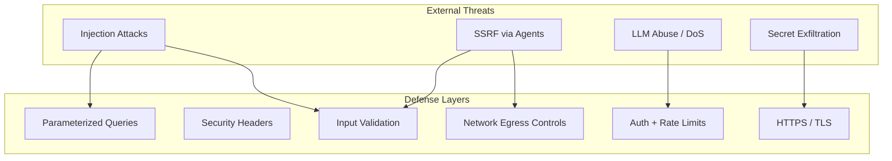
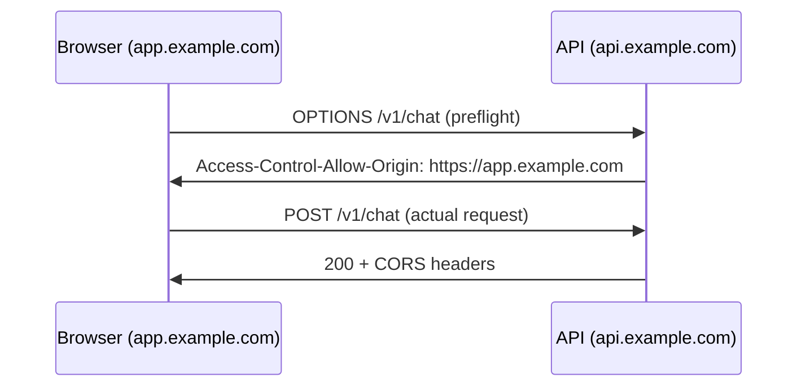
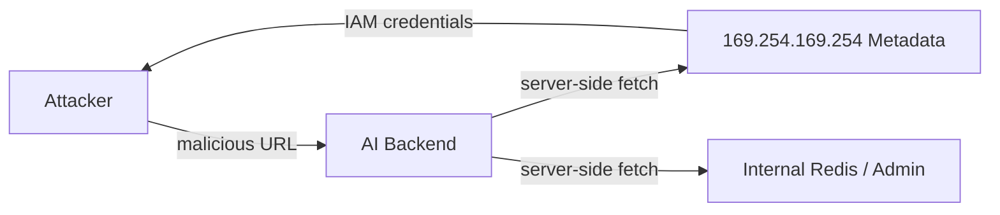
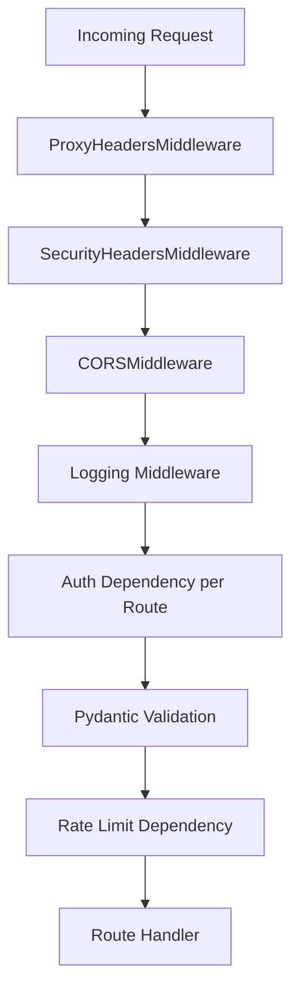

# Security for AI Backends

> Practical defenses for AI API backends — stop injection, SSRF in agent tools, credential leaks, and unauthenticated LLM spend before they reach production.

## Table of Contents

- [Why Security Differs for AI Backends](#why-security-differs-for-ai-backends)
- [Defense in Depth](#defense-in-depth)
- [HTTPS and Transport Security](#https-and-transport-security)
- [CORS](#cors)
- [CSRF Overview](#csrf-overview)
- [Input Validation](#input-validation)
- [SQL Injection](#sql-injection)
- [Cross-Site Scripting (XSS)](#cross-site-scripting-xss)
- [Server-Side Request Forgery (SSRF)](#server-side-request-forgery-ssrf)
- [Secrets Management](#secrets-management)
- [Rate Limiting](#rate-limiting)
- [Security Headers](#security-headers)
- [FastAPI Security Middleware Stack](#fastapi-security-middleware-stack)
- [Production Considerations](#production-considerations)
- [Common Mistakes](#common-mistakes)
- [Interview Preparation](#interview-preparation)
- [Navigation](#navigation)

---

## Why Security Differs for AI Backends

Standard API security applies, but AI backends introduce **unique attack surfaces**:

| AI-Specific Risk | Why It Matters |
|------------------|----------------|
| Unauthenticated LLM endpoints | Direct monetary loss per request |
| Document upload (RAG) | Malware, zip bombs, parser exploits |
| Agent URL fetching | SSRF to internal metadata services |
| Prompt injection | Bypasses auth logic in agent tools |
| Long context inputs | DoS via token exhaustion |
| Tool calling | Arbitrary function execution if unchecked |
| Embedding endpoints | Resource exhaustion at scale |

> **Production Standard:** Identity and access control are in [Authentication and Authorization for AI](authentication-authorization-for-ai.md). This document covers **transport, input, injection, SSRF, and infrastructure hardening** — the layers beneath auth.



---

## Defense in Depth

No single control stops all attacks. Layer defenses so a failure in one layer does not compromise the system.

| Layer | Controls | AI Backend Example |
|-------|----------|-------------------|
| Network | Firewall, private subnets, egress allowlists | Block agent from `169.254.169.254` |
| Transport | HTTPS, HSTS, certificate pinning (mobile) | TLS 1.2+ on all API traffic |
| Application | Auth, validation, rate limits | Per-user LLM quota |
| Data | Parameterized SQL, encryption at rest | Tenant-scoped row-level security |
| Secrets | Vault, rotation, no keys in repos | OpenAI key server-side only |
| Monitoring | Audit logs, anomaly alerts | Spike in embedding requests |

Cross-reference [Configuration and Secrets](../foundations/configuration-and-secrets.md) for secret storage patterns and [HTTP Fundamentals for AI](../apis/http-fundamentals-for-ai.md) for transport-level concepts.

---

## HTTPS and Transport Security

All production AI APIs must serve traffic over **HTTPS**. TLS encrypts tokens, API keys in headers, uploaded documents, and chat history in transit.

### Requirements

| Requirement | Implementation |
|-------------|----------------|
| TLS 1.2 minimum | Terminate at load balancer (ALB, nginx, Cloudflare) |
| Valid certificates | Let's Encrypt or managed certs; auto-renewal |
| HSTS | `Strict-Transport-Security: max-age=31536000; includeSubDomains` |
| No mixed content | Frontend loads API over HTTPS only |
| Secure cookies | `Secure; HttpOnly; SameSite=Lax` for session auth |

### nginx TLS Termination

```nginx
server {
    listen 443 ssl http2;
    server_name api.example.com;

    ssl_certificate     /etc/letsencrypt/live/api.example.com/fullchain.pem;
    ssl_certificate_key /etc/letsencrypt/live/api.example.com/privkey.pem;
    ssl_protocols       TLSv1.2 TLSv1.3;
    ssl_ciphers         HIGH:!aNULL:!MD5;

    add_header Strict-Transport-Security "max-age=31536000; includeSubDomains" always;

    location / {
        proxy_pass http://uvicorn:8000;
        proxy_set_header Host $host;
        proxy_set_header X-Real-IP $remote_addr;
        proxy_set_header X-Forwarded-Proto $scheme;
        proxy_set_header X-Forwarded-For $proxy_add_x_forwarded_for;
    }
}
```

### FastAPI Behind Proxy

```python
# app/main.py
from fastapi import FastAPI
from uvicorn.middleware.proxy_headers import ProxyHeadersMiddleware

app = FastAPI()
app.add_middleware(ProxyHeadersMiddleware, trusted_hosts=["10.0.0.0/8", "172.16.0.0/12"])
```

> **Never** expose Uvicorn directly to the public internet without a reverse proxy handling TLS.

---

## CORS

**Cross-Origin Resource Sharing** controls which browser origins can call your API. Misconfigured CORS either blocks legitimate frontends or opens your API to cross-origin abuse.

### How CORS Works

Browsers send a preflight `OPTIONS` request for non-simple cross-origin calls. The server responds with `Access-Control-Allow-Origin` and related headers.



### FastAPI CORS Configuration

```python
from fastapi import FastAPI
from fastapi.middleware.cors import CORSMiddleware

app = FastAPI()

ALLOWED_ORIGINS = [
    "https://app.example.com",
    "https://staging.example.com",
]

# Development only — never in production
if settings.app_env == "development":
    ALLOWED_ORIGINS.append("http://localhost:3000")

app.add_middleware(
    CORSMiddleware,
    allow_origins=ALLOWED_ORIGINS,       # never use ["*"] with credentials
    allow_credentials=True,
    allow_methods=["GET", "POST", "PUT", "DELETE", "OPTIONS"],
    allow_headers=["Authorization", "Content-Type", "X-Request-ID"],
    max_age=600,
)
```

### CORS Rules for AI Backends

| Rule | Rationale |
|------|-----------|
| Never `allow_origins=["*"]` with `allow_credentials=True` | Browser spec violation; security hole |
| Whitelist exact origins | Subdomain takeover breaks wildcard trust |
| Restrict `allow_headers` | Don't reflect arbitrary client headers |
| Separate staging origins | Prevent staging API called from prod frontend |
| CORS is not auth | Server-side callers (curl, agents) ignore CORS |

---

## CSRF Overview

**Cross-Site Request Forgery** tricks a logged-in user's browser into making unwanted requests to your API using their session cookie.

### When CSRF Matters

| API Style | CSRF Risk |
|-----------|-----------|
| Session cookie auth (browser) | **High** — classic CSRF target |
| JWT in `Authorization` header | **Low** — browsers don't auto-send custom headers |
| API key in header | **Low** |
| OAuth Bearer token | **Low** |

Most AI backends use **JWT or API keys in headers**, which are not vulnerable to classic CSRF because attackers cannot set custom headers in cross-origin form submissions.

### When You Still Need CSRF Protection

- Session-based auth with cookie storage
- `SameSite=None` cookies for cross-site embedding
- Endpoints accepting `application/x-www-form-urlencoded` with cookies

### Defenses

```python
# Option 1: SameSite cookies (preferred for session auth)
response.set_cookie(
    key="session_id",
    value=session_token,
    httponly=True,
    secure=True,
    samesite="lax",  # or "strict" if no cross-site needs
)

# Option 2: Double-submit cookie or CSRF token header
# Validate X-CSRF-Token matches server-issued token on state-changing requests
```

> **For JWT-in-header AI APIs:** CSRF is typically not your primary concern. Focus on token theft (XSS), auth bypass, and rate limiting instead. See [Authentication and Authorization for AI](authentication-authorization-for-ai.md).

---

## Input Validation

Validate **all** external input at the API boundary with Pydantic models. AI backends receive unusually large and varied inputs — prompts, file uploads, tool parameters, and agent actions.

### Pydantic Validation

```python
from pydantic import BaseModel, Field, field_validator
import re

class ChatRequest(BaseModel):
    message: str = Field(..., min_length=1, max_length=32_000)
    conversation_id: str = Field(..., pattern=r"^[a-zA-Z0-9_-]{1,64}$")
    temperature: float = Field(default=0.7, ge=0.0, le=2.0)

    @field_validator("message")
    @classmethod
    def strip_control_chars(cls, v: str) -> str:
        return re.sub(r"[\x00-\x08\x0b\x0c\x0e-\x1f]", "", v)


class DocumentUploadMeta(BaseModel):
    filename: str = Field(..., max_length=255)
    content_type: str = Field(..., pattern=r"^(application/pdf|text/plain)$")
    size_bytes: int = Field(..., gt=0, le=50_000_000)  # 50 MB cap
```

### AI-Specific Validation Checklist

| Input | Validation |
|-------|------------|
| User prompt | Max length, strip null bytes, optional profanity filter |
| File uploads | MIME type, extension allowlist, size limit, virus scan |
| `top_k` / `max_tokens` | Bounded integers — prevent resource exhaustion |
| Tool parameters | JSON schema validation before execution |
| URLs (agent tools) | Scheme allowlist, block private IPs — see SSRF section |
| Conversation IDs | UUID or slug pattern — prevent path traversal |

```python
from fastapi import HTTPException, UploadFile

ALLOWED_MIME = {"application/pdf", "text/plain", "text/markdown"}
MAX_UPLOAD_BYTES = 50 * 1024 * 1024

async def validate_upload(file: UploadFile) -> None:
    if file.content_type not in ALLOWED_MIME:
        raise HTTPException(400, "Unsupported file type")
    file.file.seek(0, 2)
    size = file.file.tell()
    file.file.seek(0)
    if size > MAX_UPLOAD_BYTES:
        raise HTTPException(413, "File too large")
```

Cross-reference [API Design for AI](../apis/api-design-for-ai.md) for error envelope conventions on validation failures.

---

## SQL Injection

**SQL injection** occurs when user input is concatenated into SQL strings. Attackers can read, modify, or delete data — including other tenants' conversations and embedded documents.

### Vulnerable Pattern (Never Do This)

```python
# DANGEROUS — string interpolation in SQL
async def search_documents(user_query: str):
    sql = f"SELECT * FROM documents WHERE title LIKE '%{user_query}%'"
    return await db.execute(text(sql))
```

### Safe Pattern — SQLAlchemy ORM

```python
from sqlalchemy import select
from app.models import Document

async def search_documents(db, user_query: str, tenant_id: str):
    stmt = (
        select(Document)
        .where(Document.tenant_id == tenant_id)
        .where(Document.title.ilike(f"%{user_query}%"))
    )
    result = await db.execute(stmt)
    return result.scalars().all()
```

SQLAlchemy parameterizes values automatically — user input never becomes SQL syntax.

### Safe Pattern — Raw SQL with Bind Parameters

```python
from sqlalchemy import text

async def search_by_embedding(db, tenant_id: str, query: str):
    stmt = text("""
        SELECT id, title, embedding <=> :query_embedding AS distance
        FROM documents
        WHERE tenant_id = :tenant_id
        ORDER BY distance
        LIMIT :limit
    """)
    return await db.execute(stmt, {
        "tenant_id": tenant_id,
        "query_embedding": embedding_vector,
        "limit": 10,
    })
```

### SQL Injection Prevention Checklist

| Practice | Status |
|----------|--------|
| ORM or parameterized queries everywhere | Required |
| Never f-string SQL with user input | Required |
| Least-privilege DB user (no `SUPERUSER`) | Required |
| Row-level tenant filtering in every query | Required for multi-tenant |
| ORM `order_by` from user input — use allowlist | Required |
| Regular dependency scanning (`pip-audit`) | Recommended |

See [SQLAlchemy for AI Applications](../databases/postgresql/sqlalchemy-for-ai-applications.md) for ORM patterns.

---

## Cross-Site Scripting (XSS)

**XSS** injects malicious scripts into content rendered by a browser. AI backends contribute to XSS risk when they return user-generated or LLM-generated content that frontends render as HTML.

### Backend Responsibilities

| Responsibility | Implementation |
|----------------|----------------|
| Set `Content-Type` correctly | `application/json` for API responses |
| Encode output if serving HTML | Use templating auto-escape (Jinja2) |
| Sanitize if storing rich text | Allowlist tags server-side |
| CSP headers | Restrict script sources — see Security Headers |
| Never reflect raw input in error messages | Generic error envelopes |

### JSON APIs Are Lower Risk

Pure JSON APIs consumed by React/Vue (which escape by default) have lower XSS risk than server-rendered HTML. Risk increases when:

- LLM output is rendered with `dangerouslySetInnerHTML`
- Chat messages include markdown rendered to HTML without sanitization
- Admin dashboards display raw log output

```python
# Return structured data — let frontend handle rendering safely
class ChatResponse(BaseModel):
    content: str          # frontend escapes on render
    content_type: Literal["text/plain", "markdown"] = "text/plain"
    format_version: int = 1
```

### Markdown Rendering Warning

If your backend converts markdown to HTML before sending to clients, sanitize with an allowlist library:

```python
import bleach

ALLOWED_TAGS = ["p", "br", "strong", "em", "code", "pre", "ul", "ol", "li", "a"]
ALLOWED_ATTRS = {"a": ["href", "title"]}

def sanitize_html(raw_html: str) -> str:
    return bleach.clean(raw_html, tags=ALLOWED_TAGS, attributes=ALLOWED_ATTRS, strip=True)
```

---

## Server-Side Request Forgery (SSRF)

**SSRF** is critical for AI backends. Agents and RAG pipelines fetch URLs — attackers can probe internal networks, cloud metadata endpoints, and services bound to localhost.

### Attack Scenarios in AI Apps

| Feature | SSRF Vector |
|---------|-------------|
| "Summarize this URL" tool | `http://169.254.169.254/latest/meta-data/` |
| Web page loader for RAG | `http://localhost:6379/` (Redis) |
| Webhook callbacks | Internal admin panels |
| Image URL in multimodal prompt | `file:///etc/passwd` (if handler supports it) |
| Redirect following | Open redirect → internal target |



### SSRF Defenses

```python
import ipaddress
import socket
from urllib.parse import urlparse

BLOCKED_NETWORKS = [
    ipaddress.ip_network("127.0.0.0/8"),
    ipaddress.ip_network("10.0.0.0/8"),
    ipaddress.ip_network("172.16.0.0/12"),
    ipaddress.ip_network("192.168.0.0/16"),
    ipaddress.ip_network("169.254.0.0/16"),
    ipaddress.ip_network("::1/128"),
    ipaddress.ip_network("fc00::/7"),
]

ALLOWED_SCHEMES = {"http", "https"}


def validate_url(url: str) -> str:
    parsed = urlparse(url)

    if parsed.scheme not in ALLOWED_SCHEMES:
        raise ValueError(f"Scheme not allowed: {parsed.scheme}")

    hostname = parsed.hostname
    if not hostname:
        raise ValueError("Missing hostname")

    # Block obvious internal hostnames
    blocked_hosts = {"localhost", "metadata.google.internal", "metadata"}
    if hostname.lower() in blocked_hosts:
        raise ValueError("Blocked hostname")

    # Resolve DNS and check IP — prevents DNS rebinding if done at fetch time
    resolved_ips = socket.getaddrinfo(hostname, parsed.port or 443)
    for family, _, _, _, sockaddr in resolved_ips:
        ip = ipaddress.ip_address(sockaddr[0])
        for network in BLOCKED_NETWORKS:
            if ip in network:
                raise ValueError(f"Blocked IP range: {ip}")

    return url
```

### SSRF Hardening Checklist

| Control | Priority |
|---------|----------|
| URL scheme allowlist (`http`, `https` only) | Required |
| Block private/reserved IP ranges after DNS resolve | Required |
| Disable redirect following or re-validate each hop | Required |
| Egress firewall / VPC security groups | Required in production |
| Separate fetch service with no IAM role | Recommended |
| Timeout and size limits on fetched content | Required |
| Audit log every URL fetch with user attribution | Required |

---

## Secrets Management

AI backends hold high-value secrets: LLM API keys, database credentials, JWT signing keys, vector DB tokens, and encryption keys.

### Rules

| Rule | Detail |
|------|--------|
| Never commit secrets | `.env` in `.gitignore`; use `.env.example` with placeholders |
| Never expose LLM keys to frontend | Backend proxy pattern — users get app JWT, not OpenAI key |
| Rotate on compromise | Automated rotation for DB passwords and API keys |
| Least privilege | Separate keys per environment (dev/staging/prod) |
| Inject at runtime | Environment variables, AWS Secrets Manager, Vault |
| Audit access | Log secret reads in production (not values) |

```python
# app/config/settings.py
from pydantic_settings import BaseSettings, SettingsConfigDict


class Settings(BaseSettings):
    model_config = SettingsConfigDict(env_file=".env", env_file_encoding="utf-8")

    openai_api_key: str
    database_url: str
    jwt_secret: str

    @property
    def is_production(self) -> bool:
        return self.app_env == "production"


# Validate at startup — fail fast if secrets missing
settings = Settings()
```

### Secret Scanning in CI

```yaml
# .github/workflows/security.yml
- uses: trufflesecurity/trufflehog@main
  with:
    extra_args: --only-verified
```

See [Configuration and Secrets](../foundations/configuration-and-secrets.md) for full patterns.

---

## Rate Limiting

Rate limiting protects against abuse, controls LLM spend, and mitigates DoS. AI endpoints are expensive — rate limits are a **billing control**, not just a security nicety.

### Rate Limit Dimensions

| Dimension | Example |
|-----------|---------|
| Per IP | 100 requests/minute for anonymous |
| Per user | 50 chat messages/hour |
| Per API key | 10,000 embedding calls/day |
| Per endpoint | 5 document uploads/hour |
| Global | Circuit breaker at provider 429 threshold |

### Redis Sliding Window Limiter

```python
import time
from fastapi import HTTPException, Request
import redis.asyncio as redis

class RedisRateLimiter:
    def __init__(self, redis_client: redis.Redis, max_requests: int, window_seconds: int):
        self.redis = redis_client
        self.max_requests = max_requests
        self.window_seconds = window_seconds

    async def check(self, key: str) -> None:
        now = time.time()
        pipe = self.redis.pipeline()
        pipe.zremrangebyscore(key, 0, now - self.window_seconds)
        pipe.zadd(key, {str(now): now})
        pipe.zcard(key)
        pipe.expire(key, self.window_seconds)
        _, _, count, _ = await pipe.execute()

        if count > self.max_requests:
            raise HTTPException(
                status_code=429,
                detail="Rate limit exceeded",
                headers={"Retry-After": str(self.window_seconds)},
            )
```

### FastAPI Dependency

```python
from fastapi import Depends, Request

async def rate_limit_chat(request: Request, user=Depends(get_current_user)):
    limiter = request.app.state.rate_limiter
    await limiter.check(f"chat:{user.id}")
```

### Rate Limit Response Headers

```python
# Inform clients of limits (GitHub-style)
headers = {
    "X-RateLimit-Limit": "50",
    "X-RateLimit-Remaining": "42",
    "X-RateLimit-Reset": "1720867200",
}
```

Cross-reference [Authentication and Authorization for AI](authentication-authorization-for-ai.md) for per-tenant quotas and [Redis for AI](../databases/redis/redis-for-ai.md) for distributed rate limiting.

---

## Security Headers

HTTP security headers harden browsers against common attacks. Set them at the reverse proxy or via middleware.

| Header | Value | Purpose |
|--------|-------|---------|
| `Strict-Transport-Security` | `max-age=31536000; includeSubDomains` | Force HTTPS |
| `X-Content-Type-Options` | `nosniff` | Prevent MIME sniffing |
| `X-Frame-Options` | `DENY` or `SAMEORIGIN` | Clickjacking protection |
| `Content-Security-Policy` | Restrictive policy | XSS mitigation |
| `Referrer-Policy` | `strict-origin-when-cross-origin` | Limit referrer leakage |
| `Permissions-Policy` | `camera=(), microphone=()` | Disable unused browser APIs |
| `Cache-Control` | `no-store` on auth endpoints | Prevent caching sensitive responses |

### FastAPI Security Headers Middleware

```python
from starlette.middleware.base import BaseHTTPMiddleware
from starlette.requests import Request


class SecurityHeadersMiddleware(BaseHTTPMiddleware):
    async def dispatch(self, request: Request, call_next):
        response = await call_next(request)
        response.headers["X-Content-Type-Options"] = "nosniff"
        response.headers["X-Frame-Options"] = "DENY"
        response.headers["Referrer-Policy"] = "strict-origin-when-cross-origin"
        response.headers["Permissions-Policy"] = "camera=(), microphone=(), geolocation=()"
        if request.url.scheme == "https":
            response.headers["Strict-Transport-Security"] = "max-age=31536000; includeSubDomains"
        return response


app.add_middleware(SecurityHeadersMiddleware)
```

### CSP for API + Frontend

CSP is primarily a frontend concern, but if your backend serves any HTML (docs, admin):

```
Content-Security-Policy: default-src 'self'; script-src 'self'; style-src 'self' 'unsafe-inline'; img-src 'self' data: https:; connect-src 'self' https://api.example.com
```

---

## FastAPI Security Middleware Stack

Recommended middleware order (first added = outermost):

```python
from fastapi import FastAPI
from fastapi.middleware.cors import CORSMiddleware
from uvicorn.middleware.proxy_headers import ProxyHeadersMiddleware

app = FastAPI()

# 1. Proxy headers (trust X-Forwarded-* from load balancer)
app.add_middleware(ProxyHeadersMiddleware, trusted_hosts=["10.0.0.0/8"])

# 2. Security headers
app.add_middleware(SecurityHeadersMiddleware)

# 3. CORS (after security headers)
app.add_middleware(CORSMiddleware, allow_origins=ALLOWED_ORIGINS, ...)

# 4. Request ID / logging middleware
# 5. Auth is per-route via Depends — not global middleware
```



---

## Production Considerations

- **Threat model per feature** — document upload, URL fetch, and tool execution each need separate analysis.
- **Dependency scanning** — run `pip-audit` or Snyk in CI; AI stacks have many dependencies.
- **Penetration testing** — especially SSRF on agent tools and tenant isolation on RAG data.
- **Audit logging** — log auth events, rate limit hits, URL fetches, and admin actions with `user_id` and `request_id`.
- **WAF** — Cloudflare/AWS WAF for common attack patterns at the edge.
- **Principle of least privilege** — DB user, IAM role, and API key scopes minimized per service.
- **Incident response** — key rotation runbook; ability to revoke all JWTs via blocklist in Redis.
- **Security vs UX** — rate limits should return `429` with `Retry-After`, not opaque 500s.

---

## Common Mistakes

| Mistake | Impact | Fix |
|---------|--------|-----|
| `allow_origins=["*"]` with credentials | CORS bypass / auth leak | Explicit origin whitelist |
| LLM API key in frontend env | Key theft, unlimited spend | Backend proxy only |
| Raw SQL with f-strings | SQL injection | ORM + bind parameters |
| Agent fetches any URL | SSRF to metadata service | URL validator + egress firewall |
| No upload size limit | DoS / disk exhaustion | `max_length` + streaming limits |
| Secrets in git history | Permanent exposure | trufflehog + rotate keys |
| Rate limit only by IP | Shared NAT blocks legit users | Per-user + per-IP layers |
| Trusting `Content-Type` from client | Malware upload bypass | Magic byte validation |
| Missing security headers | XSS/clickjacking risk | Middleware or nginx headers |
| Ignoring prompt injection | Tool auth bypass | Tool allowlists, human confirmation |

---

## Interview Preparation

### Frequently Asked Questions

**Q1: How is securing an AI backend different from a regular API?**

> **Strong answer:** Same fundamentals plus AI-specific risks: unauthenticated LLM spend, SSRF via agent URL tools, resource exhaustion via large prompts/embeddings, document upload attacks, and prompt injection affecting tool execution. Emphasize rate limiting as billing control and SSRF defenses for RAG/agents.

**Q2: How do you prevent SQL injection in a FastAPI + SQLAlchemy app?**

> **Strong answer:** Always use ORM queries or `text()` with bind parameters — never f-string SQL. Least-privilege DB user. Tenant scoping on every query. Allowlist for dynamic `ORDER BY`. Mention SQLAlchemy parameterization and optional `pip-audit`.

**Q3: Explain SSRF and why it matters for AI agents.**

> **Strong answer:** SSRF makes the server fetch attacker-chosen URLs. AI agents with "browse web" or "summarize URL" tools are vectors to reach `169.254.169.254` (cloud metadata), internal Redis, or admin panels. Defenses: scheme allowlist, block private IPs after DNS resolve, no redirect follow, egress firewall, separate fetch service with no IAM role.

**Q4: Do JWT-based AI APIs need CSRF protection?**

> **Strong answer:** Generally no — browsers don't auto-attach `Authorization: Bearer` headers in cross-origin form posts. CSRF matters for cookie-session auth. Focus on XSS preventing token theft, secure storage, short token TTL, and refresh token rotation. Mention `SameSite` cookies if using session auth.

### Real-World Scenario

**Scenario:** A user reports that asking your agent to "summarize http://169.254.169.254/latest/meta-data/" returned AWS instance role credentials in the chat.

> **Discussion points:** Classic SSRF via agent URL tool. Immediate: disable URL fetch, rotate IAM credentials. Fix: URL validator blocking metadata IPs, egress security groups, fetch service without IAM role, audit logging of all URL fetches, alert on metadata IP access attempts.

---

## Navigation

### Prerequisites

- [HTTP Fundamentals for AI](../apis/http-fundamentals-for-ai.md) — TLS, headers, status codes
- [Authentication and Authorization for AI](authentication-authorization-for-ai.md) — JWT, RBAC, protected routes
- [Configuration and Secrets](../foundations/configuration-and-secrets.md) — secret storage

### Related Topics

- [API Design for AI](../apis/api-design-for-ai.md) — validation error envelopes
- [Backend Fundamentals for AI](../backend-engineering/backend-fundamentals-for-ai.md) — middleware stack
- [SQLAlchemy for AI Applications](../databases/postgresql/sqlalchemy-for-ai-applications.md) — safe queries
- [Redis for AI](../databases/redis/redis-for-ai.md) — rate limiting backend

### Next Topics

- [Testing Backend for AI](../backend-engineering/testing-backend-for-ai.md) — security test cases
- [Backend Performance for AI](../performance-optimization/backend-performance-for-ai.md) — rate limit tuning
- [AI Safety](../ai-safety/README.md) — prompt injection depth

### Future Reading

- [Observability](../observability/README.md) — security audit logging
- [Production Incidents](../production-incidents/README.md) — incident response

---

## See Also

- [Security Domain README](README.md)
- [OWASP API Security Top 10](https://owasp.org/API-Security/)
- [OWASP LLM Top 10](https://owasp.org/www-project-top-10-for-large-language-model-applications/)
- [Master Index](../../meta/indexes/MASTER-INDEX.md)

## Changelog

| Version | Date | Changes |
|---------|------|---------|
| 1.0 | 2026-07-13 | Initial release |
