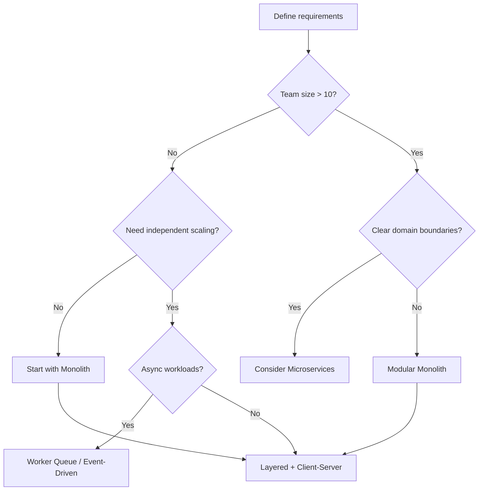
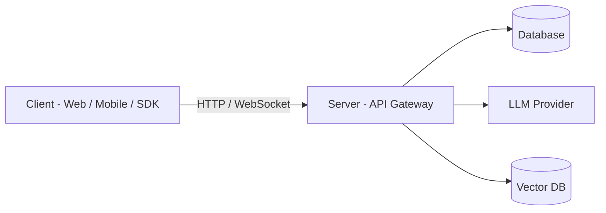
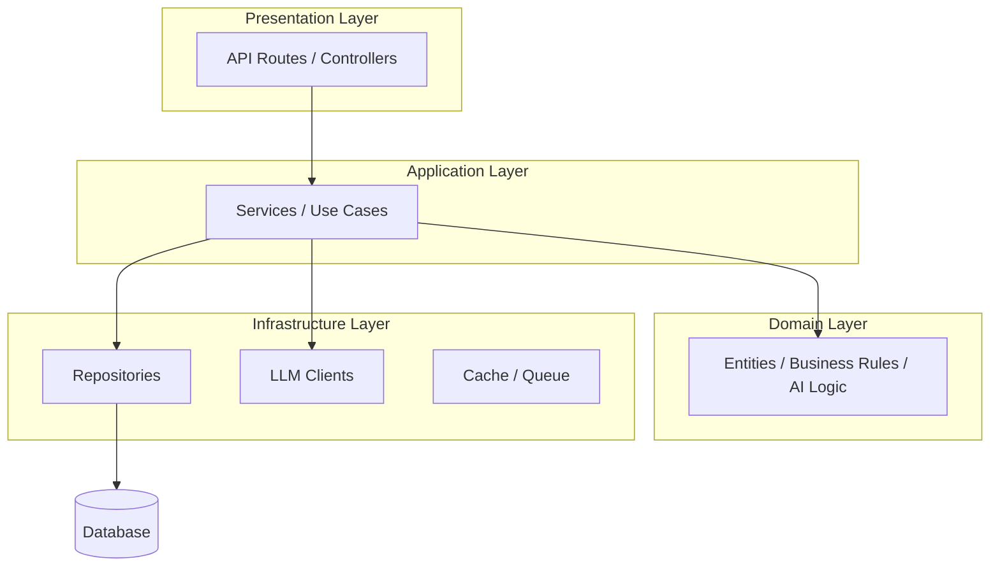
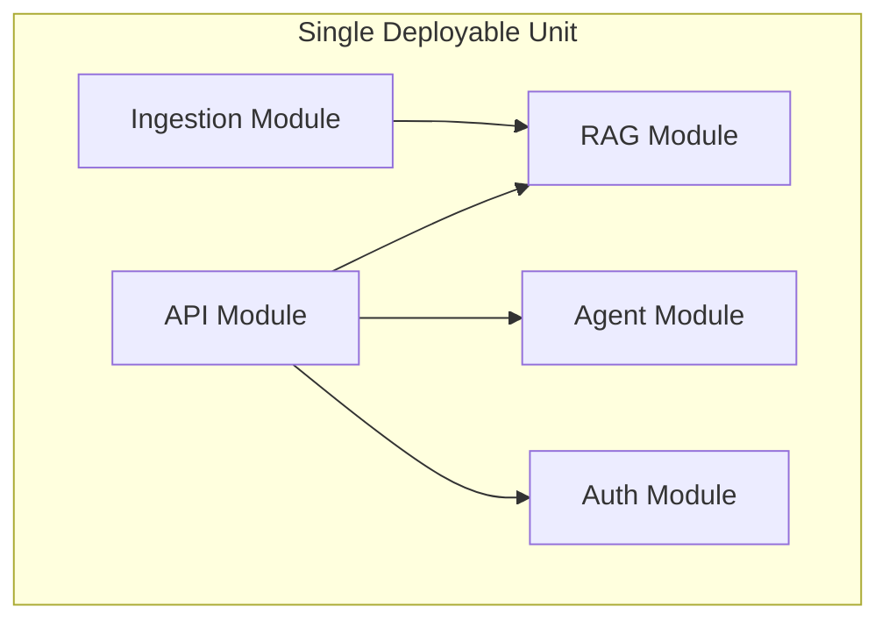
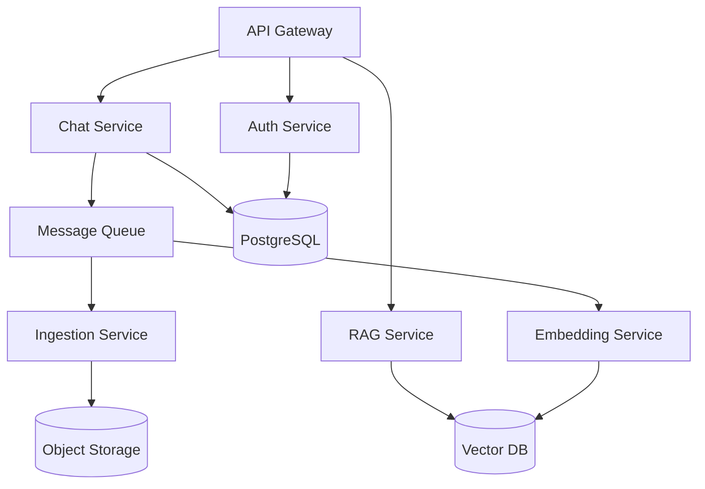
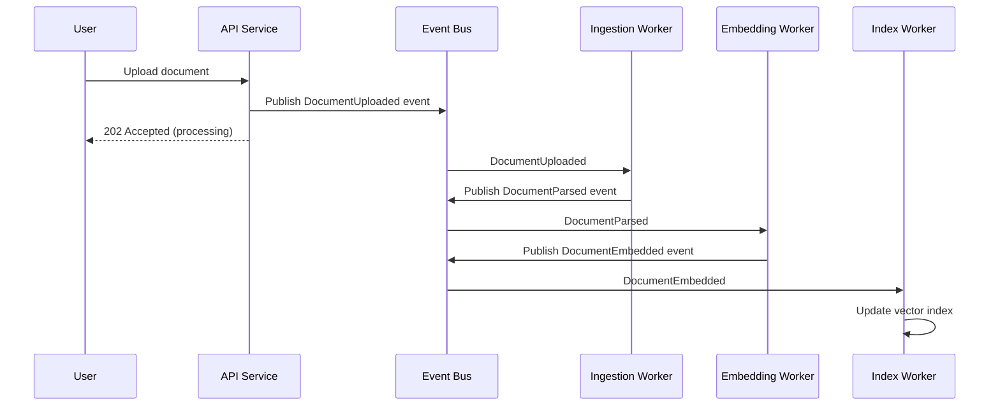
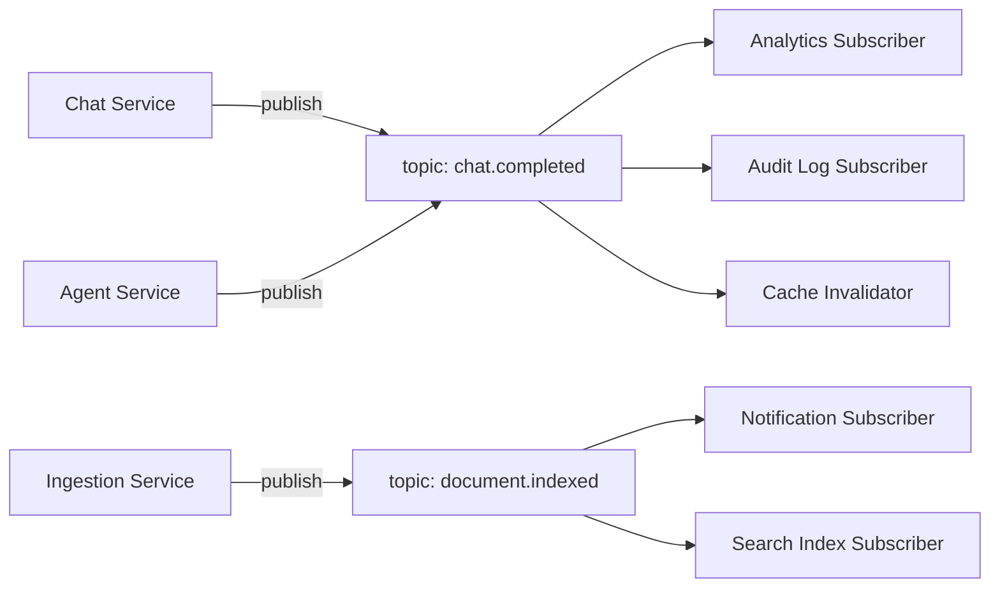
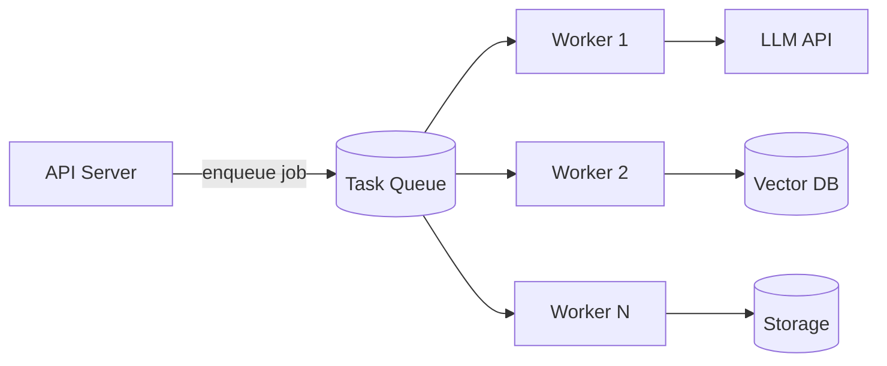
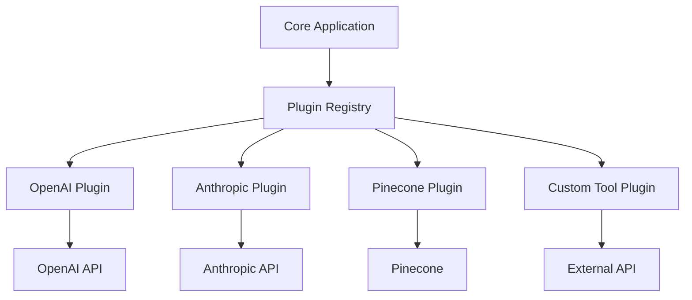
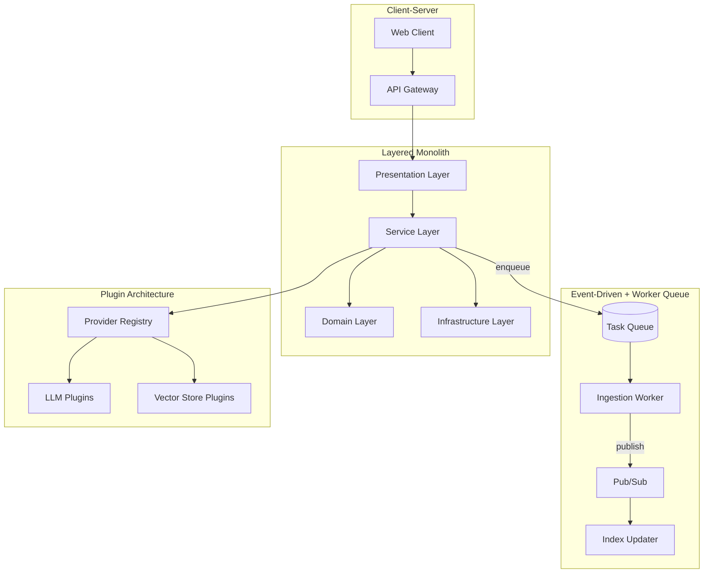

# Architecture Patterns Foundation

> Architecture patterns are reusable solutions to recurring structural problems. This guide covers the foundational patterns every AI engineer must recognize — when to apply them, when to avoid them, and how they appear in production AI systems.

## Table of Contents

- [Why Architecture Patterns Matter](#why-architecture-patterns-matter)
- [Pattern Selection Framework](#pattern-selection-framework)
- [Client-Server](#client-server)
- [Layered Architecture](#layered-architecture)
- [Monolith](#monolith)
- [Microservices](#microservices)
- [Event-Driven Architecture](#event-driven-architecture)
- [Pub/Sub](#pubsub)
- [Worker Queue](#worker-queue)
- [Plugin Architecture](#plugin-architecture)
- [Combining Patterns](#combining-patterns)
- [Production Considerations](#production-considerations)
- [Common Mistakes](#common-mistakes)
- [Interview Preparation](#interview-preparation)
- [Navigation](#navigation)

---

## Why Architecture Patterns Matter

Choosing the wrong architecture early is expensive to reverse. AI applications amplify this risk because they combine traditional backend concerns (APIs, databases, auth) with new ones (async inference, vector stores, agent orchestration, evaluation pipelines).

| Decision | Wrong Pattern | Consequence |
|----------|---------------|-------------|
| MVP chatbot | Microservices from day one | Operational overhead kills velocity |
| Multi-tenant SaaS | Monolith without boundaries | Cannot scale teams or components |
| Document ingestion | Synchronous request-response | Timeouts, poor UX |
| Multi-model platform | Hardcoded provider logic | Cannot add models without rewrites |

> **Production Standard:** Start with the simplest pattern that meets current requirements. Extract services and async boundaries when measured pain — not anticipated scale — demands it.

See [Software Engineering for AI](../foundations/software-engineering-for-ai.md) for how these patterns map to code organization.

---

## Pattern Selection Framework

Use constraints — not hype — to select patterns.



### Pattern Comparison Matrix

| Pattern | Complexity | Scalability | Team Autonomy | Best For |
|---------|-----------|-------------|---------------|----------|
| Client-Server | Low | Medium | Low | Any networked app |
| Layered | Low | Medium | Medium | Most backend apps |
| Monolith | Low–Medium | Vertical | Low | MVPs, small teams |
| Microservices | High | Horizontal | High | Large orgs, clear domains |
| Event-Driven | Medium–High | High | Medium | Decoupled workflows |
| Pub/Sub | Medium | High | Medium | Fan-out notifications |
| Worker Queue | Medium | High | Medium | Background processing |
| Plugin | Medium | Medium | High | Extensible platforms |

---

## Client-Server

The client-server pattern separates **consumers** (clients) from **providers** (servers) over a network. It is the foundation of virtually every AI application.

### Structure



### Components

| Component | Responsibility |
|-----------|---------------|
| **Client** | UI rendering, input validation, streaming display |
| **Server** | Business logic, auth, orchestration, data access |
| **Protocol** | HTTP REST, GraphQL, WebSocket, gRPC |

### AI Application Examples

- **Chat UI (React)** → **FastAPI backend** → **OpenAI API**
- **Mobile app** → **API gateway** → **RAG service**
- **CLI tool** → **Internal API** → **Agent orchestrator**

### Production Considerations

- Use **WebSockets or SSE** for streaming LLM responses — not polling
- Implement **timeouts and retries** on the client side for resilience
- Never expose LLM API keys to the client — all model calls go through the server
- Rate limit at the server boundary

### When to Use

- Any application with a separate frontend and backend
- When you need centralized auth, logging, and business logic

### When Not to Use

- Pure server-side batch jobs with no user-facing interface (no client needed)
- Peer-to-peer systems where no central authority is desired

---

## Layered Architecture

Layered architecture organizes code into horizontal tiers, each with a specific responsibility. Dependencies flow downward — upper layers depend on lower layers, never the reverse.

### Structure



### Layer Responsibilities

| Layer | Contains | Must Not Contain |
|-------|----------|-----------------|
| **Presentation** | Route handlers, request validation, response formatting | Business logic, SQL queries |
| **Application** | Use case orchestration, transaction boundaries | HTTP details, raw SDK calls |
| **Domain** | Entities, AI orchestration, interfaces/ports | Framework imports |
| **Infrastructure** | DB adapters, LLM SDK wrappers, cache clients | Business rules |

### AI-Specific Layer Mapping

```python
# Presentation: api/routes/chat.py
@router.post("/chat")
async def chat(request: ChatRequest, service: ChatService = Depends()):
    return await service.handle(request)


# Application: services/chat_service.py
class ChatService:
    def __init__(self, llm: LLMClient, retriever: Retriever):
        self._llm = llm
        self._retriever = retriever

    async def handle(self, request: ChatRequest) -> ChatResponse:
        context = await self._retriever.search(request.query)
        return await self._llm.complete(request.query, context)


# Domain: domain/ports/llm.py
class LLMClient(ABC):
    @abstractmethod
    async def complete(self, query: str, context: str) -> ChatResponse: ...


# Infrastructure: infrastructure/llm/openai_client.py
class OpenAIClient(LLMClient):
    async def complete(self, query: str, context: str) -> ChatResponse:
        ...
```

### When to Use

- Default choice for most AI backend applications
- When you need testability via layer isolation
- When onboarding engineers who need clear code navigation

### When Not to Use

- Simple scripts or notebooks (overhead exceeds benefit)
- Performance-critical paths where layer indirection adds unacceptable latency (rare)

> Deep dive: [Software Engineering for AI](../foundations/software-engineering-for-ai.md#layered-architecture)

---

## Monolith

A (modular) monolith is a single deployable unit containing all application functionality, organized into well-defined internal modules.

### Structure



### Advantages

| Advantage | Detail |
|-----------|--------|
| **Simple deployment** | One artifact, one pipeline |
| **Easy debugging** | Single process, unified logs |
| **Low latency** | In-process calls, no network overhead |
| **Fast iteration** | No cross-service coordination for changes |
| **Transactional consistency** | Single database, ACID transactions |

### Disadvantages

| Disadvantage | Detail |
|-------------|--------|
| **Scaling** | Must scale entire app, not individual components |
| **Technology lock-in** | One language/runtime per deployable |
| **Team coupling** | Large teams can step on each other without module discipline |
| **Deploy risk** | Any change redeploys everything |

### Modular Monolith — The Sweet Spot for AI Startups

Organize a monolith with strict module boundaries so you can extract services later without rewriting:

```
src/
├── modules/
│   ├── chat/           # Chat API + service
│   ├── rag/            # Retrieval pipeline
│   ├── ingestion/      # Document processing
│   ├── agents/         # Agent orchestration
│   └── shared/         # Common utilities, interfaces
├── api/                # Route registration
└── main.py             # Composition root
```

**Rules for modular monoliths:**

- Modules communicate through **public interfaces**, not internal imports
- Each module owns its **data access** (no cross-module SQL)
- Shared kernel is minimal — resist the "utils" dumping ground

### When to Use

- MVP and early-stage AI products
- Teams under 10 engineers
- When deployment simplicity outweighs independent scaling

### When Not to Use

- Proven need to scale components independently (inference vs ingestion)
- Multiple teams needing independent release cycles
- Regulatory requirements for service isolation

---

## Microservices

Microservices decompose an application into independently deployable services, each owning a bounded context.

### Structure



### Service Boundary Principles

| Principle | Application |
|-----------|-------------|
| **Single responsibility** | Ingestion service handles documents; RAG service handles retrieval |
| **Own your data** | Each service has its own database — no shared tables |
| **Decentralized governance** | Teams choose appropriate tech per service |
| **Design for failure** | Circuit breakers, retries, fallbacks between services |
| **Infrastructure automation** | CI/CD per service, container orchestration |

### AI Microservice Decomposition Example

| Service | Responsibility | Scale Driver |
|---------|---------------|--------------|
| **API Gateway** | Auth, routing, rate limiting | Request volume |
| **Chat Service** | Conversation management, streaming | Concurrent users |
| **RAG Service** | Retrieval + generation orchestration | Query complexity |
| **Embedding Service** | Batch and real-time embedding | Document volume |
| **Ingestion Service** | Parse, chunk, store documents | Upload throughput |
| **Eval Service** | Run evaluation suites | Batch schedule |

### Challenges Specific to AI Microservices

- **Latency multiplication** — each network hop adds 1–10ms; a 5-service chain adds up
- **Distributed tracing required** — debug a RAG query spanning 4 services
- **Prompt versioning across services** — coordinate prompt changes across deployments
- **Eval complexity** — end-to-end evals require all services running
- **Cost attribution** — track LLM spend per service

### When to Use

- Large teams (10+) with clear domain ownership
- Components with vastly different scaling profiles
- Need for independent technology choices (Python for ML, Go for gateway)

### When Not to Use

- Early-stage products (premature decomposition)
- Teams without DevOps/SRE capacity
- When a modular monolith would suffice

---

## Event-Driven Architecture

Event-driven architecture (EDA) uses events — notifications that something happened — to trigger downstream processing. Producers emit events; consumers react asynchronously.

### Structure



### Core Concepts

| Concept | Description |
|---------|-------------|
| **Event** | Immutable record of something that happened: `DocumentUploaded`, `ChatCompleted` |
| **Producer** | Service that emits events |
| **Consumer** | Service that reacts to events |
| **Event bus/broker** | Routes events from producers to consumers |
| **Event store** | Optional persistence for event replay and audit |

### AI Use Cases

- **Document ingestion pipeline** — upload triggers parse → chunk → embed → index
- **Agent tool execution** — tool call events trigger external API actions
- **Evaluation triggers** — model deploy triggers automated eval suite
- **Audit logging** — every LLM call emits an event for compliance
- **Cache invalidation** — knowledge base update triggers cache purge

### Event vs Command

| Type | Intent | Example |
|------|--------|---------|
| **Command** | "Do this" | `EmbedDocument(doc_id=123)` |
| **Event** | "This happened" | `DocumentParsed(doc_id=123, chunks=45)` |

Prefer events for decoupling; use commands when you need a specific handler and guaranteed execution target.

### When to Use

- Multi-step async workflows (ingestion, training pipelines)
- When producers should not know about consumers
- Systems requiring audit trails and replay capability

### When Not to Use

- Simple CRUD with synchronous responses
- When event ordering and consistency are hard to reason about for the team

---

## Pub/Sub

Publish/subscribe is a messaging pattern where publishers emit messages to **topics** without knowing subscribers. Subscribers register interest in topics and receive messages asynchronously.

### Structure



### Pub/Sub vs Message Queue

| Aspect | Pub/Sub | Message Queue |
|--------|---------|---------------|
| **Delivery** | Fan-out to all subscribers | One consumer per message |
| **Coupling** | Publisher unaware of subscribers | Producer knows queue exists |
| **Ordering** | Often per-partition | Often FIFO per queue |
| **Use case** | Notifications, logging, cache invalidation | Task distribution, job processing |
| **Examples** | Google Pub/Sub, SNS | SQS, RabbitMQ queues |

### AI Application Examples

| Topic | Publishers | Subscribers |
|-------|-----------|-------------|
| `chat.completed` | Chat service | Analytics, billing, audit |
| `document.indexed` | Ingestion pipeline | Notification service, search updater |
| `eval.finished` | Eval runner | Dashboard, Slack notifier |
| `model.deployed` | CI/CD pipeline | Cache warmer, health checker |

### Production Considerations

- **At-least-once delivery** — design subscribers to be idempotent
- **Dead letter topics** — route failed messages for inspection
- **Schema registry** — enforce event schema contracts (Avro, JSON Schema)
- **Monitoring** — alert on consumer lag and DLQ depth

---

## Worker Queue

The worker queue pattern decouples task submission from task execution using a queue. Producers enqueue jobs; workers pull and process them asynchronously.

### Structure



### Components

| Component | Role | Technology Options |
|-----------|------|--------------------|
| **Queue** | Job buffer | Redis (Celery), SQS, RabbitMQ |
| **Worker** | Job processor | Celery worker, custom consumer |
| **Broker** | Message routing | Redis, RabbitMQ |
| **Result backend** | Job status storage | Redis, PostgreSQL |

### AI Workloads Ideal for Queues

| Task | Why Queue |
|------|-----------|
| Document embedding | CPU/GPU intensive, seconds to minutes |
| Batch evaluation | Long-running, should not block API |
| Report generation | Large output, async delivery |
| Index rebuilding | Resource-heavy, off-peak execution |
| Email/notification sending | Fire-and-forget side effect |

### Example: Celery Task for Document Processing

```python
from celery import Celery

app = Celery("ai_worker", broker="redis://localhost:6379/0")


@app.task(bind=True, max_retries=3, default_retry_delay=60)
def process_document(self, document_id: str) -> dict:
    try:
        doc = fetch_document(document_id)
        chunks = chunk_document(doc)
        embeddings = embed_chunks(chunks)
        store_embeddings(document_id, embeddings)
        return {"status": "completed", "chunks": len(chunks)}
    except EmbeddingAPIError as exc:
        raise self.retry(exc=exc)
```

### Production Considerations

- **Idempotency** — workers may process the same job twice (at-least-once delivery)
- **Visibility timeout** — set longer than max job duration to prevent double processing
- **Dead letter queue** — capture permanently failed jobs
- **Monitoring** — queue depth, worker health, job duration percentiles
- **Graceful shutdown** — finish in-progress jobs before terminating workers

### When to Use

- Tasks taking > 2 seconds that should not block API responses
- Workloads needing retry logic and backoff
- Burst traffic that exceeds synchronous processing capacity

### When Not to Use

- Sub-second operations where queue overhead exceeds benefit
- Tasks requiring immediate synchronous response to the user

---

## Plugin Architecture

Plugin architecture enables extending a core system with additional capabilities without modifying core code. The core defines extension points; plugins implement them.

### Structure



### Components

| Component | Responsibility |
|-----------|---------------|
| **Core** | Defines interfaces, lifecycle, plugin loading |
| **Plugin interface** | Contract plugins must implement |
| **Plugin registry** | Discovers and registers available plugins |
| **Plugin instance** | Concrete implementation of an interface |

### AI Application Examples

| Extension Point | Plugin Examples |
|----------------|----------------|
| LLM provider | OpenAI, Anthropic, local Ollama |
| Vector store | Pinecone, Weaviate, pgvector |
| Document parser | PDF, DOCX, HTML, Markdown |
| Agent tool | Web search, code execution, database query |
| Embedding model | OpenAI, Cohere, sentence-transformers |
| Output formatter | Markdown, JSON, citations |

### Implementation Pattern

```python
from abc import ABC, abstractmethod
from typing import Protocol


class LLMProvider(Protocol):
    async def complete(self, prompt: str) -> str: ...
    @property
    def name(self) -> str: ...


class ProviderRegistry:
    def __init__(self):
        self._providers: dict[str, LLMProvider] = {}

    def register(self, provider: LLMProvider) -> None:
        self._providers[provider.name] = provider

    def get(self, name: str) -> LLMProvider:
        if name not in self._providers:
            raise ValueError(f"Unknown provider: {name}")
        return self._providers[name]


# Plugins register at startup
registry = ProviderRegistry()
registry.register(OpenAIProvider())
registry.register(AnthropicProvider())
```

### When to Use

- Multi-provider platforms (support several LLMs or vector DBs)
- User-extensible systems (custom agent tools)
- Products requiring third-party integrations

### When Not to Use

- Single-provider MVP (YAGNI — you aren't gonna need it)
- When plugin interface stability is not yet understood

> See [Engineering Best Practices](../foundations/engineering-best-practices.md#abstraction) for guidance on when abstraction earns its complexity.

---

## Combining Patterns

Production AI systems combine multiple patterns. A typical architecture:



### Evolution Path

| Stage | Architecture | Trigger to Evolve |
|-------|-------------|-------------------|
| **Prototype** | Monolith + Layered | Need to ship fast |
| **Growth** | Modular Monolith + Worker Queue | Ingestion blocks API |
| **Scale** | Extract hot services + Pub/Sub | Independent scaling needed |
| **Platform** | Microservices + Plugin Architecture | Multi-team, multi-provider |

---

## Production Considerations

- **Measure before decomposing** — extract services when a specific component has proven scaling or team ownership needs.
- **Observability is non-negotiable** — distributed patterns require tracing (OpenTelemetry), structured logging, and metrics.
- **Design for failure** — every async boundary needs retry, timeout, and dead letter handling.
- **Idempotency everywhere** — events and queue messages will be delivered more than once.
- **Start modular, deploy monolithic** — internal module boundaries enable future extraction without upfront microservices cost.
- **AI latency budgets** — count network hops; each microservice call adds latency to user-facing inference.

---

## Common Mistakes

| Mistake | Impact | Fix |
|---------|--------|-----|
| Microservices on day one | Ops burden kills velocity | Modular monolith first |
| God monolith (no modules) | Cannot extract or test | Enforce module boundaries |
| Sync processing for heavy jobs | Timeouts, poor UX | Worker queue |
| Event-driven for simple CRUD | Unnecessary complexity | Layered + client-server |
| Plugin architecture too early | Over-abstraction | Hardcode first provider, abstract when adding second |
| Ignoring idempotency in workers | Duplicate embeddings, double billing | Idempotency keys |
| Shared database across services | Coupling, schema conflicts | Database per service |
| No tracing across services | Cannot debug latency | OpenTelemetry from start |
| Pub/sub without schema contracts | Breaking consumers silently | Schema registry |
| Skipping dead letter queues | Lost jobs, silent failures | DLQ + alerting |

---

## Interview Preparation

### Frequently Asked Questions

**Q1: Monolith vs microservices — how do you decide?**

> **Strong answer:** Start with a modular monolith. Extract microservices when you have measured pain: a component needs independent scaling, a team needs independent deployment, or technology requirements diverge. Cite team size, operational maturity, and domain clarity as decision factors.

**Q2: Explain event-driven architecture and give an AI example.**

> **Strong answer:** Producers emit events describing what happened; consumers react asynchronously. Example: document upload publishes `DocumentUploaded` → ingestion worker parses → publishes `DocumentParsed` → embedding worker embeds → publishes `DocumentEmbedded` → index updater stores vectors. API returns 202 immediately.

**Q3: What is the difference between a message queue and pub/sub?**

> **Strong answer:** Queue delivers each message to one consumer (task distribution). Pub/sub fan-out delivers to all subscribers (notifications). Use queues for job processing, pub/sub for event broadcasting.

**Q4: How does layered architecture apply to a RAG system?**

> **Strong answer:** Presentation (API routes) → Application (RAGService orchestrates) → Domain (retrieval logic, prompt building, interfaces) → Infrastructure (vector DB adapter, LLM client). Each layer testable in isolation.

**Q5: When would you use a plugin architecture?**

> **Strong answer:** When supporting multiple swappable providers (LLMs, vector stores, parsers). Core defines interfaces; plugins register at startup. Avoid when you have only one provider — wait until the second.

### Real-World Scenario

**Scenario:** A 5-person team built an AI document Q&A product as 8 microservices. Deployment takes 45 minutes, debugging a single query requires checking 4 services, and the team spends 60% of time on infrastructure instead of features.

> **Discussion points:** Consolidate into modular monolith. Keep async ingestion via worker queue. Maintain plugin interfaces for LLM/vector store providers. Extract services only when ingestion volume independently requires scaling.

---

## Navigation

### Prerequisites

- [AI Engineering Overview](../foundations/ai-engineering-overview.md)
- [Software Engineering for AI](../foundations/software-engineering-for-ai.md)

### Related Topics

- [Engineering Best Practices](../foundations/engineering-best-practices.md)
- [Git and GitHub Workflow](../foundations/git-github-workflow.md)
- [Distributed Systems](../distributed-systems/README.md)
- [AI Application Architecture](../ai-application-architecture/README.md)

### Next Topics

- [AI Application Architecture](../ai-application-architecture/README.md)
- [Design Patterns](../design-patterns/README.md)

### Future Reading

- [AI System Design](../ai-system-design/README.md)
- [Performance Optimization](../performance-optimization/README.md)
- [Observability](../observability/README.md)

---

## See Also

- [Pattern Index](../../meta/indexes/patterns/)
- [Architecture Decisions Knowledge Base](../../knowledge/architecture-decisions/)
- [Software Engineering for AI](../foundations/software-engineering-for-ai.md)

## Changelog

| Version | Date | Changes |
|---------|------|---------|
| 1.0 | 2026-07-13 | Initial version |
