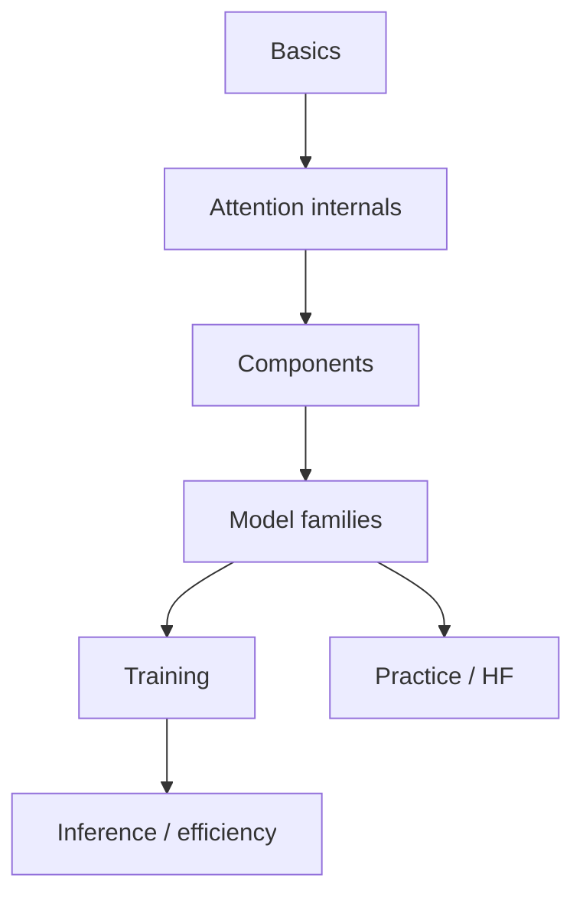

# Transformers

> Architecture curriculum behind modern NLP and LLMs — attention, model families, training, and efficient inference.

**Prerequisites:** [Deep Learning](../deep-learning/README.md) · [Natural Language Processing](../natural-language-processing/README.md)  
**Unlocks:** [Large Language Models](../llm-engineering/README.md) · [Embeddings & Vector Databases](../embeddings-vector-databases/README.md)

Lessons deepened 2026-08-12 (definitions, Mermaid, Python, eval, production). Start with a section hub below (or expand **7. Transformers** in the left sidebar).

---

## Sections

| # | Section | What you will learn | Hub |
|---|---------|---------------------|-----|
| 1 | **Transformer Basics** | Why transformers and stack overview | [transformer-basics/](transformer-basics/README.md) |
| 2 | **Attention Internals** | SDPA, heads, masks, patterns | [attention-internals/](attention-internals/README.md) |
| 3 | **Architecture Components** | Positions, FFN, norm, heads | [architecture-components/](architecture-components/README.md) |
| 4 | **Model Families** | BERT, GPT, T5, ViT, multimodal | [model-families/](model-families/README.md) |
| 5 | **Training Transformers** | Pretrain, FT, PEFT, stability | [training-transformers/](training-transformers/README.md) |
| 6 | **Inference & Efficiency** | Decode, KV cache, sampling, quant | [inference-and-efficiency/](inference-and-efficiency/README.md) |
| 7 | **Transformers in Practice** | HF, tokenizers, failure modes | [transformers-in-practice/](transformers-in-practice/README.md) |

---

## Hierarchy

### 1. Transformer Basics

| # | Topic |
|---|-------|
| 1 | [Why Transformers](transformer-basics/01-why-transformers.md) |
| 2 | [Transformer Overview](transformer-basics/02-transformer-overview.md) |
| 3 | [Encoder vs Decoder vs Encoder-Decoder](transformer-basics/03-encoder-vs-decoder-vs-encoder-decoder.md) |
| 4 | [Tokens & Input Embeddings](transformer-basics/04-tokens-and-input-embeddings.md) |
| 5 | [The Transformer Stack](transformer-basics/05-the-transformer-stack.md) |

### 2. Attention Internals

| # | Topic |
|---|-------|
| 1 | [Scaled Dot-Product Attention](attention-internals/01-scaled-dot-product-attention.md) |
| 2 | [Multi-Head Attention](attention-internals/02-multi-head-attention.md) |
| 3 | [Self-Attention vs Cross-Attention](attention-internals/03-self-attention-vs-cross-attention.md) |
| 4 | [Causal & Masked Attention](attention-internals/04-causal-and-masked-attention.md) |
| 5 | [Attention Patterns & Interpretability](attention-internals/05-attention-patterns-and-interpretability.md) |

### 3. Architecture Components

| # | Topic |
|---|-------|
| 1 | [Positional Encodings](architecture-components/01-positional-encodings.md) |
| 2 | [Feed-Forward Networks](architecture-components/02-feed-forward-networks.md) |
| 3 | [LayerNorm & Residuals](architecture-components/03-layernorm-and-residuals.md) |
| 4 | [Pre-Norm vs Post-Norm](architecture-components/04-prenorm-vs-postnorm.md) |
| 5 | [Outputs, Logits & Heads](architecture-components/05-outputs-logits-and-heads.md) |

### 4. Model Families

| # | Topic |
|---|-------|
| 1 | [Encoder Models (BERT-style)](model-families/01-encoder-models-bert.md) |
| 2 | [Decoder Models (GPT-style)](model-families/02-decoder-models-gpt.md) |
| 3 | [Encoder–Decoder (T5/BART)](model-families/03-encoder-decoder-t5-bart.md) |
| 4 | [Vision Transformers](model-families/04-vision-transformers.md) |
| 5 | [Multimodal Transformers](model-families/05-multimodal-transformers.md) |

### 5. Training Transformers

| # | Topic |
|---|-------|
| 1 | [Pretraining Objectives](training-transformers/01-pretraining-objectives.md) |
| 2 | [Fine-Tuning Transformers](training-transformers/02-fine-tuning-transformers.md) |
| 3 | [Parameter-Efficient Fine-Tuning](training-transformers/03-parameter-efficient-fine-tuning.md) |
| 4 | [Training Stability](training-transformers/04-training-stability.md) |

### 6. Inference & Efficiency

| # | Topic |
|---|-------|
| 1 | [Autoregressive Decoding](inference-and-efficiency/01-autoregressive-decoding.md) |
| 2 | [KV Cache](inference-and-efficiency/02-kv-cache.md) |
| 3 | [Sampling Strategies](inference-and-efficiency/03-sampling-strategies.md) |
| 4 | [Long Context & Efficient Attention](inference-and-efficiency/04-long-context-and-efficient-attention.md) |
| 5 | [Quantization for Transformers](inference-and-efficiency/05-quantization-for-transformers.md) |

### 7. Transformers in Practice

| # | Topic |
|---|-------|
| 1 | [Hugging Face Transformers](transformers-in-practice/01-hugging-face-transformers.md) |
| 2 | [Tokenizers](transformers-in-practice/02-tokenizers.md) |
| 3 | [Pipelines & Model Cards](transformers-in-practice/03-pipelines-and-model-cards.md) |
| 4 | [Common Failure Modes](transformers-in-practice/04-common-failure-modes.md) |

---

## Definition

The **Transformer** models sequences with self-attention instead of recurrence. It is the backbone of BERT-style encoders, GPT-style decoders, and today's LLMs.

---

## Reference notes (shorter overviews)

| Note | Document |
|------|----------|
| Transformer architecture | [transformer-architecture.md](transformer-architecture.md) |
| Attention mechanism | [attention-mechanism.md](attention-mechanism.md) |
| Encoder vs decoder models | [encoder-vs-decoder.md](encoder-vs-decoder.md) |

---

## Related topics

- [Natural Language Processing](../natural-language-processing/README.md)
- [Large Language Models](../llm-engineering/README.md)
- [LLM Fine-Tuning](../llm-fine-tuning/README.md)
- [Deep Learning · Attention](../deep-learning/advanced-deep-learning/04-attention-mechanism.md)

---

## See also

- [Domains overview](../README.md)
- [Learning Roadmap](../../meta/roadmap.md)
