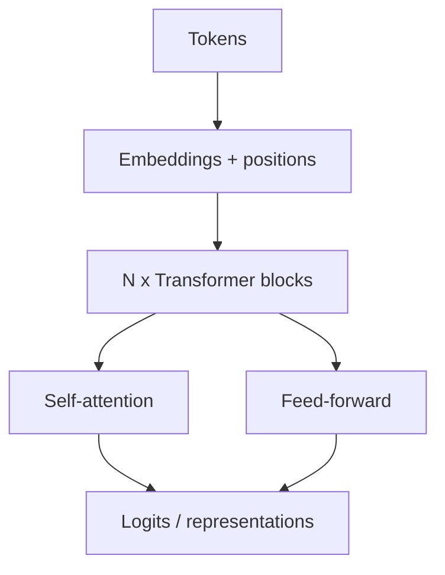

# Transformers

> The architecture behind modern NLP and LLMs — attention, encoder/decoder stacks, and practical intuition for engineers.

**Prerequisites:** [Deep Learning](../deep-learning/README.md) · [Natural Language Processing](../natural-language-processing/README.md)  
**Unlocks:** [Large Language Models](../llm-engineering/README.md) · [Embeddings & Vector Databases](../embeddings-vector-databases/README.md)

---

## Definition

The **Transformer** is a neural architecture that models sequences using **self-attention** instead of recurrence. It enables parallel training over tokens and is the backbone of BERT-style encoders, GPT-style decoders, and today's LLMs.

---

## Learning path

---

## Documents

| # | Topic | Document |
|---|-------|----------|
| 1 | Transformer architecture | [transformer-architecture.md](transformer-architecture.md) |
| 2 | Attention mechanism | [attention-mechanism.md](attention-mechanism.md) |
| 3 | Encoder vs decoder models | [encoder-vs-decoder.md](encoder-vs-decoder.md) |

---

## Related topics

- [Attention Is All You Need (notes)](../papers/attention-is-all-you-need.md)
- [LLM Engineering — transformer intuition](../llm-engineering/transformer-intuition.md)
- [Large Language Models](../llm-engineering/README.md)

---

## See also

- [Domains overview](../README.md)
- [Learning Roadmap](../../meta/roadmap.md)
- [Master Index](../../meta/indexes/MASTER-INDEX.md)
