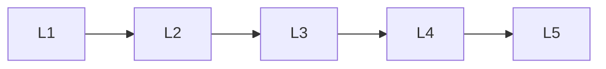

# Architecture Components

> Deep lessons for **Architecture Components** in the Transformers handbook.

## Lessons

| # | Lesson |
|---|--------|
| 1 | [Positional Encodings](01-positional-encodings.md) |
| 2 | [Feed-Forward Networks](02-feed-forward-networks.md) |
| 3 | [LayerNorm & Residuals](03-layernorm-and-residuals.md) |
| 4 | [Pre-Norm vs Post-Norm](04-prenorm-vs-postnorm.md) |
| 5 | [Outputs, Logits & Heads](05-outputs-logits-and-heads.md) |

**Topic hub:** [../README.md](../README.md)
