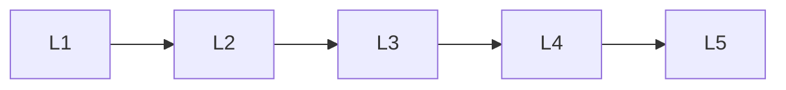

# Attention Internals

> Deep lessons for **Attention Internals** in the Transformers handbook.

## Lessons

| # | Lesson |
|---|--------|
| 1 | [Scaled Dot-Product Attention](01-scaled-dot-product-attention.md) |
| 2 | [Multi-Head Attention](02-multi-head-attention.md) |
| 3 | [Self-Attention vs Cross-Attention](03-self-attention-vs-cross-attention.md) |
| 4 | [Causal & Masked Attention](04-causal-and-masked-attention.md) |
| 5 | [Attention Patterns & Interpretability](05-attention-patterns-and-interpretability.md) |

**Topic hub:** [../README.md](../README.md)
