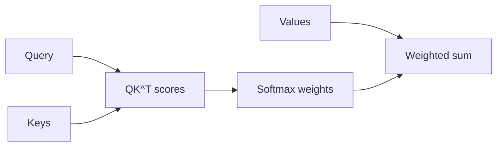

# Attention Mechanism

> Queries, keys, values — how tokens share information.

## Definition

Attention computes a weighted mix of value vectors, where weights come from compatibility between queries and keys (typically scaled dot products). Multi-head attention runs this in parallel subspaces.

## Why it matters

Retrieval, in-context learning, and many failure modes (lost-in-the-middle, distraction by irrelevant context) are attention phenomena at system scale.

## How it works

## Key principles

1. **Soft selection** — Attention is a differentiable lookup.
2. **Quadratic cost** — Naive attention scales with sequence length².
3. **KV cache** — Decode-time optimization storing past keys/values.

## Common applications

| Application | Description |
|-------------|-------------|
| Long-context systems | Chunking + retrieval vs long attention |
| Interpretability (rough) | Inspect weights cautiously |
| Efficiency | FlashAttention, GQA, etc. |

## Common mistakes

- Treating attention weights as faithful explanations
- Stuffing unlimited context and expecting perfect use

## Further reading

- [Encoder vs decoder](encoder-vs-decoder.md)
- [Context Engineering](../context-engineering/README.md)
