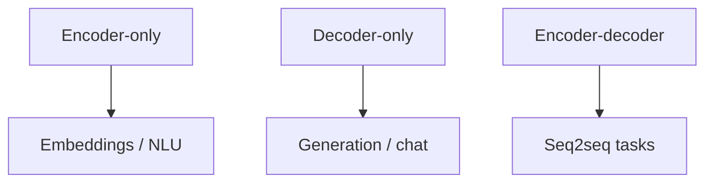

# Encoder vs Decoder Models

> BERT-style, GPT-style, and encoder–decoder — which to use when.

## Definition

Encoder-only models bidirectional-encode a full input (great for embeddings/classification). Decoder-only models generate left-to-right (chat/LLMs). Encoder–decoder models encode a source then decode a target (translation, some summarizers).

## Why it matters

Choosing the wrong family wastes money: don't use a huge chat model as your only embedder if a specialized encoder is better.

## How it works

## Key principles

1. **Match architecture to task** — Retrieve ≠ generate.
2. **Chat models are decoders** — Instruction tuning sits on LM pretraining.
3. **Rerankers often cross-encode** — Query+doc jointly encoded.

## Common applications

| Application | Description |
|-------------|-------------|
| Vector search | Encoder embeddings |
| Assistants | Decoder LLMs |
| Translation | Encoder–decoder or LLM prompting |

## Common mistakes

- Using generative LLMs for bulk embedding without benchmarking encoders
- Expecting bidirectional understanding from causal decoders without care

## Further reading

- [Embeddings & Vector Databases](../embeddings-vector-databases/README.md)
- [Large Language Models](../llm-engineering/README.md)
