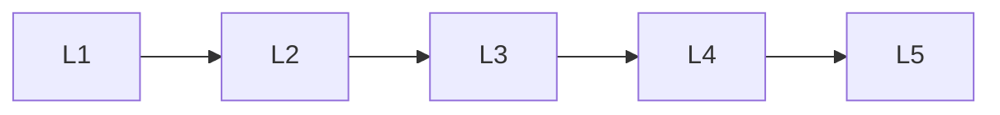

# Inference And Efficiency

> Deep lessons for **Inference And Efficiency** in the Transformers handbook.

## Lessons

| # | Lesson |
|---|--------|
| 1 | [Autoregressive Decoding](01-autoregressive-decoding.md) |
| 2 | [KV Cache](02-kv-cache.md) |
| 3 | [Sampling Strategies](03-sampling-strategies.md) |
| 4 | [Long Context & Efficient Attention](04-long-context-and-efficient-attention.md) |
| 5 | [Quantization for Transformers](05-quantization-for-transformers.md) |

**Topic hub:** [../README.md](../README.md)
