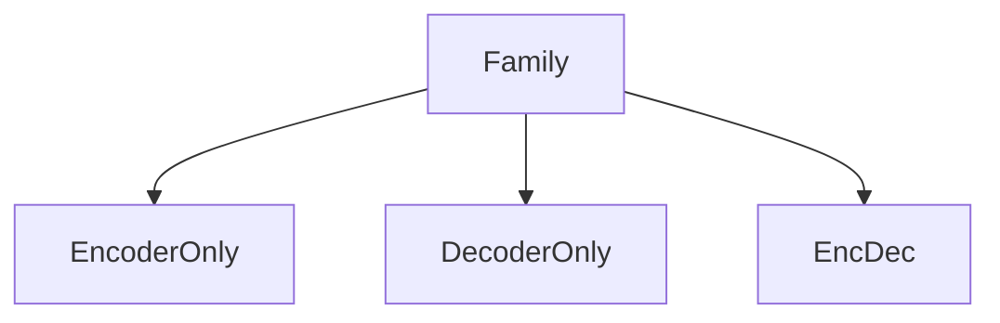

# Vision Transformers

> Image patches as tokens — ViT and friends.

## Table of Contents

- [Overview](#overview)
- [Definition](#definition)
- [Why It Matters](#why-it-matters)
- [Uses](#uses)
- [Core Ideas](#core-ideas)
- [How It Works](#how-it-works)
- [Worked Example](#worked-example)
- [Python Examples](#python-examples)
- [Data & Features](#data--features)
- [Training / Fitting](#training--fitting)
- [Evaluation](#evaluation)
- [Production Considerations](#production-considerations)
- [Performance & Cost](#performance--cost)
- [Common Failure Modes](#common-failure-modes)
- [Best Practices](#best-practices)
- [Common Mistakes](#common-mistakes)
- [Interview Preparation](#interview-preparation)
- [Navigation](#navigation)

---

## Overview

This lesson is part of the **Model Families** track in the **Transformers** handbook. Treat **Vision Transformers** as something you can implement, measure, and ship — not only define.

**Typical workflow:** encoder / decoder / encoder-decoder variants.

Complexity is dominated by attention (roughly O(T²·d) naive); efficiency work targets that term.

---

## Definition

**Vision Transformers** — Image patches as tokens — ViT and friends.

In engineering terms, you should be able to state inputs, outputs, assumptions, and the metric that proves the method works.

---

## Why It Matters

Without a crisp grip on vision transformers, teams either overcomplicate baselines or under-diagnose failures. This topic shows up in interviews, design reviews, and production incidents.

---

## Uses

| Use case | How this applies |
|----------|------------------|
| Baseline system | Get a correct, measurable first version fast |
| Production feature | Meet quality/latency constraints with known knobs |
| Debugging | Isolate whether data, model, or eval is at fault |
| Research transfer | Port a paper idea into an ablatable experiment |

---

## Core Ideas

1. Write the prediction/task contract before choosing an algorithm.
2. Prefer a strong simple baseline; complexity must buy measured gains.
3. Separate training signal from evaluation protocol (no leakage).
4. Log enough artifacts (seeds, configs, metrics) to reproduce.
5. Optimize for the metric that matches user/business cost of error.

---

## How It Works



Map each stage to code ownership: data pipeline, model/training, evaluation, and serving. Most regressions are interface mismatches between those stages.

---

## Worked Example

**Scenario:** You must apply **Vision Transformers** on a real dataset with a deadline.

1. Define success metric and slice budgets (overall + critical subgroups).
2. Build a leak-free split (time-based if production is temporal).
3. Ship the simplest method that implements this idea end-to-end.
4. Error-analyze 20–50 failures; fix data or features before model zoo hopping.
5. Only then tune hyperparameters / architecture depth.

**Exit criteria:** metric ≥ target on holdout, latency within SLO, and a documented rollback.

---

## Python Examples

```python
FAMILIES = {
    "bert": "encoder-only",
    "gpt": "decoder-only",
    "t5": "encoder-decoder",
}

```

Keep experiments in versioned scripts/notebooks; promote winning configs into library code with tests.

---

## Data & Features

- Validate schemas, missingness, and label quality before modeling.
- Fit scalers/encoders on train only; persist them with the model.
- Watch leakage: future timestamps, target-derived features, peeking at test.
- For text/vision/audio, record preprocessing versions next to checkpoints.

---

## Training / Fitting

- Fix seeds when debugging; allow controlled variance for robustness checks.
- Start with default hyperparameters; change one axis at a time.
- Use early stopping / checkpoints on validation, not test.
- Record hardware, batch size, and wall-clock — reproducibility includes cost.

---

## Evaluation

| Layer | What to check |
|-------|----------------|
| Offline holdout | Primary metric + calibrated secondary metrics |
| Slices | Rare classes, segments, length buckets |
| Robustness | Noise, shift, adversarial-lite cases |
| Online (if live) | Guardrail metrics and canary compare |

Never “tune on test.” Keep a final frozen test or use nested CV carefully.

---

## Production Considerations

- Bundle **code + preprocessing + model weights + metric floors** as one release.
- Monitor input drift and performance drift; alert before users complain.
- Feature flags / model registry for instant rollback.
- Document expected failure behavior (abstain, default class, human review).

## Performance & Cost

- Measure inference latency at p50/p95 with production batch sizes.
- Prefer cheaper models when utility is flat — complexity has ops cost.
- Cache features or embeddings when stable and safe.

---

## Common Failure Modes

- Silent leakage inflating offline scores.
- Class imbalance ignored → useless majority classifier.
- Unstable training (LR too high, bad init, broken shapes).
- Metric mismatch (optimize accuracy, care about recall).
- Serving preprocessing ≠ training preprocessing.

---

## Best Practices

1. Baseline → diagnose → complicate.
2. Unit-test data transforms on tiny fixtures.
3. Keep a living model card: intent, data, metrics, limits.
4. Prefer interpretable diagnostics early (residuals, confusion matrices, attentions).
5. Schedule periodic retrain/eval if the world drifts.

---

## Common Mistakes

- Jumping to deep models on tiny tabular data.
- Reporting training accuracy as success.
- One random seed hero run.
- No slice metrics for safety-critical groups.
- Changing preprocessing in prod without invalidating the model.

---

## Interview Preparation

**Q: How do you know vision transformers is the right tool?**

A: State the task type, data shape, constraints (latency, interpretability), and show a baseline comparison where this method wins on the metric that matches the cost of errors.

**Q: What do you check first when results look “too good”?**

A: Leakage, split bugs, label contamination, and whether the metric is trivial (e.g., imbalanced accuracy).

**Q: How would you ship this safely?**

A: Offline floors + canary + monitoring + rollback artifact bundle.

---

## Navigation

- **Section hub:** [README](README.md)
- **Topic hub:** [../README.md](../README.md)
