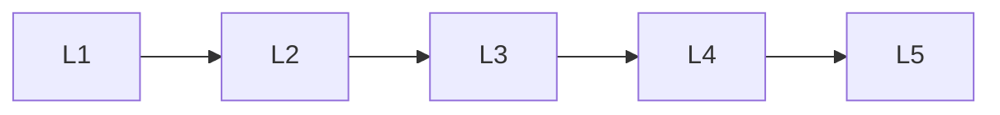

# Model Families

> Deep lessons for **Model Families** in the Transformers handbook.

## Lessons

| # | Lesson |
|---|--------|
| 1 | [Encoder Models (BERT-style)](01-encoder-models-bert.md) |
| 2 | [Decoder Models (GPT-style)](02-decoder-models-gpt.md) |
| 3 | [Encoder–Decoder (T5/BART)](03-encoder-decoder-t5-bart.md) |
| 4 | [Vision Transformers](04-vision-transformers.md) |
| 5 | [Multimodal Transformers](05-multimodal-transformers.md) |

**Topic hub:** [../README.md](../README.md)
