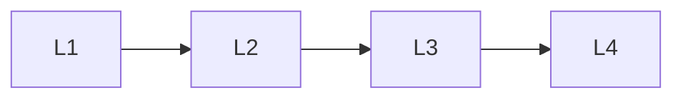

# Training Transformers

> Deep lessons for **Training Transformers** in the Transformers handbook.

## Lessons

| # | Lesson |
|---|--------|
| 1 | [Pretraining Objectives](01-pretraining-objectives.md) |
| 2 | [Fine-Tuning Transformers](02-fine-tuning-transformers.md) |
| 3 | [Parameter-Efficient Fine-Tuning](03-parameter-efficient-fine-tuning.md) |
| 4 | [Training Stability](04-training-stability.md) |

**Topic hub:** [../README.md](../README.md)
