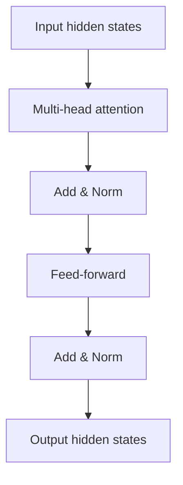

# Transformer Architecture

> Blocks, residual connections, and layer norms — the engineering view of transformers.

## Definition

A transformer stack repeats blocks containing multi-head self-attention and a position-wise feed-forward network, wrapped with residual connections and normalization. Positional information is injected because attention alone is permutation-invariant.

## Why it matters

Knowing the block structure helps you reason about context length, KV-cache, and why fine-tuning sometimes targets attention or FFN modules.

## How it works

## Key principles

1. **Residuals stabilize depth** — Enable training of deep stacks.
2. **Context is attention's job** — Every token can look at others (within limits).
3. **FFN holds much capacity** — Often a large fraction of parameters.

## Common applications

| Application | Description |
|-------------|-------------|
| Language modeling | Decoder-only stacks |
| Embedding models | Encoder stacks |
| Seq2seq | Encoder–decoder (T5, translation) |

## Common mistakes

- Assuming transformers 'understand' beyond pattern learning from data
- Ignoring context window / attention cost scaling

## Further reading

- [Attention mechanism](attention-mechanism.md)
- [LLM Engineering](../llm-engineering/README.md)
