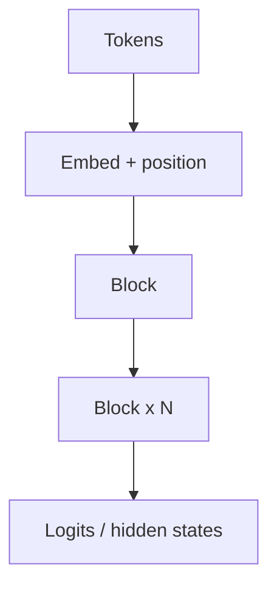

# 2. Transformer Overview

> Embeddings → N blocks of attention+FFN → output head.

## Definition

A **Transformer** maps token embeddings through stacked blocks of multi-head attention and feed-forward layers with residuals and normalization.

---

## Continue

- **Section hub:** [Transformer Basics](README.md)
- **Transformers overview:** [Transformers](../README.md)
