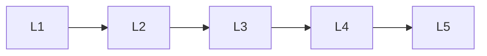

# Transformer Basics

> Deep lessons for **Transformer Basics** in the Transformers handbook.

## Lessons

| # | Lesson |
|---|--------|
| 1 | [Why Transformers](01-why-transformers.md) |
| 2 | [Transformer Overview](02-transformer-overview.md) |
| 3 | [Encoder vs Decoder vs Encoder-Decoder](03-encoder-vs-decoder-vs-encoder-decoder.md) |
| 4 | [Tokens & Input Embeddings](04-tokens-and-input-embeddings.md) |
| 5 | [The Transformer Stack](05-the-transformer-stack.md) |

**Topic hub:** [../README.md](../README.md)
