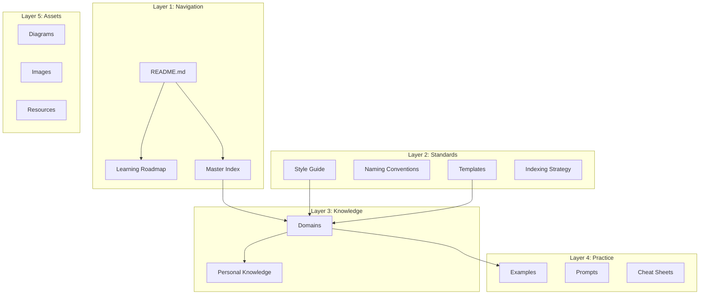
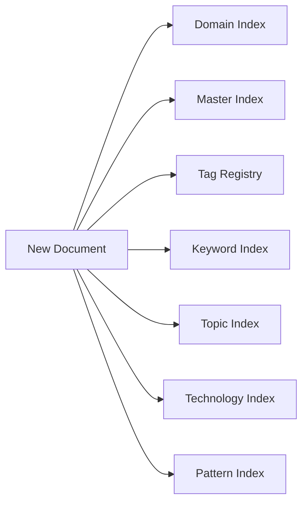
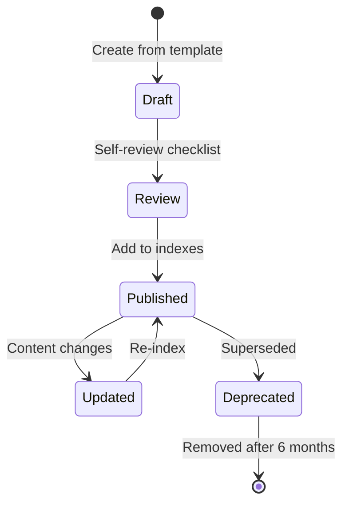

# Architecture Overview

> How the AI Engineering Playbook is structured and why.

---

## Design Philosophy

This repository is architected as a **domain-driven knowledge base**, not a personal notes collection or a technology catalog. Every structural decision optimizes for:

1. **Discoverability** — find any document within 3 clicks from the README.
2. **Scalability** — support 1000+ documents without restructuring.
3. **Consistency** — every document follows the same standards and templates.
4. **Extensibility** — new AI technologies fit naturally without creating new top-level areas.
5. **Practicality** — content focuses on building, deploying, and maintaining real AI systems.

---

## Repository Layers



---

## Top-Level Structure

```
ai-engineering-playbook/
├── README.md                 # Entry point and navigation
├── CONTRIBUTING.md           # Contribution workflow
├── CHANGELOG.md              # Version history
│
├── meta/                     # Standards, templates, indexes
│   ├── style-guide.md
│   ├── naming-conventions.md
│   ├── indexing-strategy.md
│   ├── mermaid-conventions.md
│   ├── glossary.md
│   ├── roadmap.md
│   ├── templates/            # 18 document templates
│   └── indexes/              # Master, topic, tag, pattern indexes
│
├── domains/                  # Core knowledge (40+ domains)
│   ├── foundations/
│   ├── python-engineering/
│   ├── llm-engineering/
│   ├── rag/
│   ├── ai-agents/
│   ├── ai-deployment/
│   └── ... (see domains/README.md)
│
├── knowledge/                # Personal experience and lessons
│   ├── lessons-learned/
│   ├── mistakes/
│   ├── architecture-decisions/
│   └── ...
│
├── examples/                 # Runnable code examples
├── prompts/                  # Prompt pattern library
├── cheat-sheets/             # Quick reference cards
├── assets/                   # Diagrams, images, slides
└── resources/                # Bookmarks and external links
```

---

## Domain Organization

Domains are the primary organizational unit. Each domain represents an area of AI engineering knowledge:

| Category | Domains | Purpose |
|----------|---------|---------|
| **Foundations** | foundations, python-engineering | Prerequisites |
| **Engineering** | backend, apis, fastapi, databases | Software engineering |
| **LLM Systems** | llm-engineering, prompt-engineering, context-engineering, embeddings, vector-databases | LLM integration |
| **Retrieval & Agents** | rag, ai-agents, agent-architectures, mcp, a2a, ai-workflows, multi-agent-systems | AI application patterns |
| **Production** | ai-evaluation, ai-safety, model-integration, model-serving, inference-optimization, ai-deployment, cloud-deployment, docker, cicd, monitoring, logging, observability, security, performance-optimization | Operating AI systems |
| **Architecture** | ai-system-design, ai-application-architecture, software-architecture, design-patterns, distributed-systems | System design |
| **Operations** | data-engineering, debugging, common-mistakes, production-incidents | Running and fixing systems |
| **Growth** | interview-preparation, papers, research-notes, career-notes, resources | Career and learning |

### Domain Rules

- Domains are **technology-agnostic names** (e.g., `vector-databases/` not `pinecone/`).
- Technology-specific content lives inside domain documents, indexed by technology.
- New domains are added only when a genuinely new area of knowledge emerges.
- Subfolders within domains appear when a domain exceeds ~20 documents.

---

## Indexing Architecture



Multiple index types provide complementary discovery paths:

| Index Type | Discovery Path | Example Query |
|------------|---------------|---------------|
| Master | By domain | "What exists in RAG?" |
| Topic | By theme | "Everything about streaming" |
| Tag | By label | "All `production` docs" |
| Keyword | By natural language | "token latency optimization" |
| Technology | By tool | "All FastAPI documents" |
| Pattern | By design pattern | "All retry patterns" |
| Comparison | By decision | "Which vector database?" |

---

## Content Lifecycle



| Status | Meaning |
|--------|---------|
| `draft` | Work in progress, not indexed |
| `review` | Ready for review |
| `published` | Live, indexed, and discoverable |
| `deprecated` | Superseded, warning displayed, still accessible |

---

## Extensibility Model

The repository handles future growth through:

### New Technologies
Technology-specific content goes into existing domains with technology tags. A new vector database does not create a new domain — it adds documents to `vector-databases/` and entries in the technology index.

### New Domains
A new top-level domain is created only when an entirely new area of AI engineering emerges (e.g., `multimodal-ai/` when multimodal becomes a core engineering discipline).

### New Document Types
New templates are added to `meta/templates/` when a genuinely new content type is needed. Existing templates cover 18 types.

### Automated Indexing (Future)
The front matter schema is designed for future automation — a script can generate all indexes from document metadata.

---

## Personal Knowledge Layer

The `knowledge/` directory is architecturally separate from `domains/`:

| Aspect | `domains/` | `knowledge/` |
|--------|-----------|-------------|
| Content | Curated, reference-quality | Experience-based, personal |
| Audience | Any reader | Primarily future you |
| Naming | `kebab-case.md` | `YYYY-MM-DD-description.md` |
| Value over time | Stable reference | Increasingly valuable |
| Types | Concepts, guides, patterns | Lessons, mistakes, ADRs, benchmarks |

---

## See Also

- [Style Guide](style-guide.md)
- [Naming Conventions](naming-conventions.md)
- [Indexing Strategy](indexing-strategy.md)
- [Domains Overview](../domains/README.md)
