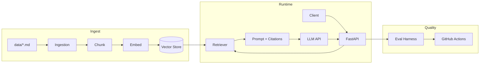

# Capstone Walkthrough: RAG Chat API

> Build a production-shaped **document Q&A API** in one session — ingest docs, retrieve with citations, expose a FastAPI endpoint, evaluate quality, containerize, and gate CI.

This walkthrough stitches together handbooks you already have. It does **not** introduce new frameworks — it composes existing [templates](../templates/README.md) into one coherent system.

---

## What You Will Build

| Component | Outcome |
|-----------|---------|
| Ingestion | Load `.md` / `.txt` files from a `data/` folder |
| Index | Chunk → embed → store in an in-memory vector store (swap for Qdrant later) |
| API | `POST /api/v1/query` returns answer + citation sources |
| Evaluation | Golden-set script scores faithfulness before merge |
| Deploy | Docker image + health checks |
| CI | pytest + eval regression on pull requests |



---

## Tutorial Info

| Attribute | Value |
|-----------|-------|
| Difficulty | Intermediate |
| Time | 4–8 hours |
| Prerequisites | Python 3.11+, basic FastAPI, skim [RAG handbook](../domains/rag/README.md) Sections 1–5 |
| Templates used | [FastAPI starter](../templates/engineering/fastapi-starter/), [RAG starter](../templates/engineering/rag-starter/) |

---

## Table of Contents

1. [Prerequisites](#prerequisites)
2. [Step 1: Scaffold the project](#step-1-scaffold-the-project)
3. [Step 2: Index your documents](#step-2-index-your-documents)
4. [Step 3: Add the query endpoint](#step-3-add-the-query-endpoint)
5. [Step 4: Wire the LLM](#step-4-wire-the-llm)
6. [Step 5: Add evaluation](#step-5-add-evaluation)
7. [Step 6: Dockerize](#step-6-dockerize)
8. [Step 7: CI with eval gate](#step-7-ci-with-eval-gate)
9. [Verification checklist](#verification-checklist)
10. [Next steps](#next-steps)
11. [Troubleshooting](#troubleshooting)

---

## Prerequisites

Before starting:

- [ ] Python 3.11+ and `git` installed
- [ ] OpenAI API key (or compatible provider) in `.env`
- [ ] Read [FastAPI starter README](../templates/engineering/fastapi-starter/README.md) (5 min)
- [ ] Read [RAG starter README](../templates/engineering/rag-starter/README.md) (5 min)

**Handbook references (optional depth):**

| Topic | Handbook section |
|-------|------------------|
| Chunking | [RAG chunking](../domains/rag/chunking-strategies.md) |
| Retrieval | [RAG retrieval](../domains/rag/retrieval-strategies.md) |
| Prompt design | [RAG prompts](../domains/prompt-engineering/prompt-templates-guide.md) |
| Evaluation | [AI Evaluation intro](../domains/ai-evaluation/introduction-to-ai-evaluation.md) |

---

## Step 1: Scaffold the project

Create a new repository and copy both starters:

```bash
mkdir rag-chat-api && cd rag-chat-api
git init

# Copy templates from the playbook (adjust path if you cloned elsewhere)
cp -r /path/to/ai-engineering-playbook/templates/engineering/fastapi-starter/* .
cp -r /path/to/ai-engineering-playbook/templates/engineering/rag-starter/src/rag src/
```

Target layout:

```
rag-chat-api/
├── src/
│   ├── app/           # from fastapi-starter
│   └── rag/           # from rag-starter
├── data/              # your documents
├── tests/
├── scripts/
│   ├── index_corpus.py
│   └── run_eval.py
├── Dockerfile
├── pyproject.toml
└── .env
```

Add RAG dependencies to `pyproject.toml`:

```toml
dependencies = [
    "fastapi>=0.115.0",
    "pydantic-settings>=2.0.0",
    "uvicorn[standard]>=0.30.0",
    "openai>=1.0.0",
    "httpx>=0.27.0",
]
```

`.env` example:

```bash
APP_NAME=rag-chat-api
OPENAI_API_KEY=sk-...
OPENAI_MODEL=gpt-4o-mini
EMBEDDING_MODEL=text-embedding-3-small
DATA_PATH=./data
```

**Checkpoint:** `uvicorn app.main:app --app-dir src` serves `/api/v1/health`.

---

## Step 2: Index your documents

Add sample docs:

```bash
mkdir -p data
echo "# Refund Policy\nRefunds within 30 days with receipt." > data/refunds.md
echo "# Support Hours\nSupport is available Mon–Fri 9am–5pm UTC." > data/support.md
```

Create `scripts/index_corpus.py`:

```python
"""One-shot indexing — run after adding documents to data/."""
import sys
from pathlib import Path

sys.path.insert(0, str(Path(__file__).resolve().parents[1] / "src"))

from rag.embeddings import EmbeddingProvider
from rag.pipeline import index_corpus
from rag.vector_store import VectorStore

def main() -> None:
    data_path = Path(__file__).resolve().parents[1] / "data"
    store = VectorStore()
    embedder = EmbeddingProvider()
    count = index_corpus(str(data_path), store, embedder)
    print(f"Indexed {count} chunks")
    # Production: persist store to Qdrant/pgvector instead of in-memory

if __name__ == "__main__":
    main()
```

Run:

```bash
python scripts/index_corpus.py
```

**Engineering note:** In-memory storage is fine for the capstone. For production, swap `VectorStore` with Qdrant — see [RAG vector DB guide](../domains/rag/vector-databases.md) and [docker-compose](../templates/engineering/docker/docker-compose.yml).

---

## Step 3: Add the query endpoint

Add `src/app/schemas/query.py`:

```python
from pydantic import BaseModel, Field


class QueryRequest(BaseModel):
    question: str = Field(min_length=1, max_length=2000)


class Citation(BaseModel):
    id: str
    source: str | None = None


class QueryResponse(BaseModel):
    answer: str
    citations: list[Citation]
```

Add `src/app/services/rag_service.py`:

```python
from rag.embeddings import EmbeddingProvider
from rag.prompt import build_rag_prompt
from rag.retrieval import Retriever
from rag.vector_store import VectorStore

# Capstone: module-level singleton; production: lifespan + DI
_store = VectorStore()
_embedder = EmbeddingProvider()
_retriever = Retriever(_store, _embedder)


def get_retriever() -> Retriever:
    return _retriever


def retrieve_context(question: str) -> tuple[str, list[dict]]:
    return build_rag_prompt(question, _retriever, top_n=3)
```

Add `src/app/api/v1/endpoints/query.py`:

```python
from fastapi import APIRouter

from app.schemas.query import Citation, QueryRequest, QueryResponse
from app.services.rag_service import retrieve_context

router = APIRouter()


@router.post("/query", response_model=QueryResponse)
async def query(body: QueryRequest) -> QueryResponse:
    prompt, docs = retrieve_context(body.question)
    # Step 4 wires the LLM call here
    answer = f"[stub] Answer for: {body.question}"  # replace in Step 4
    citations = [
        Citation(id=d["id"], source=d.get("metadata", {}).get("source"))
        for d in docs
    ]
    return QueryResponse(answer=answer, citations=citations)
```

Register in `src/app/api/v1/router.py`:

```python
from app.api.v1.endpoints import health, query

api_router.include_router(query.router, tags=["query"])
```

**Checkpoint:** `curl -X POST http://localhost:8000/api/v1/query -H 'Content-Type: application/json' -d '{"question":"What are support hours?"}'` returns citations.

---

## Step 4: Wire the LLM

Add `src/app/clients/llm.py`:

```python
import os

from openai import AsyncOpenAI

_client = AsyncOpenAI(api_key=os.environ["OPENAI_API_KEY"])


async def complete(prompt: str) -> str:
    response = await _client.chat.completions.create(
        model=os.getenv("OPENAI_MODEL", "gpt-4o-mini"),
        messages=[{"role": "user", "content": prompt}],
        temperature=0,
    )
    return response.choices[0].message.content or ""
```

Update the query endpoint:

```python
from app.clients.llm import complete

@router.post("/query", response_model=QueryResponse)
async def query(body: QueryRequest) -> QueryResponse:
    prompt, docs = retrieve_context(body.question)
    answer = await complete(prompt)
    ...
```

Use the parameterized prompt from [templates/engineering/prompts/rag.md](../templates/engineering/prompts/rag.md) inside `build_rag_prompt` for consistency.

**Handbook:** [LLM API integration](../domains/llm-engineering/llm-streaming.md) · [Prompt security](../domains/prompt-engineering/prompt-security.md)

---

## Step 5: Add evaluation

Create `scripts/run_eval.py` using the [evaluation template](../templates/engineering/evaluation/rag_eval.py):

```python
"""Golden-set regression — run before every release."""
import asyncio
import sys
from pathlib import Path

sys.path.insert(0, str(Path(__file__).resolve().parents[1] / "src"))

from rag.evaluation import EvalCase, score_answer

GOLDEN = [
    EvalCase("What are support hours?", ["Mon", "Fri", "9am"]),
    EvalCase("Refund policy?", ["30 days", "receipt"]),
]


async def main() -> None:
    from httpx import ASGITransport, AsyncClient
    from app.main import create_app

    app = create_app()
    transport = ASGITransport(app=app)
    failures = 0
    async with AsyncClient(transport=transport, base_url="http://test") as client:
        for case in GOLDEN:
            r = await client.post("/api/v1/query", json={"question": case.question})
            r.raise_for_status()
            score = score_answer(r.json()["answer"], case)
            if score < 0.5:
                failures += 1
                print(f"FAIL {case.question} score={score}")
            else:
                print(f"PASS {case.question} score={score}")
    if failures:
        sys.exit(1)


if __name__ == "__main__":
    asyncio.run(main())
```

Expand `GOLDEN` to 20–50 cases for real products — see [continuous evaluation](../domains/ai-evaluation/continuous-evaluation.md).

---

## Step 6: Dockerize

Use the [FastAPI Dockerfile](../templates/engineering/fastapi-starter/Dockerfile) and ensure `src/rag` is copied.

Add a startup step to index on boot (dev only) or run indexing as a separate job:

```dockerfile
# In Dockerfile — after COPY src
ENV PYTHONPATH=/app/src
CMD ["sh", "-c", "python scripts/index_corpus.py && uvicorn app.main:app --host 0.0.0.0 --port 8000"]
```

For production, run indexing as a [background job](../domains/backend-engineering/background-processing-for-ai.md), not on every container start.

```bash
docker build -t rag-chat-api .
docker run -p 8000:8000 --env-file .env rag-chat-api
curl http://localhost:8000/api/v1/health
```

**Handbook:** [Production AI — Docker](../domains/ai-deployment/docker-for-ai-applications.md)

---

## Step 7: CI with eval gate

Copy [fastapi-starter CI](../templates/engineering/fastapi-starter/.github/workflows/ci.yml) and add an eval step:

```yaml
      - run: pip install -e ".[dev]"
      - run: python scripts/index_corpus.py
      - run: pytest
      - run: python scripts/run_eval.py
        env:
          OPENAI_API_KEY: ${{ secrets.OPENAI_API_KEY }}
```

Skip the LLM eval step in CI if you mock the client in tests — but keep at least one integration eval in a nightly workflow.

**Handbook:** [Git workflow](../domains/foundations/git-github-workflow.md) · [Continuous evaluation](../domains/ai-evaluation/continuous-evaluation.md)

---

## Verification Checklist

| Check | Command / criterion |
|-------|---------------------|
| Health | `GET /api/v1/health` → 200 |
| Query | `POST /api/v1/query` returns answer + citations |
| Grounded | Answer cites support hours from `data/support.md` |
| Eval | `python scripts/run_eval.py` exits 0 |
| Tests | `pytest` passes |
| Docker | Container starts and responds to health |
| No secrets in git | `.env` in `.gitignore` |

---

## Next Steps

You completed the capstone. Deepen by module:

| Goal | Go to |
|------|-------|
| Better retrieval | [RAG handbook](../domains/rag/README.md) — hybrid search, reranking |
| Swap vector DB | [Vector databases](../domains/rag/vector-databases.md) + [docker-compose Qdrant](../templates/engineering/docker/docker-compose.yml) |
| Add auth | [FastAPI dependencies](../templates/engineering/fastapi-starter/src/app/api/dependencies.py) |
| Streaming responses | [LLM streaming](../domains/llm-engineering/llm-streaming.md) |
| Observability | [Monitoring template](../templates/engineering/monitoring/README.md) |
| System design depth | [AI System Design](../domains/ai-system-design/README.md) |

---

## Troubleshooting

| Symptom | Likely cause | Fix |
|---------|--------------|-----|
| Empty citations | Corpus not indexed | Run `scripts/index_corpus.py` |
| Hallucinated answers | Weak prompt or no "context only" instruction | Use [rag.md prompt](../templates/engineering/prompts/rag.md) |
| Wrong chunks retrieved | Chunk size too large/small | Tune in [rag/config.py](../templates/engineering/rag-starter/src/rag/config.py) |
| Eval flaky | LLM non-determinism | `temperature=0`; use keyword checks not exact match |
| Slow cold start | Re-indexing on boot | Separate ingest job from API container |

---

## See Also

- [Learning Roadmap](roadmap.md) — full phased path
- [RAG mistakes](../domains/rag/rag-mistakes.md)
- [Common engineering mistakes](../domains/common-mistakes/common-engineering-mistakes.md)

## Changelog

| Version | Date | Changes |
|---------|------|---------|
| 1.0 | 2026-07-13 | Initial capstone walkthrough |
