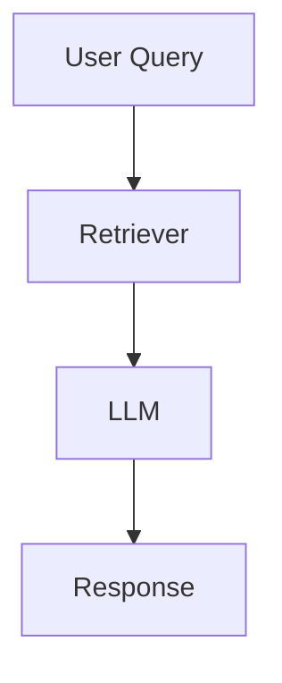
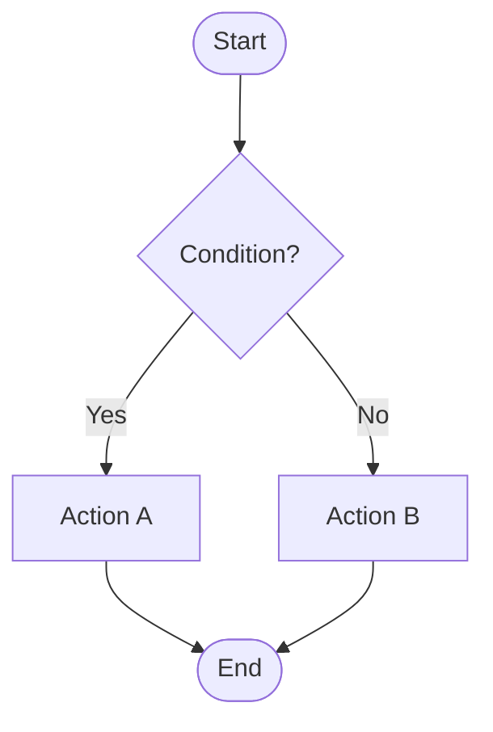
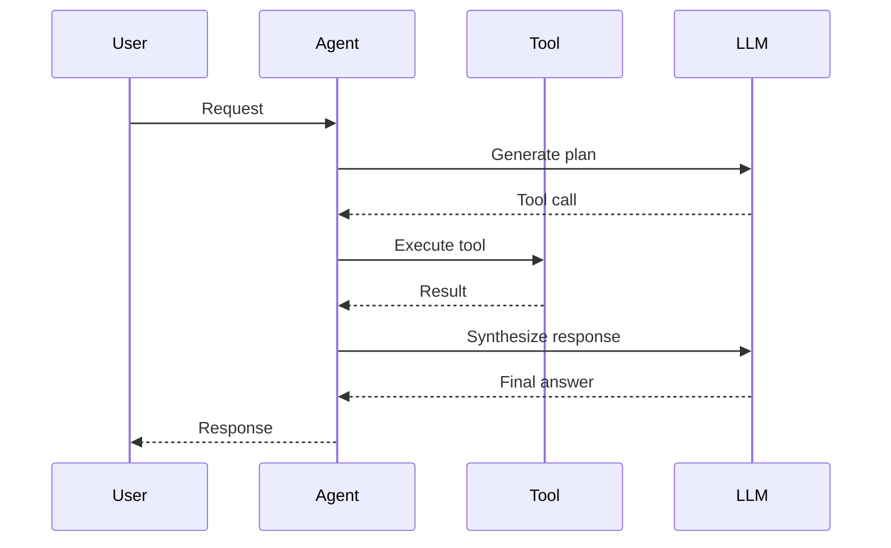
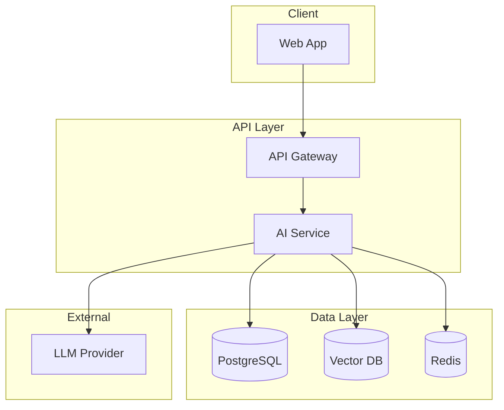
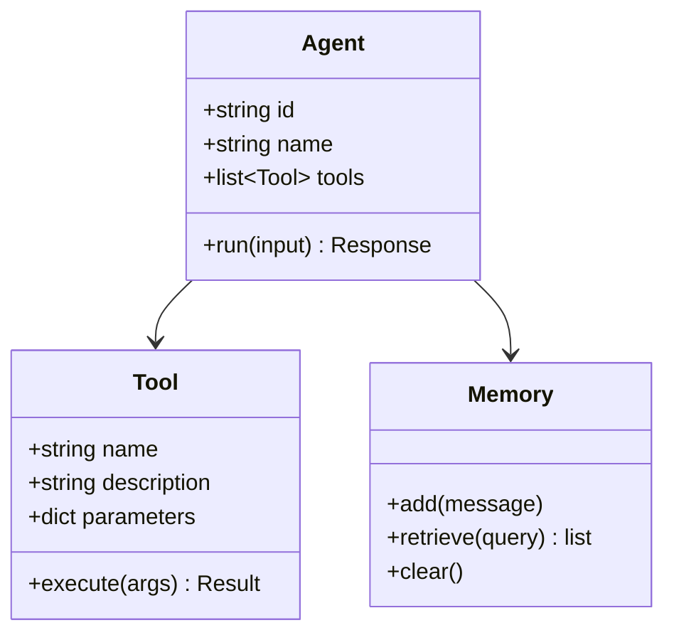
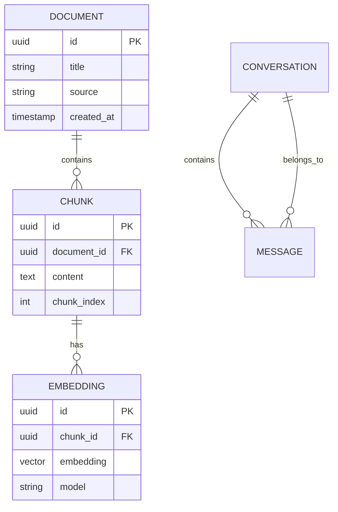
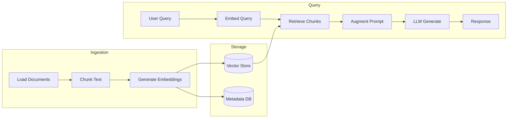
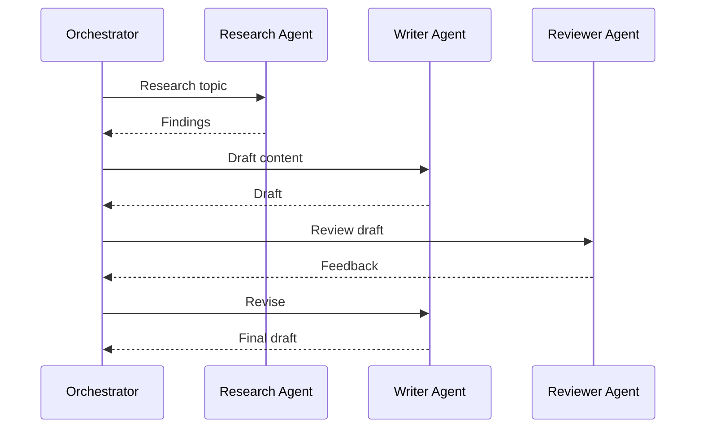
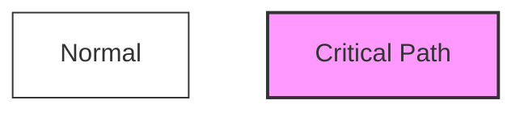

# Mermaid Diagram Conventions

> Standards for creating, organizing, and referencing Mermaid diagrams in the AI Engineering Playbook.

---

## Overview

Mermaid diagrams are a first-class documentation tool in this repository. They are used for architecture diagrams, sequence flows, agent interactions, ER diagrams, and AI workflow visualizations. This guide defines where diagrams live, how to name them, and how to write them consistently.

---

## When to Use Mermaid

| Use Mermaid | Use Static Images Instead |
|-------------|----------------------------|
| Architecture diagrams | Screenshots of UIs |
| Sequence diagrams | Photos or complex illustrations |
| Flowcharts and decision trees | Brand-specific graphics |
| ER diagrams | Charts with precise data visualization |
| Agent interaction diagrams | — |
| AI workflow diagrams | — |

---

## Diagram Locations

### Inline Diagrams

Embed directly in Markdown documents for simple, context-specific diagrams:

````markdown

````

**Use inline when:**
- The diagram is specific to one document.
- It has fewer than ~15 nodes.
- It is unlikely to be reused elsewhere.

### Standalone `.mmd` Files

Store in `assets/diagrams/{type}/` for complex or reusable diagrams:

```
assets/diagrams/
├── flowcharts/
│   └── flowchart-rag-query-routing-v1.mmd
├── sequence/
│   └── sequence-agent-tool-call-v1.mmd
├── architecture/
│   └── architecture-rag-system-v1.mmd
├── class/
│   └── class-agent-state-model-v1.mmd
├── er/
│   └── er-document-store-v1.mmd
├── workflows/
│   └── workflow-document-ingestion-v1.mmd
└── agent-interactions/
    └── agent-interactions-multi-agent-delegation-v1.mmd
```

Reference standalone files in documents:

```markdown
<!-- For renderers that support includes -->


<!-- Or embed the content inline and note the source -->
> Source: [`architecture-rag-system-v1.mmd`](../../assets/diagrams/architecture/architecture-rag-system-v1.mmd)
```

**Use standalone when:**
- The diagram has 15+ nodes.
- It will be referenced by multiple documents.
- It represents a canonical architecture or workflow.

---

## Naming Convention

```
{type}-{subject}-{version}.mmd
```

| Component | Rule | Example |
|-----------|------|---------|
| `type` | Diagram type prefix | `architecture`, `sequence`, `flowchart` |
| `subject` | What the diagram depicts | `rag-system`, `agent-tool-call` |
| `version` | Increment on semantic changes | `v1`, `v2` |

---

## Diagram Types and Templates

### Flowcharts

Use for decision flows, process flows, and routing logic.



**Folder:** `assets/diagrams/flowcharts/`

### Sequence Diagrams

Use for API interactions, agent tool calls, and request/response flows.



**Folder:** `assets/diagrams/sequence/`

### Architecture Diagrams

Use for system component layouts and data flow.



**Folder:** `assets/diagrams/architecture/`

### Class Diagrams

Use for data models, agent state schemas, and class relationships.



**Folder:** `assets/diagrams/class/`

### ER Diagrams

Use for database schemas related to AI applications.



**Folder:** `assets/diagrams/er/`

### AI Workflow Diagrams

Use for orchestration flows, pipeline stages, and multi-step AI processes.



**Folder:** `assets/diagrams/workflows/`

### Agent Interaction Diagrams

Use for multi-agent communication, delegation, and handoff patterns.



**Folder:** `assets/diagrams/agent-interactions/`

---

## Style Rules

### Node Labels

- Use clear, concise labels (2–4 words).
- Use `[brackets]` for processes, `([rounded])` for start/end, `{diamonds}` for decisions.
- Include technology names when relevant: `[(PostgreSQL)]`, `[FastAPI Service]`.

### Subgraphs

- Use `subgraph` to group related components.
- Name subgraphs descriptively: `subgraph API Layer`, `subgraph Data Layer`.

### Direction

| Diagram Type | Preferred Direction |
|-------------|-------------------|
| Architecture | `TB` (top-to-bottom) or `LR` (left-to-right) |
| Flowcharts | `TD` (top-down) |
| Workflows | `LR` (left-to-right) |
| Sequence | Default (top-to-bottom) |

### Colors and Styling

Avoid hardcoded colors in Mermaid — they may not render consistently across platforms. Use subgraphs and node shapes for visual distinction instead.

If styling is required:



### Size Guidelines

| Nodes | Approach |
|-------|----------|
| < 15 | Inline in document |
| 15–30 | Standalone `.mmd` file |
| > 30 | Split into multiple diagrams |

---

## Versioning

- Create `v1` for the initial diagram.
- Increment version (`v2`, `v3`) when the diagram's **semantic meaning** changes.
- Minor visual tweaks do not require a version bump.
- Keep old versions in the repository; do not delete superseded diagrams.

---

## Accessibility

- Always include a text description before or after the diagram.
- For complex diagrams, provide a summary table of components.
- Do not rely solely on color or shape to convey meaning.

---

## See Also

- [Style Guide](style-guide.md)
- [Naming Conventions](naming-conventions.md)
- [Assets README](../assets/README.md)
