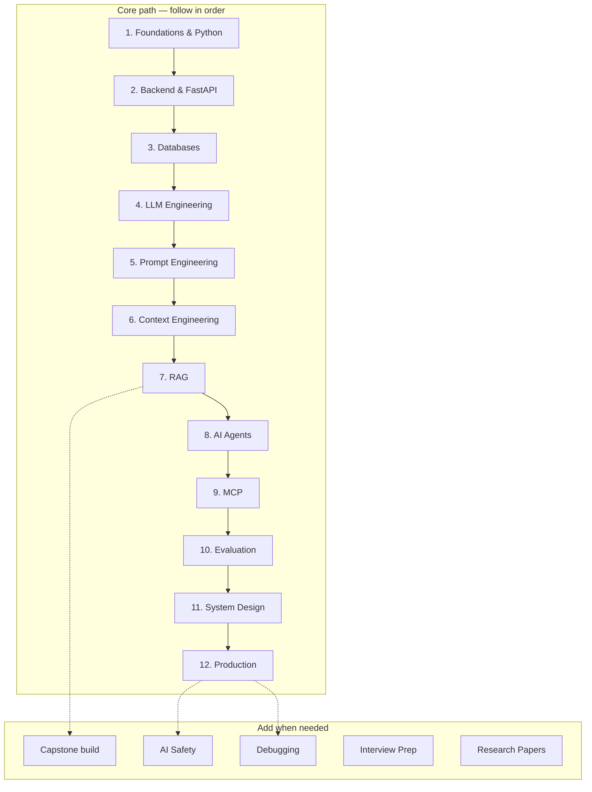

# Learning Roadmap

> One clear path: foundations → LLMs → RAG → agents → production.  
> Details below; start with the **map**, then open each phase.

---

## At a glance

| Stage | Goal | Primary handbook |
|-------|------|------------------|
| **0 Capstone** | Ship one RAG API end-to-end | [Capstone walkthrough](capstone-walkthrough.md) |
| **1–3** | Software & data foundations | [Foundations](../domains/foundations/README.md) · [Backend](../domains/backend-engineering/README.md) · [Databases](../domains/databases/README.md) |
| **4–6** | Talk to models well | [LLM](../domains/llm-engineering/README.md) · [Prompts](../domains/prompt-engineering/README.md) · [Context](../domains/context-engineering/README.md) |
| **7–9** | Grounded & agentic systems | [RAG](../domains/rag/README.md) · [Agents](../domains/ai-agents/README.md) · [MCP](../domains/mcp/README.md) |
| **10–12** | Quality & operations | [Evaluation](../domains/ai-evaluation/README.md) · [System Design](../domains/ai-system-design/README.md) · [Production](../domains/ai-deployment/README.md) |

**How to use this roadmap**

1. Pick your current stage from the table.  
2. Open the handbook hub — complete its learning path / checklist.  
3. Hit the milestone, then move to the next stage.  
4. Use side tracks (safety, debugging, interviews) only when relevant.

Estimated effort assumes ~10–15 hours/week. Skip stages you already know; don’t skip **evaluation** and **production** if you plan to ship.

---

## Philosophy

This path prioritizes **shipping production AI applications** over ML theory. You write code, design systems, integrate models, and operate them. Research papers appear later as engineering context, not as the starting point.

---

## Phase 1: Programming Foundations

**Goal:** Solid Python and software engineering fundamentals.  
**Duration:** 4–6 weeks · **Hub:** [Foundations](../domains/foundations/README.md) · [Python](../domains/python-engineering/README.md)

| Order | Topic | Domain | Key outcomes |
|-------|-------|--------|--------------|
| 1.1 | Python fundamentals | [python-engineering](../domains/python-engineering/README.md) | Functions, classes, errors |
| 1.2 | Advanced Python | [python-engineering](../domains/python-engineering/README.md) | Async, typing, tooling |
| 1.3 | Git & workflow | [foundations](../domains/foundations/README.md) | Branching, PRs, commits |
| 1.4 | Engineering principles | [foundations](../domains/foundations/README.md) | SOLID, testing mindset |

**Milestone:** A structured Python CLI with tests and type hints.

---

## Phase 2: Backend Engineering

**Goal:** Reliable server-side APIs.  
**Duration:** 4–6 weeks · **Hub:** [Backend](../domains/backend-engineering/README.md) · [FastAPI](../domains/fastapi/README.md) · [APIs](../domains/apis/README.md)

| Order | Topic | Domain | Key outcomes |
|-------|-------|--------|--------------|
| 2.1 | HTTP & REST | [apis](../domains/apis/README.md) | Status codes, auth basics |
| 2.2 | FastAPI | [fastapi](../domains/fastapi/README.md) | Routes, DI, models |
| 2.3 | Backend patterns | [backend-engineering](../domains/backend-engineering/README.md) | Services, errors, async |
| 2.4 | Auth | [security](../domains/security/README.md) | API keys, JWT |

**Milestone:** REST API with auth, validation, and tests.

---

## Phase 3: Databases

**Goal:** Persist and cache data for AI apps.  
**Duration:** 3–4 weeks · **Hub:** [Databases](../domains/databases/README.md)

| Order | Topic | Domain | Key outcomes |
|-------|-------|--------|--------------|
| 3.1 | SQL / Postgres | [postgresql](../domains/databases/postgresql/README.md) | Schema, JSONB, migrations |
| 3.2 | Redis | [redis](../domains/databases/redis/README.md) | Cache, sessions, limits |

**Milestone:** Chat-app schema with caching.

---

## Phase 4: LLM Engineering

**Goal:** Integrate LLMs safely and efficiently.  
**Duration:** 3–4 weeks · **Hub:** [LLM Engineering](../domains/llm-engineering/README.md)

| Order | Topic | Key outcomes |
|-------|-------|--------------|
| 4.1 | How LLMs work (practical) | Tokens, context, sampling |
| 4.2 | Provider APIs | Chat, streaming, tools |
| 4.3 | Cost & resilience | Retries, fallbacks, budgets |

**Milestone:** Streaming chat endpoint with error handling.

---

## Phase 5: Prompt Engineering

**Goal:** Treat prompts as versioned software.  
**Duration:** 2–3 weeks · **Hub:** [Prompt Engineering](../domains/prompt-engineering/README.md) · [Prompt library](../prompts/README.md)

| Order | Topic | Key outcomes |
|-------|-------|--------------|
| 5.1 | Anatomy & patterns | Clear, testable prompts |
| 5.2 | Structured outputs | JSON / schema discipline |
| 5.3 | Eval & versioning | Golden sets, regression |

**Milestone:** Versioned prompt with CI regression. ✅

---

## Phase 6: Context Engineering

**Goal:** Assemble the right context under token budgets.  
**Duration:** 2–3 weeks · **Hub:** [Context Engineering](../domains/context-engineering/README.md)

**Milestone:** Context assembler with budgets, ranking, and traces. ✅

---

## Phase 7: RAG

**Goal:** Ground answers in your data.  
**Duration:** 4–5 weeks · **Hub:** [RAG](../domains/rag/README.md)

**Milestone:** Ingest → retrieve → cite → evaluate pipeline. ✅

**Build:** [Capstone walkthrough](capstone-walkthrough.md) · [RAG starter](../templates/engineering/rag-starter/README.md)

---

## Phase 8: AI Agents

**Goal:** Plan, use tools, and recover from failures.  
**Duration:** 4–6 weeks · **Hub:** [AI Agents](../domains/ai-agents/README.md)

**Milestone:** Agent with max-step guard, tool registry, checkpoints. ✅

---

## Phase 9: MCP

**Goal:** Standardize tools/resources via Model Context Protocol.  
**Duration:** 2–3 weeks · **Hub:** [MCP](../domains/mcp/README.md)

**Milestone:** Working MCP server + client. ✅

---

## Phase 10: Evaluation & LLMOps

**Goal:** Measure quality before and after ship.  
**Duration:** 3–4 weeks · **Hub:** [AI Evaluation](../domains/ai-evaluation/README.md)

**Milestone:** Golden set + CI eval gate. ✅

---

## Phase 11: AI System Design

**Goal:** Design products and scale them.  
**Duration:** 3–4 weeks · **Hub:** [AI System Design](../domains/ai-system-design/README.md)

**Milestone:** One full system design write-up (interview-ready). ✅

---

## Phase 12: Production AI

**Goal:** Deploy, observe, and operate.  
**Duration:** 4–5 weeks · **Hub:** [Production AI](../domains/ai-deployment/README.md)

**Milestone:** Dockerized API with CI, health checks, and basic observability. ✅

---

## Side tracks

| Track | When | Hub |
|-------|------|-----|
| Templates & assets | Building in parallel | [Templates](../templates/README.md) |
| Safety | Before public launch | [AI Safety](../domains/ai-safety/README.md) |
| Debugging | When something breaks | [Debugging](../domains/debugging/README.md) |
| Interviews | Job search | [Interview Prep](../domains/interview-preparation/README.md) |
| Papers | Deepening theory | [Research Papers](../domains/papers/README.md) |

---

## Later depth (optional)

These domains are **planned or thin** — use after the core path:

- Workflows & multi-agent depth  
- Cloud / model serving / inference optimization  
- Extended architecture domains  

See [Domains Overview](../domains/README.md) for Published vs Planned.

---

## See also

- [Home — how the playbook is organized](../README.md)
- [Capstone walkthrough](capstone-walkthrough.md)
- [Master Index](indexes/MASTER-INDEX.md)
