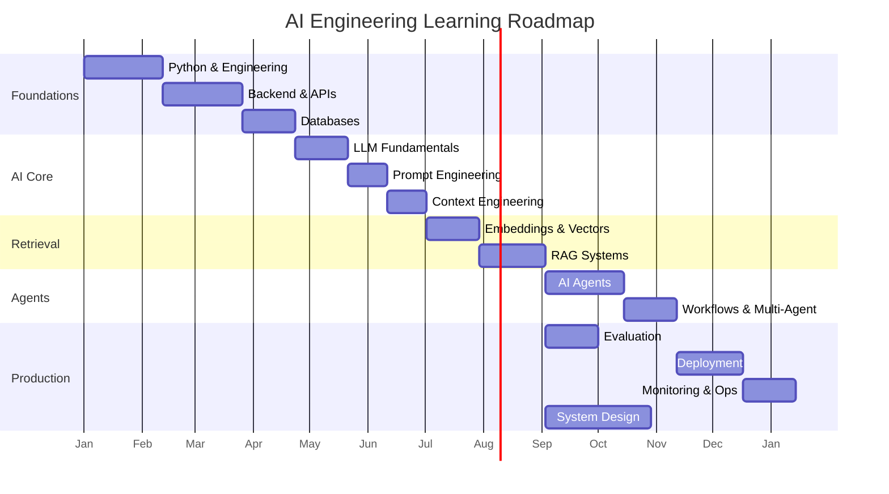

# Learning Roadmap

> Recommended learning path for modern AI engineering.
> Designed to be extended as new technologies emerge — not dependent on any specific framework or model.

---

## Philosophy

This roadmap prioritizes **building production AI applications** over theoretical machine learning. You will learn to write code, design systems, integrate models, and deploy reliable AI-powered software. Traditional ML/DL theory is included only where it directly supports practical engineering workflows.

The path is sequential within each phase but parallel across phases once prerequisites are met. Estimated times assume focused part-time study (10–15 hours/week).

---

## Phase 1: Programming Foundations

**Goal:** Solid Python and software engineering fundamentals.

**Duration:** 4–6 weeks

| Order | Topic | Domain | Key Outcomes |
|-------|-------|--------|-------------|
| 1.1 | Python fundamentals | [python-engineering](../../domains/python-engineering/) | Variables, functions, classes, error handling |
| 1.2 | Python advanced patterns | [python-engineering](../../domains/python-engineering/) | Async/await, type hints, decorators, context managers |
| 1.3 | Package management and tooling | [python-engineering](../../domains/python-engineering/) | venv, pip, ruff, pytest |
| 1.4 | Git and version control | [foundations](../../domains/foundations/) | Branching, PRs, conventional commits |
| 1.5 | Software engineering principles | [foundations](../../domains/foundations/) | SOLID, clean code, testing mindset |

**Milestone:** Write a well-structured Python CLI tool with tests and type hints.

---

## Phase 2: Backend Engineering

**Goal:** Build reliable server-side applications.

**Duration:** 4–6 weeks

| Order | Topic | Domain | Key Outcomes |
|-------|-------|--------|-------------|
| 2.1 | HTTP and REST fundamentals | [apis](../../domains/apis/) | Methods, status codes, headers, REST principles |
| 2.2 | FastAPI basics | [fastapi](../../domains/fastapi/) | Routes, dependency injection, request/response models |
| 2.3 | FastAPI advanced | [fastapi](../../domains/fastapi/) | Middleware, background tasks, WebSockets |
| 2.4 | Backend patterns | [backend-engineering](../../domains/backend-engineering/) | Service layer, repository pattern, error handling |
| 2.5 | Authentication and authorization | [security](../../domains/security/) | API keys, JWT, OAuth basics |

**Milestone:** Build a REST API with authentication, validation, and automated tests.

---

## Phase 3: Databases and Data Storage

**Goal:** Store, query, and manage data for AI applications.

**Duration:** 3–4 weeks

| Order | Topic | Domain | Key Outcomes |
|-------|-------|--------|-------------|
| 3.1 | SQL fundamentals | [databases/sql](../../domains/databases/sql/) | SELECT, JOIN, INSERT, indexes |
| 3.2 | PostgreSQL | [databases/postgresql](../../domains/databases/postgresql/) | Setup, migrations, JSON columns |
| 3.3 | Redis | [databases/redis](../../domains/databases/redis/) | Caching, session storage, rate limiting |
| 3.4 | Data modeling for AI apps | [data-engineering](../../domains/data-engineering/) | Conversation storage, document metadata |

**Milestone:** Design and implement a database schema for a chat application with caching.

---

## Phase 4: LLM Fundamentals

**Goal:** Understand how LLMs work and how to integrate them.

**Duration:** 3–4 weeks

| Order | Topic | Domain | Key Outcomes |
|-------|-------|--------|-------------|
| 4.1 | How LLMs work (practical) | [llm-engineering](../../domains/llm-engineering/) | Tokens, context windows, temperature, model families |
| 4.2 | LLM API integration | [llm-engineering](../../domains/llm-engineering/) | Chat completions, streaming, function calling |
| 4.3 | Model selection | [model-integration](../../domains/model-integration/) | Choosing models by task, cost, latency |
| 4.4 | Error handling and resilience | [llm-engineering](../../domains/llm-engineering/) | Retries, fallbacks, timeout management |

**Milestone:** Build a streaming chat API endpoint with error handling and model fallback.

---

## Phase 5: Prompt Engineering (Complete)

**Goal:** Treat prompts as maintainable software artifacts for production AI systems.

**Duration:** 2–3 weeks

| Order | Topic | Domain | Key Outcomes |
|-------|-------|--------|-------------|
| 5.1 | Prompt engineering handbook | [prompt-engineering](../../domains/prompt-engineering/) | 18 sections: anatomy through production |
| 5.2 | Structured prompting | [prompt-engineering](../../domains/prompt-engineering/structured-prompting.md) | XML, JSON, Markdown, tagged formats |
| 5.3 | Reasoning & chaining | [prompt-engineering](../../domains/prompt-engineering/) | CoT, ReAct, ToT, multi-step pipelines |
| 5.4 | Testing & evaluation | [prompt-engineering](../../domains/prompt-engineering/) | Golden datasets, regression, metrics |
| 5.5 | Prompt patterns library | [prompts/templates](../../prompts/templates/) | 16 reusable production templates |

**Milestone:** Versioned prompt with golden dataset, CI regression tests, and structured output validation. ✅

---

## Phase 6: Context Engineering (Complete)

**Goal:** Design systems that manage what the model sees within token budgets.

**Duration:** 2–3 weeks

| Order | Topic | Domain | Key Outcomes |
|-------|-------|--------|-------------|
| 6.1 | Context engineering handbook | [context-engineering](../../domains/context-engineering/) | 20 sections: architecture through production |
| 6.2 | Memory and state | [context-engineering](../../domains/context-engineering/memory-systems.md) | Six memory types, conversation state |
| 6.3 | Selection and ranking | [context-engineering](../../domains/context-engineering/) | Filter, rank, compress, budget |
| 6.4 | Retrieval context foundation | [context-engineering](../../domains/context-engineering/retrieval-context.md) | Grounding before full RAG phase |

**Milestone:** Context engine with traced assembly, layered budgets, and retrieval integration. ✅

---

## Phase 7: RAG (Complete)

**Goal:** Build production-grade retrieval-augmented generation systems.

**Duration:** 4–6 weeks

| Order | Topic | Domain | Key Outcomes |
|-------|-------|--------|-------------|
| 7.1 | RAG handbook | [rag](../../domains/rag/) | 21 sections: ingest through production |
| 7.2 | Vector databases | [rag/providers](../../domains/rag/providers/) | 7 provider guides |
| 7.3 | Evaluation | [rag/rag-evaluation.md](../../domains/rag/rag-evaluation.md) | Golden sets, recall@K, RAGAS |
| 7.4 | Advanced RAG | [rag/advanced-rag-architectures.md](../../domains/rag/advanced-rag-architectures.md) | GraphRAG, agentic patterns |

**Milestone:** Hybrid RAG with CI eval gate and tenant ACL filters. ✅

---

## Phase 8: AI Agents (Complete)

**Goal:** Build production autonomous agent systems.

| Order | Topic | Outcomes |
|-------|-------|----------|
| 8.1 | Agent handbook | 20 sections + frameworks |
| 8.2 | Multi-agent patterns | Supervisor, swarm, HITL |
| 8.3 | BYO framework | Minimal extensible core |

**Milestone:** ReAct agent with eval suite and HITL. ✅

---

## Phase 9: MCP & AI Protocol Engineering

**Goal:** Design, implement, secure, and scale Model Context Protocol systems.

**Duration:** 3–4 weeks

| Order | Topic | Domain | Key Outcomes |
|-------|-------|--------|-------------|
| 9.1 | MCP handbook | [mcp](../../domains/mcp/) | 20 sections + comparisons |
| 9.2 | Server & client builds | [mcp](../../domains/mcp/) | Reference implementations |
| 9.3 | Production MCP | [mcp](../../domains/mcp/) | Security, multi-server, observability |

**Milestone:** Production MCP server with tools, resources, auth, and tests. ✅

---

## Phase 10: AI Evaluation & LLMOps Evaluation

**Goal:** Design, implement, automate, and monitor evaluation pipelines for production AI systems.

**Duration:** 3–4 weeks

| Order | Topic | Domain | Key Outcomes |
|-------|-------|--------|-------------|
| 10.1 | Evaluation handbook | [ai-evaluation](../../domains/ai-evaluation/) | 20 sections + frameworks |
| 10.2 | RAG & agent eval | [ai-evaluation](../../domains/ai-evaluation/) | RAGAS, metrics, golden sets |
| 10.3 | Continuous eval | [ai-evaluation](../../domains/ai-evaluation/) | CI/CD, A/B, dashboards |

**Milestone:** Golden dataset + CI regression gate + quality dashboard. ✅

---

## Phase 11: AI System Design

**Goal:** Design end-to-end production AI systems; senior interview preparation.

**Duration:** 4–5 weeks

| Order | Topic | Domain | Key Outcomes |
|-------|-------|--------|-------------|
| 11.1 | System design handbook | [ai-system-design](../../domains/ai-system-design/) | 17 sections + product designs |
| 11.2 | Scaling & patterns | [ai-system-design](../../domains/ai-system-design/) | Scale, tradeoffs, interviews |

**Milestone:** Whiteboard design for ChatGPT-class + enterprise RAG systems. ✅

---

## Phase 12: Production AI & AI Platform Engineering

**Goal:** Deploy, operate, monitor, and scale AI applications reliably.

**Duration:** 4–5 weeks

| Order | Topic | Domain | Key Outcomes |
|-------|-------|--------|-------------|
| 12.1 | Production handbook | [ai-deployment](../../domains/ai-deployment/) | Docker, deploy, CI/CD |
| 12.2 | Observability & ops | [ai-deployment](../../domains/ai-deployment/) | Logging, tracing, incidents |
| 12.3 | Reliability & security | [ai-deployment](../../domains/ai-deployment/) | Cache, retry, readiness |

**Milestone:** Dockerized AI API with CI eval gate + observability. ✅

---

## Phase 13: AI Workflows and Multi-Agent Systems

**Goal:** Orchestrate complex AI processes and multi-agent collaboration.

**Duration:** 3–4 weeks

| Order | Topic | Domain | Key Outcomes |
|-------|-------|--------|-------------|
| 13.1 | Workflow orchestration | [ai-workflows](../../domains/ai-workflows/) | State machines, DAGs, conditional routing |
| 13.2 | LangGraph and frameworks | [ai-workflows](../../domains/ai-workflows/) | Graph-based agent workflows |
| 13.3 | Multi-agent systems | [multi-agent-systems](../../domains/multi-agent-systems/) | Delegation, handoffs, collaboration patterns |
| 13.4 | Human-in-the-loop | [ai-workflows](../../domains/ai-workflows/) | Approval flows, feedback integration |

**Milestone:** Build a multi-agent workflow with human-in-the-loop approval.

---

## Phase 14: Cloud & Advanced Deployment

**Goal:** Cloud-native deployment and model serving depth (extends Phase 12).

**Duration:** 4–5 weeks

| Order | Topic | Domain | Key Outcomes |
|-------|-------|--------|-------------|
| 14.1 | Cloud deployment | [cloud-deployment](../../domains/cloud-deployment/) | Managed services, regions |
| 14.2 | Model serving | [model-serving](../../domains/model-serving/) | Load balancing, GPU serving |
| 14.3 | Inference optimization | [inference-optimization](../../domains/inference-optimization/) | Batching, caching |

**Milestone:** Cloud-deployed AI API with autoscaling.

---

## Phase 15: Monitoring, Observability, and Optimization (Depth)

**Goal:** Operate AI systems reliably in production.

**Duration:** 3–4 weeks

| Order | Topic | Domain | Key Outcomes |
|-------|-------|--------|-------------|
| 15.1 | Logging depth | [logging](../../domains/logging/) | Structured logging, PII redaction |
| 15.2 | Monitoring depth | [monitoring](../../domains/monitoring/) | Dashboards, alerting, SLIs/SLOs |
| 15.3 | Observability depth | [observability](../../domains/observability/) | Tracing, LLM-specific telemetry |
| 15.4 | Performance optimization | [performance-optimization](../../domains/performance-optimization/) | Latency, throughput, cost |
| 15.5 | Security in production | [security](../../domains/security/) | Input validation, key rotation |
| 15.6 | AI safety and guardrails | [ai-safety](../../domains/ai-safety/) | Content filtering, bias detection |

**Milestone:** Set up full observability for an AI application with cost tracking and alerting.

---

## Phase 14: System Design and Architecture

**Goal:** Design scalable, maintainable AI systems.

**Duration:** Ongoing (parallel with Phases 8–13)

| Order | Topic | Domain | Key Outcomes |
|-------|-------|--------|-------------|
| 14.1 | AI system design | [ai-system-design](../../domains/ai-system-design/) | End-to-end system design |
| 14.2 | AI application architecture | [ai-application-architecture](../../domains/ai-application-architecture/) | Component design, data flow |
| 14.3 | Design patterns | [design-patterns](../../domains/design-patterns/) | Reusable AI engineering patterns |
| 14.4 | Distributed systems | [distributed-systems](../../domains/distributed-systems/) | Scaling, consistency, fault tolerance |
| 14.5 | Software architecture | [software-architecture](../../domains/software-architecture/) | Clean architecture for AI apps |

**Milestone:** Design and document a complete AI system architecture.

---

## Extending the Roadmap

This roadmap is designed to grow. When adding new phases or topics:

1. **Identify the prerequisite phase** — what must be learned first?
2. **Define clear outcomes** — what can the learner build or do?
3. **Link to domain folders** — where will the content live?
4. **Add a milestone project** — practical application of the knowledge.
5. **Update this document** — add the new phase or insert into an existing phase.

### Future Topics (Placeholders)

These topics will be added as the field evolves:

- Multimodal AI (vision, audio, video integration)
- AI automation systems (workflow automation beyond agents)
- Edge inference and on-device AI
- Fine-tuning and model customization (when practically needed)
- New agent protocols and communication standards
- AI-native databases and storage systems

---

## Visual Overview

---

## See Also

- [Domains Overview](../../domains/README.md)
- [Master Index](indexes/MASTER-INDEX.md)
- [Projects](../../projects/)
- [Examples](../../examples/)
