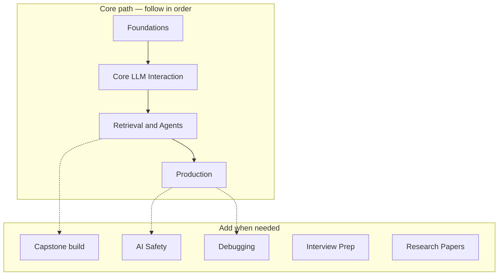

# Learning Roadmap

> One clear path: foundations → LLMs → retrieval & agents → production.  
> Content is grouped by **capability**, not by numbered curriculum stages.

---

## At a glance

| Capability | Goal | Primary handbooks |
|------------|------|-------------------|
| **Capstone** (optional first win) | Ship one RAG API end-to-end | [Capstone walkthrough](capstone-walkthrough.md) |
| **Foundations** | Software & data foundations | [Foundations](../domains/foundations/README.md) · [Backend](../domains/backend-engineering/README.md) · [Databases](../domains/databases/README.md) |
| **Core** | Talk to models well | [LLM](../domains/llm-engineering/README.md) · [Prompts](../domains/prompt-engineering/README.md) · [Context](../domains/context-engineering/README.md) |
| **Retrieval & Agents** | Grounded & agentic systems | [RAG](../domains/rag/README.md) · [Agents](../domains/ai-agents/README.md) · [MCP](../domains/mcp/README.md) |
| **Production** | Quality & operations | [Evaluation](../domains/ai-evaluation/README.md) · [System Design](../domains/ai-system-design/README.md) · [Production AI](../domains/ai-deployment/README.md) |
| **Craft & Growth** | Safety, debugging, career, research | [AI Safety](../domains/ai-safety/README.md) · [Debugging](../domains/debugging/README.md) · [Interviews](../domains/interview-preparation/README.md) · [Papers](../domains/papers/README.md) |

**How to use this roadmap**

1. Pick your current capability from the table.  
2. Open the handbook hub — complete its learning path / checklist.  
3. Hit the milestone, then move to the next capability.  
4. Use side tracks (safety, debugging, interviews) only when relevant.

Estimated effort assumes ~10–15 hours/week. Skip modules you already know; don’t skip **evaluation** and **production** if you plan to ship.

---

## Philosophy

This path prioritizes **shipping production AI applications** over ML theory. You write code, design systems, integrate models, and operate them. Research papers appear later as engineering context, not as the starting point.

---

## Foundations

**Goal:** Solid Python, backend APIs, and data stores for AI apps.  
**Duration:** 8–12 weeks total · **Hubs:** [Foundations](../domains/foundations/README.md) · [Backend](../domains/backend-engineering/README.md) · [FastAPI](../domains/fastapi/README.md) · [Databases](../domains/databases/README.md)

| Order | Topic | Domain | Key outcomes |
|-------|-------|--------|--------------|
| 1 | Python fundamentals | [python-engineering](../domains/python-engineering/README.md) | Functions, classes, async, typing |
| 2 | Git & workflow | [foundations](../domains/foundations/README.md) | Branching, PRs, commits |
| 3 | Engineering principles | [foundations](../domains/foundations/README.md) | SOLID, testing mindset |
| 4 | HTTP & REST | [apis](../domains/apis/README.md) | Status codes, auth basics |
| 5 | FastAPI | [fastapi](../domains/fastapi/README.md) | Routes, DI, models |
| 6 | Backend patterns | [backend-engineering](../domains/backend-engineering/README.md) | Services, errors, async |
| 7 | Auth & security | [security](../domains/security/README.md) | API keys, JWT |
| 8 | SQL / Postgres | [postgresql](../domains/databases/postgresql/README.md) | Schema, JSONB, migrations |
| 9 | Redis | [redis](../domains/databases/redis/README.md) | Cache, sessions, limits |

**Milestones**

- Structured Python CLI with tests and type hints  
- REST API with auth, validation, and tests  
- Chat-app schema with caching  

---

## Core (LLM Interaction)

**Goal:** Integrate LLMs safely and assemble the right context.  
**Duration:** 7–10 weeks · **Hubs:** [LLM Engineering](../domains/llm-engineering/README.md) · [Prompt Engineering](../domains/prompt-engineering/README.md) · [Context Engineering](../domains/context-engineering/README.md)

| Order | Topic | Key outcomes |
|-------|-------|--------------|
| 1 | How LLMs work (practical) | Tokens, context, sampling |
| 2 | Provider APIs | Chat, streaming, tools |
| 3 | Cost & resilience | Retries, fallbacks, budgets |
| 4 | Prompt anatomy & patterns | Clear, testable prompts |
| 5 | Structured outputs | JSON / schema discipline |
| 6 | Prompt eval & versioning | Golden sets, regression |
| 7 | Context assembly | Budgets, ranking, traces |

**Milestones**

- Streaming chat endpoint with error handling  
- Versioned prompt with CI regression  
- Context assembler with budgets, ranking, and traces  

---

## Retrieval & Agents

**Goal:** Ground answers in your data; plan, use tools, and recover from failures.  
**Duration:** 10–14 weeks · **Hubs:** [RAG](../domains/rag/README.md) · [AI Agents](../domains/ai-agents/README.md) · [MCP](../domains/mcp/README.md)

| Order | Topic | Key outcomes |
|-------|-------|--------------|
| 1 | RAG pipeline | Ingest → retrieve → cite → evaluate |
| 2 | Agents | Max-step guard, tool registry, checkpoints |
| 3 | MCP | Working MCP server + client |

**Milestones**

- End-to-end RAG with citations and eval  
- Agent with tool use and failure recovery  
- MCP server + client integration  

**Build:** [Capstone walkthrough](capstone-walkthrough.md) · [RAG starter](../templates/engineering/rag-starter/README.md)

---

## Production

**Goal:** Measure quality, design systems, and operate in production.  
**Duration:** 10–13 weeks · **Hubs:** [AI Evaluation](../domains/ai-evaluation/README.md) · [AI System Design](../domains/ai-system-design/README.md) · [Production AI](../domains/ai-deployment/README.md)

| Order | Topic | Key outcomes |
|-------|-------|--------------|
| 1 | Evaluation & LLMOps | Golden set + CI eval gate |
| 2 | System design | Interview-ready design write-up |
| 3 | Deploy & observe | Docker, CI, health, observability |

**Milestones**

- Golden set + CI eval gate  
- One full system design write-up  
- Dockerized API with CI, health checks, and basic observability  

---

## Craft & Growth (side tracks)

Use these when the situation calls for them — not as a strict sequence after Production.

| Track | When | Hub |
|-------|------|-----|
| Templates & assets | Building in parallel | [Templates](../templates/README.md) |
| Safety | Before public launch | [AI Safety](../domains/ai-safety/README.md) |
| Debugging | When something breaks | [Debugging](../domains/debugging/README.md) |
| Interviews | Job search | [Interview Prep](../domains/interview-preparation/README.md) |
| Papers | Deepening theory | [Research Papers](../domains/papers/README.md) |

---

## Later depth (optional)

These domains are **planned or thin** — use after the core path:

- Workflows & multi-agent depth  
- Cloud / model serving / inference optimization  
- Extended architecture domains  

See [Domains Overview](../domains/README.md) for Published vs Planned.

---

## See also

- [Home — how the playbook is organized](../README.md)
- [Capstone walkthrough](capstone-walkthrough.md)
- [Master Index](indexes/MASTER-INDEX.md)
