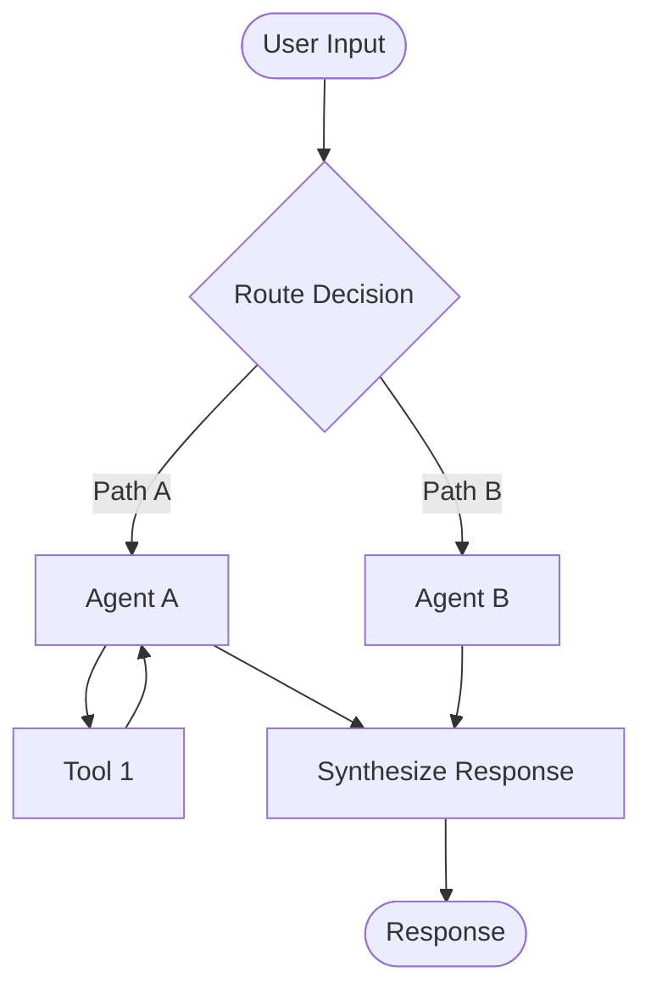
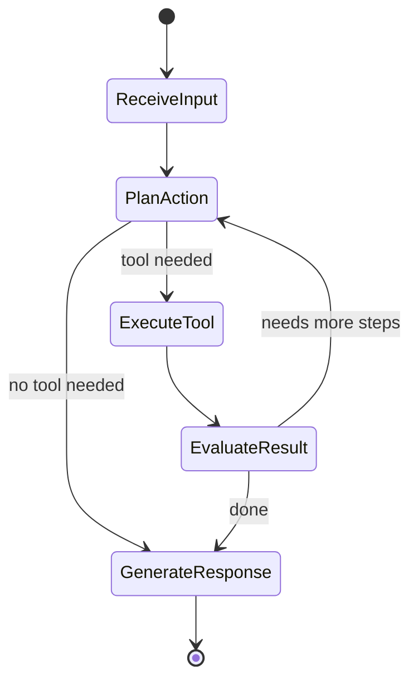
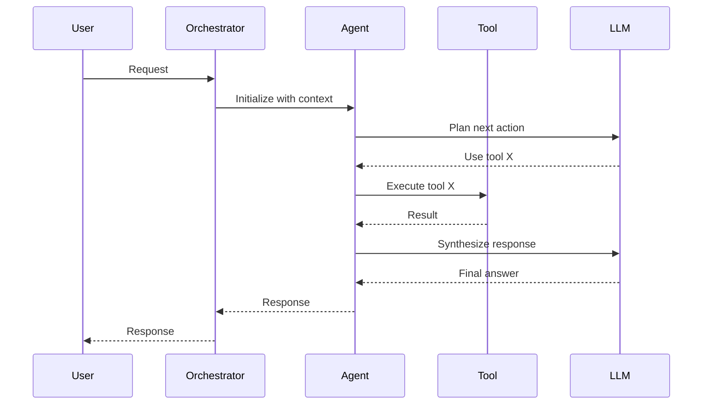

# {Workflow Name} Agent Workflow

> How to design and implement this agent workflow for {use case}.

## Workflow Overview

| Attribute | Value |
|-----------|-------|
| Type | Single-agent / Multi-agent / Hierarchical |
| Complexity | Simple / Moderate / Complex |
| Framework | LangGraph / Custom / etc. |
| Avg. Execution Time | ~X seconds |
| Tools Required | List of tools |

## Use Case

What problem this workflow solves and when to use it.

## Architecture



## Agents

### Agent 1: {Name}

| Attribute | Value |
|-----------|-------|
| Role | What this agent does |
| Model | gpt-4o / etc. |
| Tools | tool_1, tool_2 |
| Input | What it receives |
| Output | What it produces |

**System Prompt:**

```
You are a {role}. Your responsibilities:
1. Responsibility 1
2. Responsibility 2

When you need {condition}, use the {tool_name} tool.
```

### Agent 2: {Name}

| Attribute | Value |
|-----------|-------|
| Role | |
| Model | |
| Tools | |
| Input | |
| Output | |

## Tools

### Tool 1: {Name}

```python
@tool
def tool_name(param: str) -> str:
    """Description of what this tool does.

    Args:
        param: Description of parameter

    Returns:
        Description of return value
    """
    # Implementation
    return result
```

### Tool 2: {Name}

Description and implementation.

## State Schema

```python
from typing import TypedDict, Annotated
from langgraph.graph import add_messages

class WorkflowState(TypedDict):
    messages: Annotated[list, add_messages]
    current_step: str
    context: dict
    result: str | None
```

## Workflow Graph



## Implementation

```python
from langgraph.graph import StateGraph

def build_workflow():
    graph = StateGraph(WorkflowState)

    graph.add_node("receive_input", receive_input)
    graph.add_node("plan_action", plan_action)
    graph.add_node("execute_tool", execute_tool)
    graph.add_node("generate_response", generate_response)

    graph.set_entry_point("receive_input")
    graph.add_edge("receive_input", "plan_action")
    graph.add_conditional_edges("plan_action", route_action)
    graph.add_edge("execute_tool", "plan_action")
    graph.add_edge("generate_response", END)

    return graph.compile()
```

## Execution Flow



## Error Handling

| Error | Handling Strategy |
|-------|------------------|
| Tool execution failure | Retry once, then report to user |
| LLM timeout | Retry with shorter context |
| Invalid tool call | Re-prompt agent with error feedback |
| Max iterations reached | Return partial result with explanation |

## Configuration

| Parameter | Default | Description |
|-----------|---------|-------------|
| `max_iterations` | 10 | Max agent loop iterations |
| `timeout_seconds` | 60 | Total workflow timeout |
| `model` | gpt-4o | Primary LLM |
| `fallback_model` | gpt-4o-mini | Fallback on primary failure |

## Evaluation

| Metric | Target | Measurement |
|--------|--------|-------------|
| Task completion rate | > 85% | Automated eval suite |
| Avg. tool calls | < 5 | Workflow telemetry |
| User satisfaction | > 4/5 | Feedback collection |

## Production Considerations

> **Production Standard:** Requirements for running this workflow in production.

- [ ] Set max iteration limits to prevent runaway loops
- [ ] Implement timeout for entire workflow
- [ ] Log all tool calls and LLM interactions
- [ ] Monitor token usage per workflow execution
- [ ] Implement graceful degradation on tool failures
- [ ] Add human-in-the-loop for high-stakes decisions

---

## See Also

- [Agent Architectures](../../domains/agent-architectures/)
- [MCP Integration](../../domains/mcp/)
- [Examples](../../examples/agents/)

## Changelog

| Version | Date | Changes |
|---------|------|---------|
| 1.0 | YYYY-MM-DD | Initial version |
