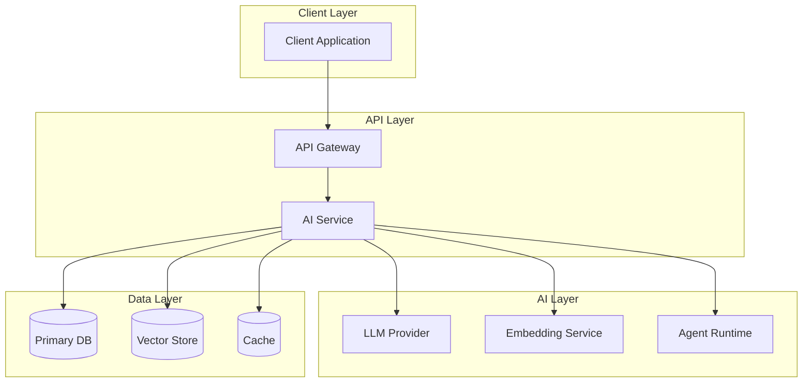
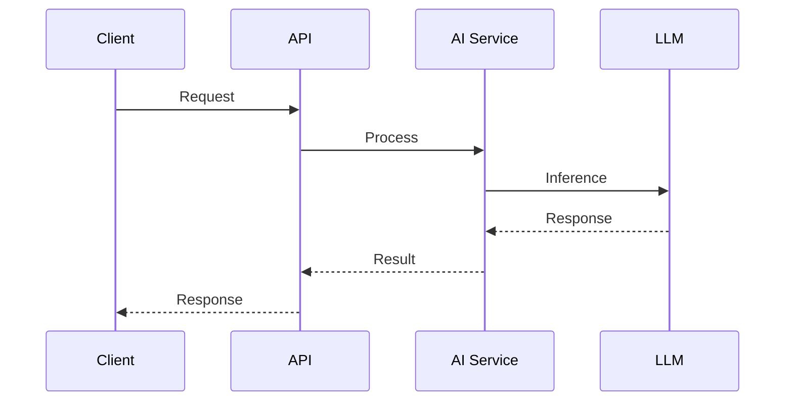
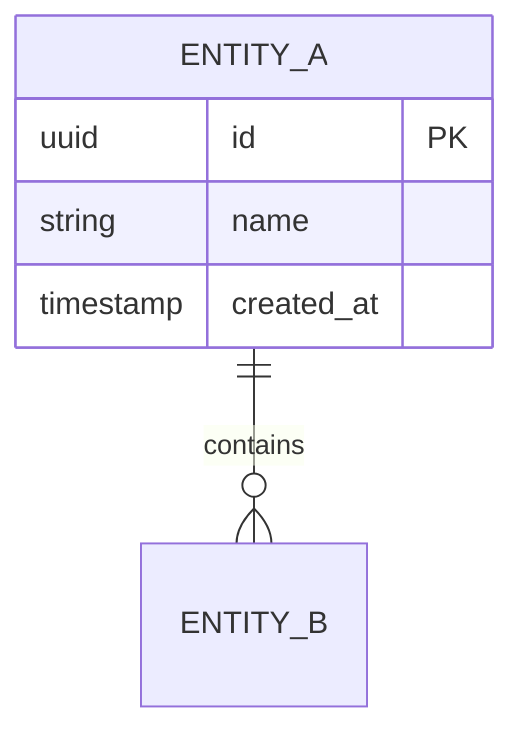

# {System Name} — System Design

> High-level overview of the system, its purpose, and the key architectural decisions.

## Table of Contents

- [Requirements](#requirements)
- [Architecture Overview](#architecture-overview)
- [Component Design](#component-design)
- [Data Flow](#data-flow)
- [API Design](#api-design)
- [Data Model](#data-model)
- [AI/ML Components](#aiml-components)
- [Scalability](#scalability)
- [Reliability](#reliability)
- [Security](#security)
- [Cost Analysis](#cost-analysis)
- [Tradeoffs and Decisions](#tradeoffs-and-decisions)
- [Future Considerations](#future-considerations)

## Requirements

### Functional Requirements

1. The system must...
2. The system must...
3. The system must...

### Non-Functional Requirements

| Requirement | Target | Priority |
|-------------|--------|----------|
| Latency (p95) | < 2s | High |
| Availability | 99.9% | High |
| Throughput | 100 req/s | Medium |
| Cost | < $X/month | Medium |

### Constraints

- Constraint 1
- Constraint 2

## Architecture Overview

## Component Design

### Component 1: {Name}

| Attribute | Value |
|-----------|-------|
| Responsibility | |
| Technology | |
| Scaling | Horizontal / Vertical |
| Dependencies | |

### Component 2: {Name}

| Attribute | Value |
|-----------|-------|
| Responsibility | |
| Technology | |
| Scaling | |
| Dependencies | |

## Data Flow

### Primary Flow: {Flow Name}

## API Design

| Endpoint | Method | Purpose |
|----------|--------|---------|
| `/api/v1/resource` | POST | Create resource |
| `/api/v1/resource/{id}` | GET | Retrieve resource |

## Data Model

## AI/ML Components

| Component | Model / Tool | Purpose | Fallback |
|-----------|-------------|---------|----------|
| LLM | gpt-4o | Generation | gpt-4o-mini |
| Embeddings | text-embedding-3-small | Retrieval | — |
| Agent | Custom | Orchestration | — |

## Scalability

- **Horizontal scaling:** Which components scale horizontally
- **Bottlenecks:** Known bottlenecks and mitigation
- **Caching strategy:** What is cached and where

## Reliability

- **Failure modes:** What can fail and impact
- **Retry logic:** Where retries are implemented
- **Fallback strategies:** Degraded operation modes
- **Data durability:** Backup and recovery approach

## Security

- Authentication and authorization model
- Data encryption (at rest and in transit)
- PII handling
- API key management
- Input validation and sanitization

## Cost Analysis

| Component | Monthly Cost (est.) | Optimization Opportunity |
|-----------|--------------------|-----------------------|
| LLM API | $X | Caching, smaller models |
| Vector DB | $X | |
| Compute | $X | |
| **Total** | **$X** | |

## Tradeoffs and Decisions

| Decision | Options Considered | Choice | Rationale |
|----------|-------------------|--------|-----------|
| Vector store | Pinecone, pgvector, Weaviate | pgvector | Existing PostgreSQL infra |
| Agent framework | LangGraph, CrewAI, custom | LangGraph | State management needs |

## Future Considerations

- Enhancement 1
- Enhancement 2
- Technical debt to address

---

## See Also

- [Architecture Pattern](../design-patterns/)
- [Knowledge: ADR](../../knowledge/architecture-decisions/)

## Changelog

| Version | Date | Changes |
|---------|------|---------|
| 1.0 | YYYY-MM-DD | Initial version |
