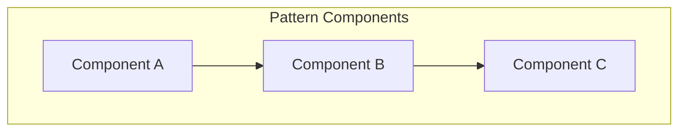

# {Pattern Name}

> What problem this pattern solves, when to use it, and when to avoid it.

## Table of Contents

- [Problem](#problem)
- [Solution](#solution)
- [Architecture](#architecture)
- [Components](#components)
- [Implementation](#implementation)
- [When to Use](#when-to-use)
- [When Not to Use](#when-not-to-use)
- [Variations](#variations)
- [Related Patterns](#related-patterns)
- [Real-World Examples](#real-world-examples)

## Problem

Describe the engineering challenge this pattern addresses.

## Solution

High-level description of the pattern's approach.

## Architecture



## Components

| Component | Responsibility | Technology Options |
|-----------|---------------|-------------------|
| Component A | What it does | FastAPI, etc. |
| Component B | What it does | PostgreSQL, etc. |

## Implementation

### Step 1: {Step Name}

Description and code:

```python
# Implementation example
```

### Step 2: {Step Name}

Description and code.

## When to Use

- Condition 1
- Condition 2
- Condition 3

## When Not to Use

- Anti-condition 1
- Anti-condition 2

## Variations

### Variation A: {Name}

How this variation differs and when to choose it.

### Variation B: {Name}

How this variation differs and when to choose it.

## Related Patterns

| Pattern | Relationship |
|---------|-------------|
| [Related Pattern](../path/to/doc.md) | Complements / Alternative / Extension |

## Real-World Examples

- [Project or case study](../../projects/path/to/project.md)
- [Knowledge entry](../../knowledge/architecture-decisions/)

---

## See Also

- [Pattern Index](../../meta/indexes/patterns/)

## Changelog

| Version | Date | Changes |
|---------|------|---------|
| 1.0 | YYYY-MM-DD | Initial version |
