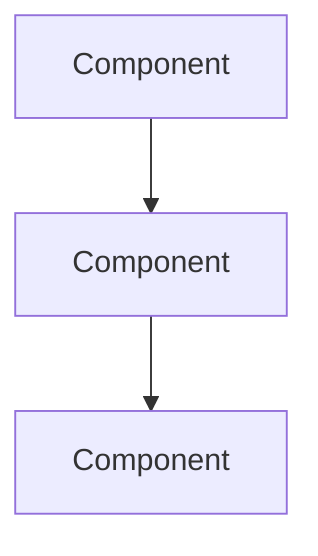

# {Case Study Name}

> What you built, the problem it solved, and the engineering lessons worth keeping.

> **Where this lives:** optional case studies go under [`knowledge/retrospectives/`](../../knowledge/retrospectives/), not a top-level `projects/` folder (removed). For an end-to-end build walkthrough, see [Capstone Walkthrough](../capstone-walkthrough.md).

## Overview

| Attribute | Value |
|-----------|-------|
| Status | Active / Completed / Archived |
| Started | YYYY-MM-DD |
| Stack | Python, FastAPI, PostgreSQL, etc. |
| AI Components | LLM, RAG, Agents, etc. |
| Repository | [Link](https://github.com/) (if public) |

## Problem Statement

What problem did this solve? Who were the users?

## Goals

1. Goal 1
2. Goal 2
3. Goal 3

## Architecture

### Key Design Decisions

| Decision | Rationale | Alternatives Considered |
|----------|-----------|------------------------|
| | | |

## Tech Stack

| Layer | Technology | Why |
|-------|-----------|-----|
| API | FastAPI | Async, auto-docs |
| Database | PostgreSQL + pgvector | Unified relational + vector |
| LLM | OpenAI gpt-4o | Quality / cost balance |
| Deployment | Docker on AWS | Team familiarity |

## What Went Well

- Success 1
- Success 2

## What Could Be Improved

- Improvement 1
- Improvement 2

## Challenges and Solutions

| Challenge | Solution | Lesson Learned |
|-----------|----------|----------------|
| Challenge 1 | How it was solved | What to do differently |
| Challenge 2 | How it was solved | What to do differently |

## Results

| Metric | Before | After | Notes |
|--------|--------|-------|-------|
| Latency (p95) | | | |
| Accuracy | | | |
| Cost/month | | | |

## Lessons for Future Work

1. Lesson 1
2. Lesson 2
3. Lesson 3

## Links

- [Capstone Walkthrough](../capstone-walkthrough.md)
- [Knowledge: Retrospectives](../../knowledge/retrospectives/)
- [System Design](../../domains/ai-system-design/)
- [Example Code](../../examples/)

---

## See Also

- [Similar Case Study](../../knowledge/retrospectives/)

## Changelog

| Version | Date | Changes |
|---------|------|---------|
| 1.0 | YYYY-MM-DD | Initial version |
