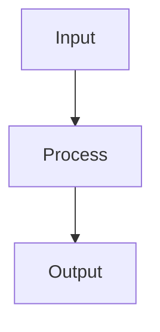

# {Concept Name}

> One-paragraph overview explaining what this concept is, why it matters in AI engineering, and when you need to understand it.

## Table of Contents

- [Definition](#definition)
- [Why It Matters](#why-it-matters)
- [How It Works](#how-it-works)
- [Key Principles](#key-principles)
- [Common Applications](#common-applications)
- [Tradeoffs and Considerations](#tradeoffs-and-considerations)
- [Common Mistakes](#common-mistakes)
- [Further Reading](#further-reading)

## Definition

Clear, concise definition of the concept. Avoid jargon where possible; link to the [glossary](../../meta/glossary.md) for specialized terms.

## Why It Matters

Explain the practical importance of this concept for AI engineers building production systems.

## How It Works

Explain the mechanism or mental model. Include a diagram if helpful:

## Key Principles

1. **Principle one** — explanation
2. **Principle two** — explanation
3. **Principle three** — explanation

## Common Applications

Where and how this concept appears in real AI engineering work:

| Application | Description |
|-------------|-------------|
| Example 1 | How it applies |
| Example 2 | How it applies |

## Tradeoffs and Considerations

| Advantage | Disadvantage |
|-----------|-------------|
| Pro 1 | Con 1 |
| Pro 2 | Con 2 |

## Common Mistakes

- Mistake one and how to avoid it
- Mistake two and how to avoid it

## Further Reading

- [Related Document](../path/to/doc.md)
- [External Resource](https://example.com)

---

## See Also

- [Related Concept](../path/to/doc.md)

## Changelog

| Version | Date | Changes |
|---------|------|---------|
| 1.0 | YYYY-MM-DD | Initial version |
