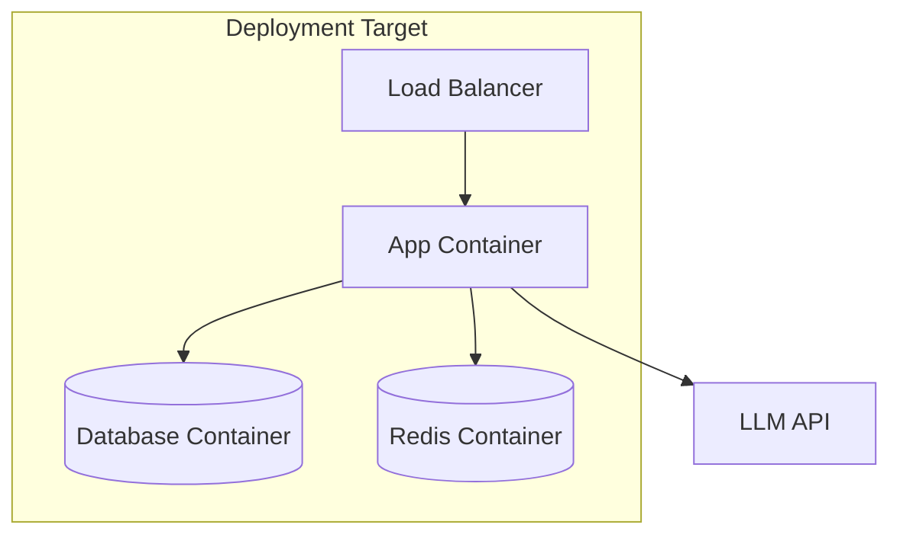

# Deploying {Application Name}

> How to deploy this AI application from development to production.

## Table of Contents

- [Overview](#overview)
- [Prerequisites](#prerequisites)
- [Architecture](#architecture)
- [Environment Setup](#environment-setup)
- [Local Deployment](#local-deployment)
- [Staging Deployment](#staging-deployment)
- [Production Deployment](#production-deployment)
- [CI/CD Pipeline](#cicd-pipeline)
- [Verification](#verification)
- [Rollback](#rollback)
- [Troubleshooting](#troubleshooting)

## Overview

| Attribute | Value |
|-----------|-------|
| Application | |
| Runtime | Python 3.12 / Node.js / etc. |
| Container | Docker |
| Target Platform | Cloud provider / VPS / etc. |
| Estimated Deploy Time | ~X minutes |

## Prerequisites

- [ ] Docker and Docker Compose installed
- [ ] Cloud account with appropriate permissions
- [ ] API keys for external services configured
- [ ] Domain and SSL certificate (production)

## Architecture



## Environment Setup

### Environment Variables

Create a `.env` file (never commit to version control):

```bash
# .env.example — copy to .env and fill in values
APP_ENV=production
DATABASE_URL=postgresql://user:pass@db:5432/app
REDIS_URL=redis://redis:6379/0
OPENAI_API_KEY=sk-...
LOG_LEVEL=info
```

## Local Deployment

### Using Docker Compose

```bash
# Build and start all services
docker compose up -d --build

# Verify health
curl http://localhost:8000/health

# View logs
docker compose logs -f app
```

### Dockerfile

```dockerfile
FROM python:3.12-slim

WORKDIR /app
COPY requirements.txt .
RUN pip install --no-cache-dir -r requirements.txt

COPY . .
EXPOSE 8000

CMD ["uvicorn", "main:app", "--host", "0.0.0.0", "--port", "8000"]
```

## Staging Deployment

1. Push to `staging` branch
2. CI/CD pipeline builds and deploys automatically
3. Run smoke tests against staging URL
4. Verify with staging API keys

## Production Deployment

> **Warning:** Complete the [production checklist](production-guide.md#production-checklist) before deploying to production.

1. Merge to `main` branch
2. CI/CD pipeline builds production image
3. Deploy with zero-downtime strategy
4. Run verification tests
5. Monitor for 30 minutes post-deploy

## CI/CD Pipeline

```yaml
# .github/workflows/deploy.yml (example structure)
name: Deploy
on:
  push:
    branches: [main]

jobs:
  test:
    runs-on: ubuntu-latest
    steps:
      - uses: actions/checkout@v4
      - name: Run tests
        run: pytest

  deploy:
    needs: test
    runs-on: ubuntu-latest
    steps:
      - name: Build and deploy
        run: |
          docker build -t app:${{ github.sha }} .
          # Deploy commands
```

## Verification

### Health Checks

```bash
# Application health
curl -f https://api.example.com/health

# AI endpoint smoke test
curl -X POST https://api.example.com/v1/chat \
  -H "Authorization: Bearer $API_KEY" \
  -H "Content-Type: application/json" \
  -d '{"message": "Hello"}'
```

### Post-Deploy Checklist

- [ ] Health endpoint returns 200
- [ ] AI endpoints respond correctly
- [ ] Logs show no errors
- [ ] Monitoring dashboards updating
- [ ] Latency within acceptable range

## Rollback

```bash
# Rollback to previous version
docker compose down
docker compose up -d --no-build  # Uses previous image tag

# Or via CI/CD
# Revert the merge commit and redeploy
```

## Troubleshooting

| Symptom | Likely Cause | Fix |
|---------|-------------|-----|
| 502 Bad Gateway | App not started | Check container logs |
| Slow responses | Cold start / no caching | Enable keep-alive, add cache |
| Auth errors | Expired API key | Rotate key in secrets manager |

---

## See Also

- [Production Guide](production-guide.md)
- [Docker Domain](../../domains/docker/)
- [Examples](../../examples/deployment/)

## Changelog

| Version | Date | Changes |
|---------|------|---------|
| 1.0 | YYYY-MM-DD | Initial version |
