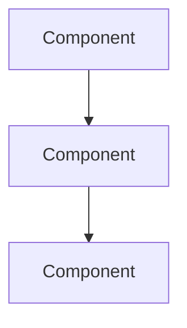

# {Topic} — Interview Preparation

> Key concepts, common questions, and strong answers for {topic} in AI engineering interviews.

## Topic Overview

| Attribute | Value |
|-----------|-------|
| Category | System Design / Coding / Conceptual / Behavioral |
| Difficulty | Beginner / Intermediate / Advanced |
| Frequency | How often this appears in interviews |
| Related Roles | AI Engineer, ML Engineer, Backend Engineer |

## Core Concepts to Know

### Concept 1

Brief explanation of the concept and why interviewers ask about it.

### Concept 2

Brief explanation.

### Concept 3

Brief explanation.

## Key Terminology

| Term | Definition |
|------|------------|
| Term 1 | Definition |
| Term 2 | Definition |

## Common Interview Questions

### Conceptual Questions

**Q1: {Question}**

> **Strong answer:** Key points to cover in a strong answer. Structure your response as: context → approach → tradeoffs → example.

**Q2: {Question}**

> **Strong answer:** Key points.

**Q3: {Question}**

> **Strong answer:** Key points.

### System Design Questions

**Q: Design a {system type} that {requirement}.**

> **Approach:**
> 1. Clarify requirements (scale, latency, cost)
> 2. High-level architecture
> 3. Deep dive into key components
> 4. Discuss tradeoffs
> 5. Address failure modes



### Coding Questions

**Q: Implement {task}.**

```python
# Solution approach (not necessarily complete code)
def solution():
    pass
```

> **Key points:** Time complexity, edge cases, error handling.

## Tradeoffs to Discuss

| Decision | Option A | Option B | When to Choose Each |
|----------|----------|----------|---------------------|
| | | | |

## Red Flags in Answers

- Red flag 1 — what NOT to say
- Red flag 2
- Red flag 3

## Follow-Up Questions to Expect

- Follow-up 1
- Follow-up 2

## Practice Problems

1. [Problem description] — practice designing/implementing this
2. [Problem description]

## Study Resources

- [Playbook Document](../domains/path/to/doc.md)
- [External Resource](https://example.com)

---

## See Also

- [Related Interview Topic](../path/to/doc.md)
- [Cheat Sheet](../../cheat-sheets/)

## Changelog

| Version | Date | Changes |
|---------|------|---------|
| 1.0 | YYYY-MM-DD | Initial version |
