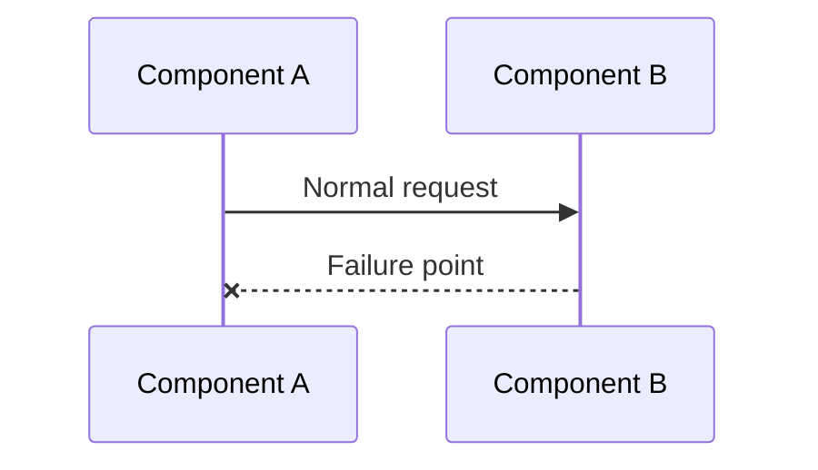

# Postmortem: {Incident Title}

> Summary of what happened, the impact, and what we're doing to prevent recurrence.

## Incident Summary

| Field | Value |
|-------|-------|
| Date | YYYY-MM-DD |
| Duration | X hours Y minutes |
| Severity | P1 / P2 / P3 |
| Impact | Description of user/business impact |
| Detection | How the incident was detected |
| Resolution | How the incident was resolved |

## Timeline

All times in UTC.

| Time | Event |
|------|-------|
| HH:MM | First symptom observed / alert fired |
| HH:MM | Investigation started |
| HH:MM | Root cause identified |
| HH:MM | Mitigation applied |
| HH:MM | Service fully restored |
| HH:MM | Postmortem scheduled |

## Impact

### User Impact

- Number of users affected
- Features impacted
- Data integrity concerns (if any)

### Business Impact

- Revenue impact (if applicable)
- SLA breach (if applicable)

## Root Cause

Detailed technical explanation of what went wrong and why.

## Contributing Factors

1. Factor 1 — e.g., missing monitoring
2. Factor 2 — e.g., insufficient testing
3. Factor 3 — e.g., configuration drift

## What Went Well

- Positive aspect 1 — e.g., fast detection
- Positive aspect 2 — e.g., effective rollback

## What Went Poorly

- Negative aspect 1
- Negative aspect 2

## Action Items

| Action | Owner | Priority | Due Date | Status |
|--------|-------|----------|----------|--------|
| Add monitoring for X | | P1 | YYYY-MM-DD | Open |
| Implement circuit breaker for Y | | P2 | YYYY-MM-DD | Open |
| Update runbook for Z | | P2 | YYYY-MM-DD | Open |
| Add integration test for scenario | | P3 | YYYY-MM-DD | Open |

## Lessons Learned

1. **Lesson 1** — what we learned and how it changes our approach
2. **Lesson 2**
3. **Lesson 3**

## Prevention

How similar incidents will be prevented in the future:

- Monitoring improvements
- Process changes
- Architecture changes
- Testing improvements

---

## See Also

- [Production Guide](../domains/ai-deployment/)
- [Knowledge: Production Challenges](../../knowledge/production-challenges/)
- [Troubleshooting Guide](troubleshooting-guide.md)

## Changelog

| Version | Date | Changes |
|---------|------|---------|
| 1.0 | YYYY-MM-DD | Initial version |
