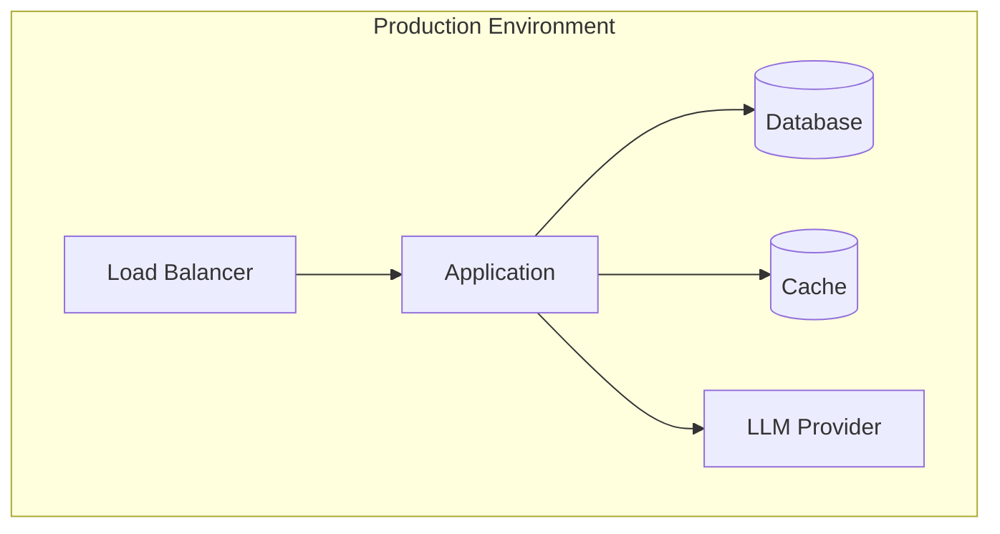

# {Topic} — Production Guide

> What you need to know to run {topic} reliably in production AI applications.

## Table of Contents

- [Prerequisites](#prerequisites)
- [Production Architecture](#production-architecture)
- [Configuration](#configuration)
- [Deployment Steps](#deployment-steps)
- [Production Checklist](#production-checklist)
- [Monitoring and Alerting](#monitoring-and-alerting)
- [Performance Tuning](#performance-tuning)
- [Security Hardening](#security-hardening)
- [Cost Management](#cost-management)
- [Failure Modes](#failure-modes)
- [Incident Response](#incident-response)
- [Maintenance](#maintenance)

## Prerequisites

- [ ] Prerequisite 1
- [ ] Prerequisite 2
- [ ] Prerequisite 3

## Production Architecture

## Configuration

### Environment Variables

| Variable | Required | Default | Description |
|----------|----------|---------|-------------|
| `API_KEY` | Yes | — | Service API key |
| `LOG_LEVEL` | No | `info` | Logging verbosity |
| `MAX_WORKERS` | No | `4` | Concurrent workers |

### Production vs Development

| Setting | Development | Production |
|---------|--------------|------------|
| Debug mode | `true` | `false` |
| Log level | `debug` | `info` |
| Rate limiting | Disabled | Enabled |

## Deployment Steps

1. **Step 1:** Description
2. **Step 2:** Description
3. **Step 3:** Description

## Production Checklist

> **Production Standard:** Complete every item before going live.

### Before Launch

- [ ] All environment variables configured via secrets manager
- [ ] Health check endpoint responding
- [ ] Logging configured and shipping to log aggregator
- [ ] Monitoring dashboards created
- [ ] Alerting rules configured
- [ ] Rate limiting enabled
- [ ] Error handling tested with failure injection
- [ ] Load testing completed
- [ ] Rollback procedure documented and tested
- [ ] On-call runbook created

### After Launch

- [ ] Monitor error rates for 24 hours
- [ ] Verify cost metrics within budget
- [ ] Confirm alerting is firing correctly
- [ ] Review logs for unexpected warnings

## Monitoring and Alerting

### Key Metrics

| Metric | Warning Threshold | Critical Threshold |
|--------|-------------------|-------------------|
| Error rate | > 1% | > 5% |
| Latency (p95) | > 3s | > 10s |
| Token usage/hour | > budget | > 2x budget |

### Dashboards

- Dashboard 1: System health overview
- Dashboard 2: AI-specific metrics (token usage, model latency)

### Alert Rules

| Alert | Condition | Action |
|-------|-----------|--------|
| High error rate | Error rate > 5% for 5 min | Page on-call |
| LLM timeout | Timeout rate > 10% | Investigate provider status |

## Performance Tuning

- Tuning recommendation 1
- Tuning recommendation 2

## Security Hardening

- [ ] API keys rotated and stored in secrets manager
- [ ] Input validation on all endpoints
- [ ] PII detection and redaction in logs
- [ ] Network policies restrict outbound access
- [ ] Dependencies scanned for vulnerabilities

## Cost Management

| Cost Driver | Monthly Estimate | Optimization |
|-------------|-----------------|--------------|
| LLM API calls | $X | Response caching |
| Compute | $X | Right-size instances |
| Storage | $X | Data retention policy |

## Failure Modes

| Failure | Impact | Detection | Mitigation |
|---------|--------|-----------|------------|
| LLM provider outage | No AI responses | Health check fails | Fallback model |
| Database connection loss | Data unavailable | Connection pool alert | Retry + circuit breaker |
| Rate limit exceeded | Degraded service | 429 responses | Backoff + queue |

## Incident Response

1. **Detect** — alert fires or user report
2. **Assess** — determine severity and scope
3. **Mitigate** — apply immediate fix or rollback
4. **Resolve** — root cause fix
5. **Review** — postmortem within 48 hours

## Maintenance

| Task | Frequency | Procedure |
|------|-----------|-----------|
| Dependency updates | Monthly | Review and test |
| API key rotation | Quarterly | Rotate via secrets manager |
| Load testing | Quarterly | Run load test suite |
| Cost review | Monthly | Review billing dashboards |

---

## See Also

- [Deployment Guide](deployment-guide.md)
- [Troubleshooting Guide](troubleshooting-guide.md)

## Changelog

| Version | Date | Changes |
|---------|------|---------|
| 1.0 | YYYY-MM-DD | Initial version |
