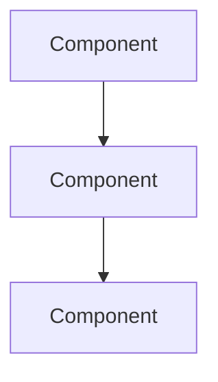

# {Project Name}

> What this project does, the problem it solves, and key engineering lessons.

## Project Overview

| Attribute | Value |
|-----------|-------|
| Status | Active / Completed / Archived |
| Started | YYYY-MM-DD |
| Stack | Python, FastAPI, PostgreSQL, etc. |
| AI Components | LLM, RAG, Agents, etc. |
| Repository | [Link](https://github.com/) (if public) |

## Problem Statement

What problem does this project solve? Who are the users?

## Goals

1. Goal 1
2. Goal 2
3. Goal 3

## Architecture



### Key Design Decisions

| Decision | Rationale | Alternatives Considered |
|----------|-----------|------------------------|
| | | |

## Tech Stack

| Layer | Technology | Why |
|-------|-----------|-----|
| API | FastAPI | Async, auto-docs |
| Database | PostgreSQL + pgvector | Unified relational + vector |
| LLM | OpenAI gpt-4o | Quality / cost balance |
| Deployment | Docker on AWS | Team familiarity |

## Implementation Highlights

### Feature 1: {Name}

Description of an interesting implementation detail.

```python
# Key code snippet
```

### Feature 2: {Name}

Description.

## Challenges and Solutions

| Challenge | Solution | Lesson Learned |
|-----------|----------|----------------|
| Challenge 1 | How it was solved | What to do differently |
| Challenge 2 | How it was solved | What to do differently |

## Results

| Metric | Before | After | Notes |
|--------|--------|-------|-------|
| Latency (p95) | | | |
| Accuracy | | | |
| Cost/month | | | |

## What Went Well

- Success 1
- Success 2

## What Could Be Improved

- Improvement 1
- Improvement 2

## Lessons for Future Projects

1. Lesson 1
2. Lesson 2
3. Lesson 3

## Links

- [System Design Document](../domains/ai-system-design/)
- [Knowledge: Retrospective](../../knowledge/retrospectives/)
- [Example Code](../../examples/)

---

## See Also

- [Similar Project](../path/to/project.md)

## Changelog

| Version | Date | Changes |
|---------|------|---------|
| 1.0 | YYYY-MM-DD | Initial version |
