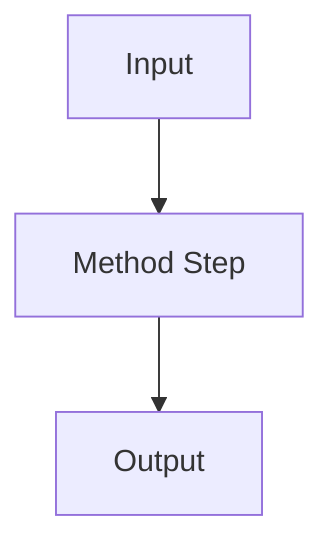

# {Paper Title}

> One-sentence takeaway: the most important insight for AI engineers.

## Paper Details

| Field | Value |
|-------|-------|
| Authors | |
| Year | |
| Venue | |
| Link | [Paper URL](https://arxiv.org/abs/XXXX.XXXXX) |
| Code | [Repository URL](https://github.com/) (if available) |

## TL;DR

2–3 sentences capturing the paper's core contribution and why it matters for practitioners.

## Problem Statement

What problem does this paper address?

## Key Contributions

1. Contribution 1
2. Contribution 2
3. Contribution 3

## Method Overview

Explain the approach at a level useful for engineers (not a full reproduction).



## Key Results

| Metric | Baseline | Proposed | Improvement |
|--------|----------|----------|-------------|
| | | | |

## Relevance to AI Engineering

How this paper's ideas apply to building production AI systems:

- **Directly applicable:** Ideas you can use today
- **Inspirational:** Concepts that may influence future designs
- **Theoretical:** Background knowledge with indirect application

## Practical Takeaways

1. Takeaway 1 — what to do differently in your work
2. Takeaway 2
3. Takeaway 3

## Limitations

- Limitation acknowledged by authors
- Practical limitations for engineers

## Implementation Notes

If implementing ideas from this paper:

```python
# Pseudocode or key algorithm snippet
```

## Related Work

| Paper | Relationship |
|-------|-------------|
| [Related Paper](link) | Builds on / Contrasts with / Extends |

---

## See Also

- [Related Concept](../path/to/doc.md)
- [Research Notes](../research-notes/)

## Changelog

| Version | Date | Changes |
|---------|------|---------|
| 1.0 | YYYY-MM-DD | Initial version |
