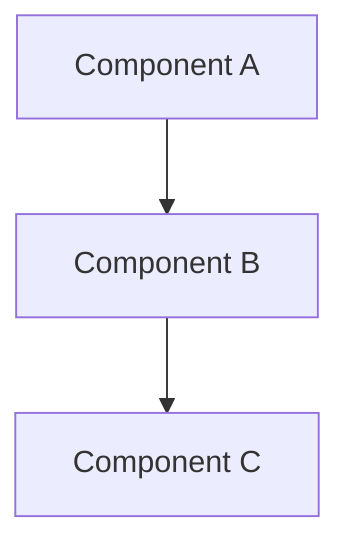

# {Technology Name}

> What this technology is, what problems it solves, and when to choose it for AI engineering projects.

## Table of Contents

- [Overview](#overview)
- [Core Capabilities](#core-capabilities)
- [Architecture](#architecture)
- [Installation and Setup](#installation-and-setup)
- [Basic Usage](#basic-usage)
- [Integration with AI Systems](#integration-with-ai-systems)
- [Configuration](#configuration)
- [Performance Characteristics](#performance-characteristics)
- [Production Considerations](#production-considerations)
- [Alternatives and Comparisons](#alternatives-and-comparisons)
- [Resources](#resources)

## Overview

| Attribute | Value |
|-----------|-------|
| Type | Database / Framework / Service / Library |
| Language | Python / Multi-language / etc. |
| License | Open source / Commercial |
| Maturity | Early / Stable / Mature |
| AI Relevance | How it fits into AI engineering workflows |

## Core Capabilities

- Capability 1
- Capability 2
- Capability 3

## Architecture

Describe the technology's internal architecture or deployment model.



## Installation and Setup

```bash
# Installation commands
pip install {package-name}
```

### Prerequisites

- Prerequisite 1
- Prerequisite 2

## Basic Usage

```python
# Minimal working example
```

## Integration with AI Systems

How this technology integrates with LLMs, agents, RAG pipelines, or other AI components.

## Configuration

| Setting | Default | Description |
|---------|---------|-------------|
| `setting_name` | `default_value` | What it controls |

## Performance Characteristics

| Metric | Value | Notes |
|--------|-------|-------|
| Latency | | |
| Throughput | | |
| Scalability | | |

## Production Considerations

> **Production Standard:** Key requirements for using this technology in production.

- Monitoring and alerting
- Backup and recovery
- Security hardening
- Scaling approach

## Alternatives and Comparisons

| Feature | This Technology | Alternative A | Alternative B |
|---------|----------------|---------------|---------------|
| Feature 1 | | | |
| Feature 2 | | | |

See [comparison index](../../meta/indexes/comparisons/) for detailed comparisons.

## Resources

- [Official Documentation](https://example.com)
- [Related Playbook Document](../path/to/doc.md)

---

## See Also

- [Related Technology](../path/to/doc.md)

## Changelog

| Version | Date | Changes |
|---------|------|---------|
| 1.0 | YYYY-MM-DD | Initial version |
