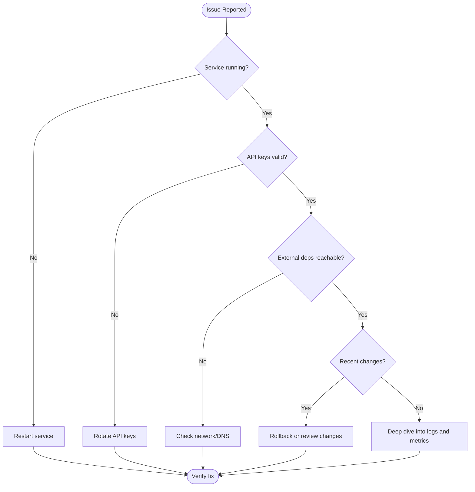

# Troubleshooting: {Problem Area}

> Systematic guide to diagnosing and fixing {problem area} issues in production AI applications.

## Table of Contents

- [Symptoms](#symptoms)
- [Quick Diagnostics](#quick-diagnostics)
- [Common Issues](#common-issues)
- [Diagnostic Flowchart](#diagnostic-flowchart)
- [Advanced Debugging](#advanced-debugging)
- [Prevention](#prevention)

## Symptoms

| Symptom | Possible Causes | Severity |
|---------|----------------|----------|
| High latency | Model timeout, no caching, large context | High |
| Empty responses | Prompt issue, model error, rate limit | High |
| Inconsistent quality | Temperature, context window, retrieval | Medium |

## Quick Diagnostics

Run these checks first:

```bash
# 1. Check service health
curl -f http://localhost:8000/health

# 2. Check logs for errors
docker compose logs --tail=50 app | grep -i error

# 3. Test LLM connectivity
curl -X POST https://api.openai.com/v1/chat/completions \
  -H "Authorization: Bearer $OPENAI_API_KEY" \
  -H "Content-Type: application/json" \
  -d '{"model": "gpt-4o-mini", "messages": [{"role": "user", "content": "test"}]}'
```

### Diagnostic Checklist

- [ ] Service is running and healthy
- [ ] API keys are valid and not expired
- [ ] External dependencies are reachable
- [ ] No recent deployments or config changes
- [ ] Error rate within normal range
- [ ] Resource utilization (CPU, memory) normal

## Common Issues

### Issue 1: {Problem Title}

**Symptoms:** What you observe

**Root Causes:**
1. Cause A
2. Cause B

**Diagnosis:**

```bash
# Commands to confirm the diagnosis
```

**Fix:**

```bash
# Commands or code to resolve
```

**Verification:**

```bash
# How to confirm the fix worked
```

---

### Issue 2: {Problem Title}

**Symptoms:** What you observe

**Root Causes:**
1. Cause A
2. Cause B

**Diagnosis:**

```bash
# Commands to confirm
```

**Fix:**

```bash
# Resolution steps
```

---

### Issue 3: {Problem Title}

**Symptoms:** What you observe

**Root Causes:**
1. Cause A

**Diagnosis and Fix:**

Description and commands.

## Diagnostic Flowchart



## Advanced Debugging

### Log Analysis

What to look for in logs:

```bash
# Filter for AI-specific errors
grep -E "timeout|rate.limit|token|embedding" app.log
```

### Metrics to Check

| Metric | Normal Range | Action if Abnormal |
|--------|-------------|-------------------|
| Request latency (p95) | < 3s | Check model provider status |
| Error rate | < 1% | Check logs for error patterns |
| Token usage | Within budget | Check for prompt bloat |

### Enabling Debug Mode

```bash
# Temporarily increase log verbosity
export LOG_LEVEL=debug
# Restart service and reproduce the issue
```

> **Warning:** Disable debug mode after troubleshooting. Debug logs may contain sensitive data.

## Prevention

- Prevention measure 1
- Prevention measure 2
- Prevention measure 3

---

## See Also

- [Production Guide](production-guide.md)
- [Knowledge: Debugging Stories](../../knowledge/debugging-stories/)
- [Common Mistakes](../../domains/common-mistakes/)

## Changelog

| Version | Date | Changes |
|---------|------|---------|
| 1.0 | YYYY-MM-DD | Initial version |
