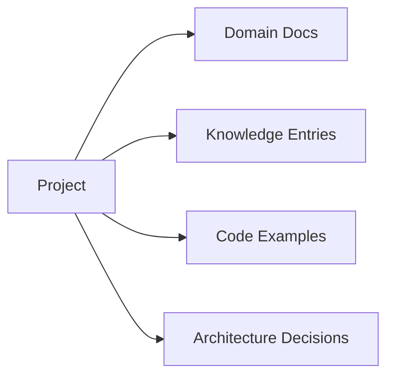

# Projects

> Case studies and documentation for AI engineering projects.

---

## Purpose

Projects document real AI systems you've built — architecture, challenges, solutions, and lessons learned. They bridge the gap between reference documentation and personal knowledge.

---

## Project Documentation

Each project follows the [Project template](../meta/templates/project.md) and includes:

- Problem statement and goals
- Architecture and tech stack
- Key design decisions
- Challenges and solutions
- Results and metrics
- Lessons for future projects

---

## Relationship to Other Areas

| Area | What Projects Provide |
|------|----------------------|
| [Domains](../domains/) | Real-world examples referenced in guides |
| [Knowledge](../knowledge/) | ADRs, retrospectives, lessons learned |
| [Examples](../examples/) | Extracted, reusable code patterns |

---

## Adding a Project

1. Create a project directory or document.
2. Use the [project template](../meta/templates/project.md).
3. Link to related domain documents, knowledge entries, and examples.
4. Add a retrospective to [knowledge/retrospectives/](../knowledge/retrospectives/).

---

## See Also

- [Knowledge Base](../knowledge/) — lessons and ADRs
- [Examples](../examples/) — code patterns
- [Project Template](../meta/templates/project.md)
