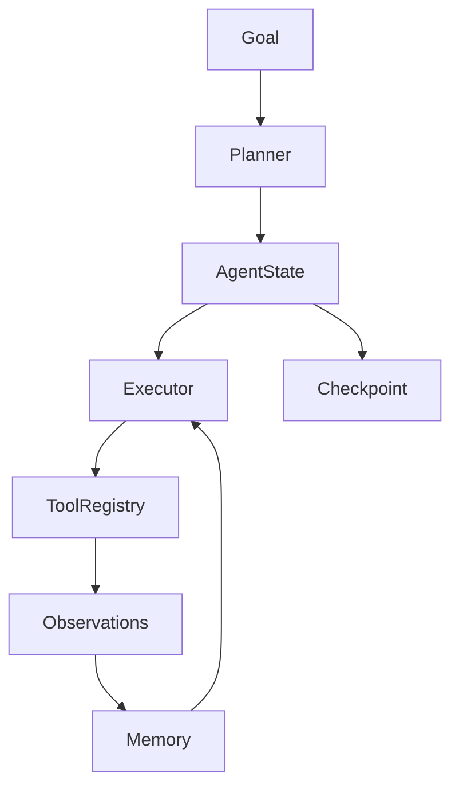

# Agent Starter Template

> Clean-architecture agent with planner, executor, memory, tools, and checkpointing.

---

## Purpose

Extensible agent runtime for hackathons and production — swap planners, tools, and memory backends without rewriting the loop.

---

## Architecture



---

## Components

| Module | Role |
|--------|------|
| `state.py` | Serializable agent state |
| `planner.py` | Goal decomposition |
| `executor.py` | Step execution with retries |
| `tools.py` | Tool registration |
| `memory.py` | Short-term buffer |

---

## Usage

```bash
cd templates/engineering/agent-starter
PYTHONPATH=src python -m agent.main
```

---

## Extension Points

- Replace `Planner` with LLM-based ReAct planner
- Add LangFuse/OpenTelemetry spans in `executor.py`
- Persist `checkpoint()` to Redis/Postgres

---

## Production Considerations

- Cap max steps and tool spend
- Human approval for destructive tools
- Structured logging per step

---

## Related Templates

- [MCP Starter](../mcp-starter/README.md) — tools via protocol
- [Evaluation](../evaluation/agent_eval.py)

---

## See Also

- [Agent Engineering Handbook](../../../domains/ai-agents/README.md)
