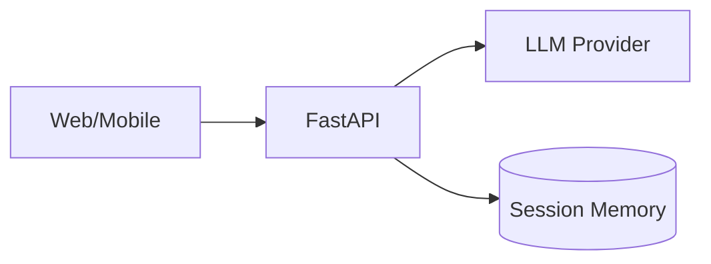

# Project Boilerplates

> Compose starters into full product scaffolds.

---

## Purpose

Map common AI product types to template combinations. Each boilerplate lists which folders to copy and how to wire them.

---

## AI Chat App

| Layer | Template |
|-------|----------|
| API | [fastapi-starter](../fastapi-starter/) |
| Prompts | [prompts/chat.md](../prompts/chat.md) |
| Memory | Redis from [docker/docker-compose.yml](../docker/docker-compose.yml) |
| Observability | [monitoring/observability.py](../monitoring/observability.py) |

---

## RAG App

| Layer | Template |
|-------|----------|
| Pipeline | [rag-starter](../rag-starter/) |
| Vector DB | Qdrant service in [docker-compose](../docker/docker-compose.yml) |
| Evaluation | [evaluation/rag_eval.py](../evaluation/rag_eval.py) |

---

## Agent Platform

| Layer | Template |
|-------|----------|
| Runtime | [agent-starter](../agent-starter/) |
| Tools | Extend `ToolRegistry` |
| Tracing | [monitoring/observability.py](../monitoring/observability.py) |

---

## AI Search

Combine RAG starter with hybrid retrieval and reranking modules. See [rag-starter](../rag-starter/README.md).

---

## AI API

[fastapi-starter](../fastapi-starter/) + [utilities](../utilities/) + [deployment](../deployment/).

---

## AI SaaS

FastAPI + auth + Postgres + Stripe webhook endpoint (add to `api/v1/endpoints/`). Deploy via [render.yaml](../deployment/render.yaml) or [railway.toml](../deployment/railway.toml).

---

## MCP Project

[mcp-starter](../mcp-starter/) server + optional [fastapi-starter](../fastapi-starter/) gateway.

---

## See Also

- [AI System Design](../../../domains/ai-system-design/README.md)
- [Production AI](../../../domains/ai-deployment/README.md)
