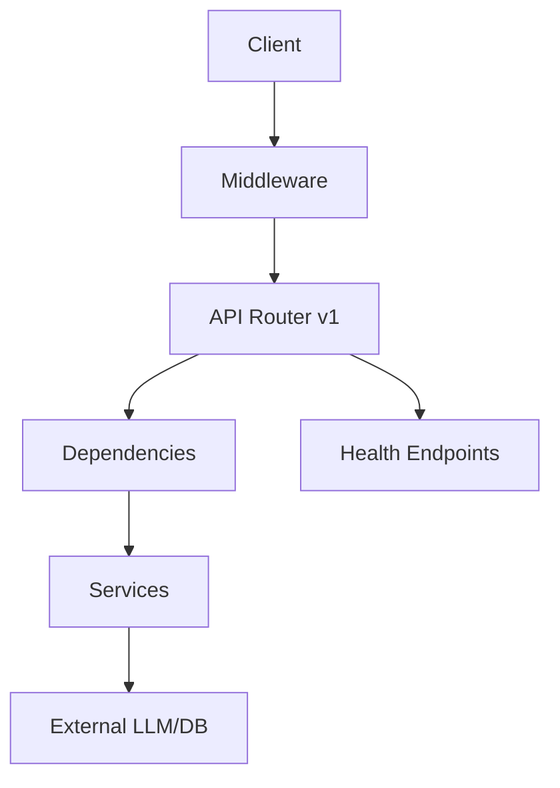

# FastAPI Starter Template

> Production-ready FastAPI scaffold for AI backends — copy and customize.

---

## Purpose

Bootstrap a modular AI API with configuration, dependency injection, authentication, structured logging, middleware, exception handling, health endpoints, Docker, tests, and GitHub Actions in minutes.

---

## Folder Structure

```
fastapi-starter/
├── src/app/
│   ├── main.py              # create_app() factory
│   ├── config/settings.py   # Pydantic settings
│   ├── api/
│   │   ├── dependencies.py  # DI + API key auth
│   │   ├── middleware.py    # Request ID + timing
│   │   └── v1/
│   │       ├── router.py
│   │       └── endpoints/health.py
│   └── core/
│       ├── exceptions.py
│       └── logging.py
├── tests/
├── Dockerfile
├── pyproject.toml
└── .github/workflows/ci.yml
```

---

## Architecture



---

## Components

| Component | Role |
|-----------|------|
| `create_app()` | Application factory for tests and production |
| `Settings` | Environment-driven configuration |
| `verify_api_key` | Optional header-based auth |
| `RequestLoggingMiddleware` | Correlation ID and latency headers |
| `AppError` hierarchy | Consistent HTTP error responses |

---

## Configuration

| Variable | Default | Description |
|----------|---------|-------------|
| `APP_NAME` | `ai-api` | OpenAPI title |
| `API_KEY` | empty | When set, requires `X-API-Key` |
| `LOG_LEVEL` | `INFO` | Logging verbosity |
| `CORS_ORIGINS` | localhost | Allowed origins |

Copy `.env.example` to `.env`.

---

## Installation

```bash
cd templates/engineering/fastapi-starter
pip install -e ".[dev]"
```

---

## Usage

```bash
uvicorn app.main:app --reload --app-dir src
curl http://localhost:8000/api/v1/health
```

---

## Customization

- Add endpoints under `api/v1/endpoints/`
- Register services in `dependencies.py`
- Extend `Settings` for LLM keys and vector DB URLs

---

## Extension Points

- `services/` — business logic and LLM orchestration
- `clients/` — httpx wrappers for providers
- `repositories/` — database access

---

## Production Considerations

- Run behind reverse proxy ([deployment/nginx](../deployment/nginx-reverse-proxy.conf))
- Set `API_KEY` in production
- Use multi-stage Docker build from [docker/Dockerfile.multistage](../docker/Dockerfile.multistage)
- Wire [structured logging](../logging/structured_logger.py) and [monitoring](../monitoring/observability.py)

---

## Best Practices

- Keep routes thin; inject services via FastAPI `Depends`
- Use `create_app()` in tests — never import a global app with side effects
- Version APIs under `/api/v1`

---

## Common Mistakes

- Putting LLM calls directly in route handlers
- Skipping health/readiness probes for orchestrators
- Hardcoding secrets instead of environment variables

---

## Related Templates

- [Docker Starter](../docker/README.md)
- [Logging](../logging/README.md)
- [GitHub Actions](../github-actions/README.md)
- [AI API Boilerplate](../boilerplates/README.md#ai-api)

---

## See Also

- [FastAPI Foundation](../../domains/fastapi/fastapi-foundation.md)
- [Backend Architecture for AI](../../domains/backend-engineering/backend-architecture-for-ai.md)
