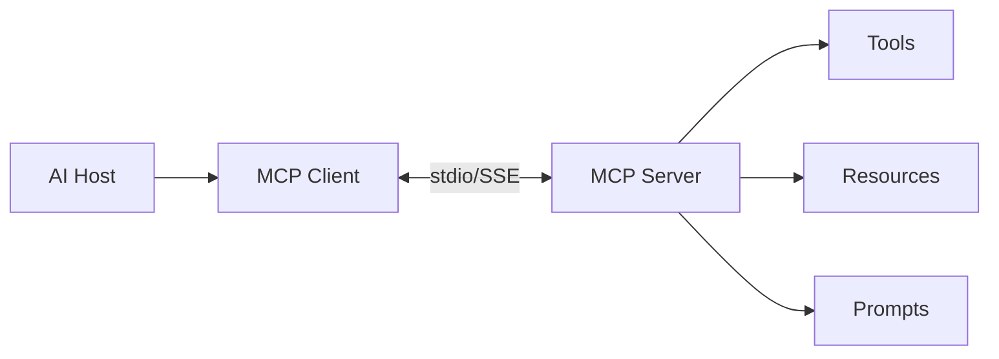

# MCP Starter Template

> Production MCP server and client with tool, resource, and prompt registration.

---

## Purpose

Bootstrap Model Context Protocol integrations — register tools, resources, and prompts with configurable stdio/SSE transport.

---

## Files

| File | Role |
|------|------|
| `server.py` | FastMCP server with `@tool`, `@resource`, `@prompt` |
| `client.py` | Stdio client session bootstrap |

---

## Architecture



---

## Usage

```bash
pip install mcp
python server.py   # stdio transport
python client.py   # list tools
```

---

## Extension Points

- Add OAuth for remote SSE servers
- Register domain-specific tools
- Compose with [FastAPI gateway](../fastapi-starter/)

---

## Related Templates

- [Architecture: MCP](../architecture/mcp.mmd)
- [MCP Handbook](../../domains/mcp/README.md)
