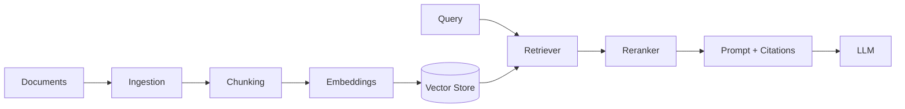

# RAG Starter Template

> Modular retrieval-augmented generation pipeline with swappable embeddings and vector stores.

---

## Purpose

Copy-paste RAG pipeline: ingestion → chunking → embeddings → vector store → retrieval → reranking → prompt assembly with citations → evaluation.

---

## Folder Structure

```
rag-starter/src/rag/
├── ingestion.py      # Document loaders
├── chunking.py       # Text splitting
├── embeddings.py     # Embedding provider interface
├── vector_store.py   # Vector DB interface
├── retrieval.py      # Retrieve + rerank
├── prompt.py         # Citation-aware prompts
├── evaluation.py     # Golden-set scoring
├── config.py         # RAGSettings
├── pipeline.py       # Indexing orchestration
└── main.py           # CLI entry
```

---

## Architecture



---

## Configuration

| Variable | Default | Description |
|----------|---------|-------------|
| `CHUNK_SIZE` | 512 | Words per chunk |
| `TOP_K` | 5 | Initial retrieval count |
| `RERANK_TOP_N` | 3 | Chunks in prompt |
| `VECTOR_BACKEND` | memory | Swap for qdrant, pinecone, pgvector |

---

## Installation & Usage

```bash
cd templates/engineering/rag-starter
# Add data/*.md files
PYTHONPATH=src python -m rag.main
```

---

## Customization

- Implement `EmbeddingProvider.embed()` with OpenAI/Cohere/local models
- Replace `VectorStore` with Qdrant/Pinecone/pgvector adapter
- Plug reranker (Cohere, cross-encoder)

---

## Extension Points

- `ingestion.py` — PDF/HTML loaders
- `evaluation.py` — RAGAS/DeepEval integration

---

## Production Considerations

- Batch embedding during ingestion
- Metadata filters for ACL
- Cache frequent queries

---

## Best Practices

- Keep chunk boundaries semantic where possible
- Always return citations to users
- Evaluate faithfulness on golden sets

---

## Common Mistakes

- Embedding queries and documents with different models
- Skipping reranking when top-k is noisy
- No evaluation harness before launch

---

## Related Templates

- [Evaluation](../evaluation/README.md)
- [FastAPI Starter](../fastapi-starter/README.md)
- [Architecture: RAG](../architecture/rag.mmd)

---

## See Also

- [RAG Handbook](../../../domains/rag/README.md)
